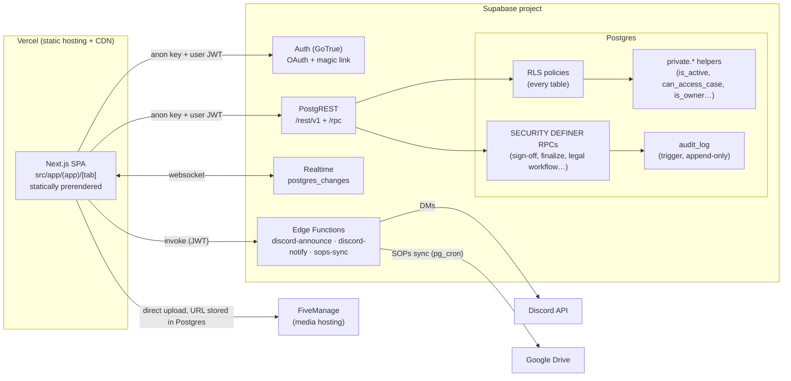

# Architecture — CID Portal

How the application is put together: routing, components, data flow, security
boundaries, and external integrations. For file-by-file depth, follow the
links into the [Developer Handbook](handbook/README.md).

The CID Portal is a human-designed case-management and legal-review platform
for a GTA V roleplay Criminal Investigation Division. It organizes cases,
evidence, reports, intelligence, operations, warrants, subpoenas, approvals,
and audit history through role-based workflows enforced by the database.

The project's requirements, workflows, security model, and final
implementation decisions are human-directed and human-reviewed. Development
tools may assist with drafting or implementation, but no tool independently
defines policy, approves changes, or operates investigative and legal
decisions.

---

## 1. The one-sentence model

**The database is the authority; the UI is a convenience.** Every permission
check in React only hides buttons — Postgres Row Level Security (RLS) does
the real enforcement. Every section below is a consequence of that rule.

## 2. System diagram

## 3. Routing — the `[tab]` SSG model

The whole app is one dynamic route:
[`src/app/(app)/[tab]/page.tsx`](../src/app/(app)/[tab]/page.tsx).

- `generateStaticParams()` returns every key of `PAGE_META`
  ([`src/lib/nav.ts`](../src/lib/nav.ts)), so **every tab is statically
  prerendered** at build time — the "server" side of the app is a static
  shell on Vercel's CDN.
- The page component is a switch: each known tab renders its feature view
  inside `<Suspense>` with a `ViewPlaceholder` fallback.
- Fallbacks: `/reports` redirects to `/cases`; any unknown slug redirects to
  `/command`.
- `nav.ts` is a three-way contract (PAGE_META keys = URL slugs = TAB_LABEL
  keys) plus the `[tab]` switch — see
  [Handbook Ch. 3, Block 2](handbook/03-architecture.md).

There are **no custom API routes** — no `route.ts` files exist under
`src/app`. The app's "API" is Supabase's auto-generated REST layer plus
database RPCs; see [Handbook Ch. 7](handbook/07-api.md).

## 4. Component organization

| Location | Contents |
| --- | --- |
| `src/components/<feature>/` | One folder per domain (cases, legal, justice, operations, owner, devdocs, command-center, …). Feature views share a uniform shape: fetch on mount + realtime version bump → `refresh()`; permission-gated buttons; fresh-mounted modals; toasts + Undo for deletes. |
| `src/components/ui/` | Shared primitives (Modal, Toaster, dialog host, headers, …) everything is assembled from. |
| `src/components/shell/` | The constant chrome (`AppShell`, sidebar, nav badges). |
| `src/components/auth/` | The `Gate` screens (login, pending approval, retry, setup). |
| `src/lib/` | Domain libraries and infrastructure — data access, auth, realtime, sign-off vocabulary, form schemas, exports. |

The [Handbook Ch. 6](handbook/06-components.md) catalogs the reusable
building blocks; [Ch. 5](handbook/05-pages.md) maps every URL to its
components, data, and permissions.

## 5. Server/client boundaries

This is an SPA. The Next.js build produces static HTML shells; everything
interactive is client-side:

- [`src/app/(app)/layout.tsx`](../src/app/(app)/layout.tsx) is a client
  component that wraps every tab in `AuthProvider` and the `Gated` switch —
  non-authenticated states render the `Gate` screen *instead of* the shell.
- All data access happens in the browser through `@supabase/supabase-js`
  ([`src/lib/supabase.ts`](../src/lib/supabase.ts)) using the **publishable
  (anon) key only** — public by design; a `service_role` key must never
  appear anywhere in this app.
- There is no server-side session, middleware auth, or hand-written HTTP
  endpoint. Client gating is UX only; **RLS is the authority for every data
  access** (the comment at the top of `auth.tsx` says exactly this).

## 6. Supabase integration — RLS as the sole authority

- **Every table has RLS**; policies key on `auth.uid()` through helper
  functions in the `private` schema (`is_active`, `can_edit`,
  `can_access_case_row`, `is_owner`, command checks). See
  [Handbook Ch. 8](handbook/08-database.md) and
  [`supabase/README.md`](../supabase/README.md) for the RBAC model
  (role × bureau, deny-by-default for new sign-ins).
- **SECURITY DEFINER RPC pattern**: server-authoritative workflows — the
  case sign-off chain, report finalize/reopen, membership review, joint
  cases, announcements, the entire DOJ legal workflow — run through
  SECURITY DEFINER functions that run privileged and then check the caller
  inside. All of them pin `set search_path = ''` and schema-qualify
  references. Lockdown triggers reject direct client writes to the columns
  those RPCs own. The full RPC inventory lives in
  [`supabase/README.md`](../supabase/README.md) and
  [Handbook Ch. 7](handbook/07-api.md).
- **Justice/legal tables are SELECT-only for clients** — every write path is
  an RPC. DOJ roles live in `justice_memberships`, a separate identity
  domain from the CID `app_role` enum.
- **No Supabase Storage** — media is stored as external (FiveManage) URLs in
  Postgres; there are no buckets or storage policies.

## 7. Authentication lifecycle

[`src/components/auth/Gate.tsx`](../src/components/auth/Gate.tsx) renders
whichever screen matches the state machine in
[`src/lib/auth.tsx`](../src/lib/auth.tsx):

| Gate state | Meaning | Screen |
| --- | --- | --- |
| `loading` | first evaluation in flight | initializing |
| `setup` | Supabase env missing/placeholder | setup notice |
| `out` | no session | login (Google/Discord OAuth, email magic link) |
| `pending` | signed in but profile missing, inactive, or `login_denied` | pending-approval / denied screen |
| `error` | profile fetch failed (network blip) | retry screen — deliberately **not** `pending` |
| `in` | active member (or active justice identity) | the app |

Details that matter:

- `onAuthStateChange` drives everything — `INITIAL_SESSION` on subscribe
  covers boot, and later events (sign-in, sign-out, hourly token refresh)
  re-run `evaluate()`. Evaluations are sequence-guarded so a stale result
  never overwrites a newer one.
- A user with an **active justice membership but no active CID profile**
  passes the gate into the Justice portal (`JusticeShell`) — never the CID
  shell. `login_denied` blocks both identities.
- `profiles.email` is column-granted to command only, so profile reads use
  the explicit `PROFILE_COLS` projection; a member's own email comes from
  the auth session.
- Sign-out tears down cached identity and all realtime channels so a
  different account on a shared browser inherits nothing.
- `is_owner` is granted via SQL only — a trigger blocks any client write.

More depth: [Handbook Ch. 9](handbook/09-auth.md).

## 8. Data flow and state management

- **[`src/lib/db.ts`](../src/lib/db.ts) is the only sanctioned path to the
  database.** The contract: `list()` throws; mutations return `{ error }`;
  `updateWhere` returning zero rows with no error means the predicate
  matched nothing (RLS-blocked or lost race) — treat as failure; `withRetry`
  is reads-only; `deleteWithUndo` snapshots cascade children before
  deleting (the app's 6-second Undo).
- **State lives in small zustand stores co-located with their domain** —
  realtime version counters (`lib/realtime.ts`), toasts (`lib/toast.ts`),
  the roster cache (`lib/profiles.ts`), watchlist, operations, the dialog
  host, and the Owner Portal vitals. There is no global app store.
- **Device preferences** (accent, density, pins, drafts) persist in one
  localStorage blob (`cid-portal-v3`, [`src/lib/store.ts`](../src/lib/store.ts)).
- Feature views fetch on mount and refetch when their table version bumps —
  see [Handbook Ch. 10](handbook/10-state.md).

## 9. Realtime

[`src/lib/realtime.ts`](../src/lib/realtime.ts) is a subscription registry:

- One channel per table (`rt_<table>`), registered at most once per authed
  session — remounting views never double-subscribes.
- Every `postgres_changes` event bumps a per-table **version counter** in a
  zustand store; components call `useTableVersion(table)` and refetch when
  the number moves. No payloads are consumed — the model is
  *notify-then-refetch*, which keeps RLS the single read path.
- Teardown on sign-out: `supabase.removeAllChannels()` (auth layer) +
  `resetRealtime()`.
- A table must be in the Supabase realtime publication for events to arrive;
  forgetting that is the classic "screen only refreshes on remount" bug
  ([Handbook Ch. 3, Block 5](handbook/03-architecture.md)).

## 10. File uploads — FiveManage

[`src/lib/fivemanage.ts`](../src/lib/fivemanage.ts) uploads photo/video/audio
files **directly from the browser** to the FiveManage API and returns the
hosted URL, which the Media Vault and Case Files views store in Postgres
alongside their tags. The API token is public by design (referrer-bound on
FiveManage's side), provided via `NEXT_PUBLIC_` env. If absent, uploads are
disabled and the views fall back to paste-a-URL.

## 11. External integrations — Edge Functions

Three Deno functions live in [`supabase/functions/`](../supabase/functions/)
(see [DEPLOYMENT.md](DEPLOYMENT.md) for how they ship):

| Function | Trigger | What it does |
| --- | --- | --- |
| `discord-announce` | Browser invoke (JWT) after `publish_announcement()` | One rate-limited Discord DM sweep for a published announcement. Recipients are read back from the notifications the RPC already created, so Discord delivery can never disagree with the portal fan-out. Author-only; verifies the caller's JWT and active profile server-side. |
| `discord-notify` | Browser invoke (JWT) | DMs a single member via the Discord bot. Verifies the caller is active and that a matching in-app notification was just created (no forgery). |
| `sops-sync` | `pg_cron` schedule via `pg_net` | Pulls Google Docs from a shared Drive folder into `documents(folder='SOPs')`. Config comes from the `app_secrets` table (RLS deny-all to clients); idempotent upserts keyed by Drive file id. |

Both Discord functions use the service-role key **inside the function only**
and require `DISCORD_BOT_TOKEN`; without it they no-op. The client
publishable key is never involved in service-role writes.

## 12. Owner-only surfaces

Gated by `profiles.is_owner` in the UI and `private.is_owner()` in RLS:

- **Owner Portal** (`/owner`, [`src/components/owner/`](../src/components/owner)) —
  Health (DB round-trip, live row counts, realtime activity, client errors),
  **Security Testing** (reads `security_test_runs` via the
  `owner_security_overview()` RPC: recent RLS-suite runs, live fixture
  health, leftover test-data counts), env/routes/architecture reference,
  suggestions, and feedback triage.
- **Developer Handbook in-app** (`/devdocs`,
  [`src/components/devdocs/`](../src/components/devdocs)) — generated from
  `docs/handbook/` by `npm run gen:handbook`; CI fails if the generated copy
  drifts.
- **Audit Log** (`/audit`) — the append-only `audit_log`, exportable to CSV.
- **Owner-only RPCs** — e.g. the v1.15 warrant import
  (`import_legal_warrant` / `import_rollback_by_key`).

## 13. Where to go deeper

| Topic | Reference |
| --- | --- |
| The nine architecture blocks, risks, common mistakes | [Handbook Ch. 3](handbook/03-architecture.md) |
| Every feature's end-to-end data flow | [Handbook Ch. 4](handbook/04-features.md) |
| Every RPC and its caller checks | [Handbook Ch. 7](handbook/07-api.md), [`supabase/README.md`](../supabase/README.md) |
| Tables, policies, triggers | [Handbook Ch. 8](handbook/08-database.md) |
| Security model and residual risks | [Handbook Ch. 18](handbook/18-security.md), [HARDENING.md](HARDENING.md) |
| Deploying and operating all of this | [DEPLOYMENT.md](DEPLOYMENT.md), [OPERATIONS.md](OPERATIONS.md) |
