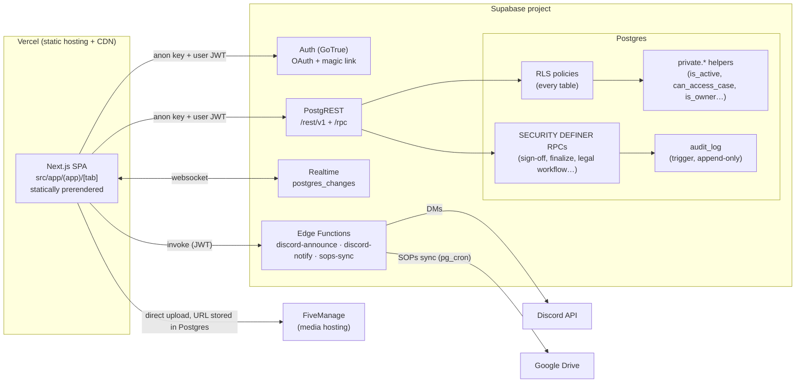

# Architecture — CID Portal

How the application is put together: routing, components, data flow, security
boundaries, and external integrations. For file-by-file depth, follow the
links into the [Developer Handbook](handbook/README.md).

The CID Portal is a case-management, intelligence, and legal-review
platform for a GTA V roleplay Criminal Investigation Division. It organizes
cases, evidence, reports, intelligence, operations, warrants, subpoenas,
approvals, and audit history through role-based workflows enforced by the
database.

---

## 1. The one-sentence model

**The database is the authority; the UI is a convenience.** Every permission
check in React only hides buttons — Postgres Row Level Security (RLS) does
the real enforcement. Every section below is a consequence of that rule.

## 2. System diagram


```mermaid
flowchart LR
  subgraph Vercel["Vercel (static hosting + CDN)"]
    SPA["Next.js SPA<br/>src/app/(app)/[tab]<br/>statically prerendered"]
  end

  subgraph Supabase["Supabase project"]
    AUTH["Auth (GoTrue)<br/>OAuth + magic link"]
    REST["PostgREST<br/>/rest/v1 + /rpc"]
    RT["Realtime<br/>postgres_changes"]
    subgraph PG["Postgres"]
      RLS["RLS policies<br/>(every table)"]
      PRIV["private.* helpers<br/>(is_active, can_access_case, is_owner…)"]
      RPC["SECURITY DEFINER RPCs<br/>(sign-off, finalize, legal workflow…)"]
      AUD["audit_log<br/>(trigger, append-only)"]
    end
    EF["Edge Functions<br/>discord-announce · discord-notify · sops-sync"]
  end

  FM["FiveManage<br/>(media hosting)"]
  DISC["Discord API"]
  GD["Google Drive"]

  SPA -->|"anon key + user JWT"| AUTH
  SPA -->|"anon key + user JWT"| REST
  SPA <-->|websocket| RT
  SPA -->|"direct upload, URL stored in Postgres"| FM
  SPA -->|"invoke (JWT)"| EF
  REST --> RLS
  RLS --> PRIV
  REST --> RPC
  RPC --> AUD
  EF -->|DMs| DISC
  EF -->|"SOPs sync (pg_cron)"| GD
```

## 3. Routing — the `[tab]` SSG model

The whole app is one dynamic route:
[`src/app/(app)/[tab]/page.tsx`](../src/app/(app)/[tab]/page.tsx).

- `generateStaticParams()` returns every key of `PAGE_META`
  ([`src/lib/nav.ts`](../src/lib/nav.ts)), so **every tab is statically
  prerendered** at build time — the "server" side of the app is a static
  shell on Vercel's CDN.
- The page component is a switch: each known tab renders its feature view
  inside `<Suspense>` with a `ViewPlaceholder` fallback.
- Fallbacks: `/reports` redirects to `/cases`; any unknown slug redirects to
  `/command`.
- `nav.ts` is a three-way contract (PAGE_META keys = URL slugs = TAB_LABEL
  keys) plus the `[tab]` switch — see
  [Handbook Ch. 3, Block 2](handbook/03-architecture.md).
- **Investigative Tools**: the former Intelligence category's 14 tool slugs
  (`/persons`, `/bolo`, … — the list is `TOOL_TABS` in
  [`src/lib/toolsModel.ts`](../src/lib/toolsModel.ts)) stay prerendered but
  render `ToolTabRedirect`, a client shim that forwards into the workspace at
  `/tools?tool=…&record=…` with every other query param preserved — old deep
  links, bookmarks and notification links keep resolving. `/tools` renders
  `ToolsView` ([`src/components/tools/`](../src/components/tools)): a grouped
  tool directory plus a keep-alive multi-tab strip — open tabs stay mounted
  (inactive ones `display:none`), the active tab mirrors into the query
  string, and open tabs persist per user in sessionStorage as **ids only**,
  restored with titles re-fetched through the RLS-scoped client (a row the
  viewer cannot see closes its tab silently). The tool views are code-split
  in `tools/toolRegistry.tsx` rather than imported by the `[tab]` page;
  permissions and RLS are untouched — this layer is navigation only.

- **Portal Improvements routes** (Phases 3, 7, 8 — all `PAGE_META`
  leaves except the last): `/workspace` — the unified workspace (§14);
  `/action` — the Action Center (`ActionCenterView`, one queue store shared
  with My Dashboard and the Command Center — [AUTHORIZATION §19](AUTHORIZATION.md));
  `/trash` — the Trash (`TrashView`, Oversight category next to `/audit`;
  §16); and **`/m/cases/[id]`** — the one route outside the `[tab]` pattern:
  a Next dynamic segment (`src/app/(app)/m/cases/[id]/page.tsx`, a client
  component reading `useParams()`) rendering `MobileCaseView` with the shell
  chrome reduced to a top bar (case number, "Open on desktop"). The
  workspace `router.replace`s a narrow viewport (`useNarrow`) to
  `/m/cases/<id>?s=<section>` unless the tab's
  `sessionStorage['cid:desktop-on-mobile']` flag is set, and `/cases?case=`
  on a phone lands there too (`src/components/mobile/mobileCaseRoute.ts`).
  The route embeds no data and needs no `force-dynamic`; RLS answers the
  case after mount exactly as the desktop tab does.

There are **no custom API routes** — no `route.ts` files exist under
`src/app`. The app's "API" is Supabase's auto-generated REST layer plus
database RPCs; see [Handbook Ch. 7](handbook/07-api.md).

## 4. Component organization

| Location | Contents |
| --- | --- |
| `src/components/<feature>/` | One folder per domain (cases, legal, justice, operations, owner, devdocs, command-center, …). Feature views share a uniform shape: fetch on mount + realtime version bump → `refresh()`; permission-gated buttons; fresh-mounted modals; toasts + Undo for deletes. |
| `src/components/tools/` | The Investigative Tools workspace (`/tools`): tool directory, keep-alive tab strip, the legacy-route redirect shim, and the lazy per-tool component registry. |
| `src/components/ui/` | Shared primitives (Modal, Toaster, dialog host, headers, …) everything is assembled from. |
| `src/components/shell/` | The constant chrome (`AppShell`, sidebar, nav badges, the ⌘K `SearchPalette`, the notifications bell, and `CreateHost` — the universal "+ Create" provider that lazy-loads the registry views' exported create modals via `useCreate()`). |
| `src/components/shared/` | Cross-feature record widgets — `LinkEditPopover` (relationship-link editing), `RecordSearchPicker` (the bounded entity-search combobox; loaders from `lib/entitySearch`, keyboard kernel in `useListboxNav`), `LinkedPersonPanel` (case link form's registry-profile panel + completion choice), `DuplicateMatches`, `PinButton`, `RecordPeekButton`. |
| `src/components/auth/` | The `Gate` screens (login, pending approval, retry, setup). |
| `src/lib/` | Domain libraries and infrastructure — data access, auth, realtime, sign-off vocabulary, the central status registry (`status.ts`, rendered by `ui/StatusBadge`), record previews (`entityPreview.ts` → `ui/RecordPeek`), the entity-search and autofill layer (`entitySearch.ts` — bounded per-kind picker queries; `autofill.ts` — blank-protected fill-the-gaps invariants), the per-user personalization layer (`pins.ts`, `recents.ts`, `userDrafts.ts`, `savedViews.ts`), notification actions (`notifications.ts`), form schemas, exports. |

The [Handbook Ch. 6](handbook/06-components.md) catalogs the reusable
building blocks; [Ch. 5](handbook/05-pages.md) maps every URL to its
components, data, and permissions.

## 5. Server/client boundaries

This is an SPA. The Next.js build produces static HTML shells; everything
interactive is client-side:

- [`src/app/(app)/layout.tsx`](../src/app/(app)/layout.tsx) is a client
  component that wraps every tab in `AuthProvider` and the `Gated` switch —
  non-authenticated states render the `Gate` screen *instead of* the shell.
- All data access happens in the browser through `@supabase/supabase-js`
  ([`src/lib/supabase.ts`](../src/lib/supabase.ts)) using the **publishable
  (anon) key only** — public by design; a `service_role` key must never
  appear anywhere in this app.
- There is no server-side session, middleware auth, or hand-written HTTP
  endpoint. Client gating is UX only; **RLS is the authority for every data
  access** (the comment at the top of `auth.tsx` says exactly this).

## 6. Supabase integration — RLS as the sole authority

- **Every table has RLS**; policies key on `auth.uid()` through helper
  functions in the `private` schema (`is_active`, `can_edit`,
  `can_access_case_row`, `is_owner`, command checks). See
  [Handbook Ch. 8](handbook/08-database.md) and
  [`supabase/README.md`](../supabase/README.md) for the RBAC model
  (role × bureau, deny-by-default for new sign-ins).
- **SECURITY DEFINER RPC pattern**: server-authoritative workflows — the
  case sign-off chain, report finalize/reopen, membership review, joint
  cases, announcements, the entire DOJ legal workflow — run through
  SECURITY DEFINER functions that run privileged and then check the caller
  inside. All of them pin `set search_path = ''` and schema-qualify
  references. Lockdown triggers reject direct client writes to the columns
  those RPCs own. The full RPC inventory lives in
  [`supabase/README.md`](../supabase/README.md) and
  [Handbook Ch. 7](handbook/07-api.md).
- **Justice/legal tables are SELECT-only for clients** — every write path is
  an RPC. DOJ roles live in `justice_memberships`, a separate identity
  domain from the CID `app_role` enum.
- **No Supabase Storage** — media is stored as external (FiveManage) URLs in
  Postgres; there are no buckets or storage policies.

### Case data ownership

One owner per concept — every case-workspace surface reads/writes exactly one
of these homes (per the case-ecosystem audit):

- **Identity** (number, title, status, bureau, lead) → `cases`.
- **Assignments** → `case_assignments` (lead pointer stays on `cases`).
- **Narrative** (investigative reports, warrant reports) → `reports`.
- **Visual** (photos, clips, documents) → `media`.
- **Working notes** (informal scratchpad, no history) → `cases.notes` —
  edited on the Intel & Notes tab.
- **Structured intel** (person/gang/place/narcotic links with role + note) →
  `case_intel_links` — the Intel & Notes tab is the ONE editor; the Graph tab
  is a read-only view of the same rows.
- **Chat** → `case_messages`.
- **Charges** → `cases.charges` jsonb (static penal catalog in `lib/penal`).
- **Tasks** → `case_tasks`.
- **Legal** (warrants/subpoenas) → `legal_requests` (RPC-only writes) — the
  case Legal tab renders only the viewer's own RLS-scoped rows.
- **Approvals** → `case_signoff_history` (+ RPC-owned pointers on `cases`).
- **Blockers** → `case_blockers`.
- **Timeline** → derived (re-reads evidence/reports/tasks/history; owns
  nothing).
- **Graph** → derived (reads the canonical links + case rows; persists only a
  per-device layout).

## 7. Authentication lifecycle

[`src/components/auth/Gate.tsx`](../src/components/auth/Gate.tsx) renders
whichever screen matches the state machine in
[`src/lib/auth.tsx`](../src/lib/auth.tsx):

| Gate state | Meaning | Screen |
| --- | --- | --- |
| `loading` | first evaluation in flight | initializing |
| `setup` | Supabase env missing/placeholder | setup notice |
| `out` | no session | login (Google/Discord OAuth, email magic link) |
| `pending` | signed in but profile missing, inactive, or `login_denied` | pending-approval / denied screen |
| `error` | profile fetch failed (network blip) | retry screen — deliberately **not** `pending` |
| `in` | active member (or active justice identity) | the app |

Details that matter:

- `onAuthStateChange` drives everything — `INITIAL_SESSION` on subscribe
  covers boot, and later events (sign-in, sign-out, hourly token refresh)
  re-run `evaluate()`. Evaluations are sequence-guarded so a stale result
  never overwrites a newer one.
- A user with an **active justice membership but no active CID profile**
  passes the gate into the Justice portal (`JusticeShell`) — never the CID
  shell. `login_denied` blocks both identities. *(Retired 2026-07-22: justice
  memberships are deactivated and the Justice portal is removed — see
  [DOJ-INTEGRATION.md](DOJ-INTEGRATION.md) Phase-1 banner; legal approval is now
  Bureau Lead+.)*
- `profiles.email` is column-granted to command only, so profile reads use
  the explicit `PROFILE_COLS` projection; a member's own email comes from
  the auth session.
- Sign-out tears down cached identity and all realtime channels so a
  different account on a shared browser inherits nothing.
- `is_owner` is granted via SQL only — a trigger blocks any client write.

More depth: [Handbook Ch. 9](handbook/09-auth.md).

## 8. Data flow and state management

- **[`src/lib/db.ts`](../src/lib/db.ts) is the only sanctioned path to the
  database.** The contract: `list()` throws; mutations return `{ error }`;
  `updateWhere` returning zero rows with no error means the predicate
  matched nothing (RLS-blocked or lost race) — treat as failure; `withRetry`
  is reads-only; `remove()` on a soft-deletable table routes to the
  `soft_delete` RPC, and `src/lib/deleteRecord.ts` is the one delete helper
  ("<Label> deleted · In Trash" — Undo is `restore_record`; §16).
- **State lives in small zustand stores co-located with their domain** —
  realtime version counters (`lib/realtime.ts`), toasts (`lib/toast.ts`),
  the roster cache (`lib/profiles.ts`), watchlist, operations, the dialog
  host, and the Owner Console vitals. There is no global app store.
- **Device preferences** (accent, density, list view modes, the ids-only
  recents trail) persist in one localStorage blob (`cid-portal-v3`,
  [`src/lib/store.ts`](../src/lib/store.ts)).
- **Per-user cross-device state** lives in three owner-only tables (RLS
  admits only the owner; no audit triggers, no realtime, size-capped
  jsonb): `user_pins` (pinned records — [`src/lib/pins.ts`](../src/lib/pins.ts)),
  `user_drafts` (autosaved drafts with a per-user local mirror and the
  Saving/Saved/Offline `SaveState` chip —
  [`src/lib/userDrafts.ts`](../src/lib/userDrafts.ts)), and `user_prefs`
  (saved views — [`src/lib/savedViews.ts`](../src/lib/savedViews.ts) — and
  notification mutes — [`src/lib/notifications.ts`](../src/lib/notifications.ts)).
  Rows referencing records store **ids only**; titles are re-resolved
  through the viewer's RLS at render, so lost access hides entries.
- Feature views fetch on mount and refetch when their table version bumps —
  see [Handbook Ch. 10](handbook/10-state.md).

## 9. Realtime

[`src/lib/realtime.ts`](../src/lib/realtime.ts) is a subscription registry:

- One channel per table (`rt_<table>`), registered at most once per authed
  session — remounting views never double-subscribes.
- Every `postgres_changes` event bumps a per-table **version counter** in a
  zustand store; components call `useTableVersion(table)` and refetch when
  the number moves. No payloads are consumed — the model is
  *notify-then-refetch*, which keeps RLS the single read path.
- Teardown on sign-out: `supabase.removeAllChannels()` (auth layer) +
  `resetRealtime()`.
- A table must be in the Supabase realtime publication for events to arrive;
  forgetting that is the classic "screen only refreshes on remount" bug
  ([Handbook Ch. 3, Block 5](handbook/03-architecture.md)).

## 10. File uploads — Supabase Storage (evidence) and FiveManage (legacy)

Since the platform upgrade the case's **Evidence & Media** tab uploads to the
private `case-evidence` bucket (`case/<case>/<media>/<file>`, RLS on
`storage.objects`, 300 s signed URLs) after hashing the file in the browser,
then registers it through `evidence_register` — the integrity, custody and
derivative story in [PLATFORM-UPGRADE.md §5–§6](PLATFORM-UPGRADE.md) and
[UPLOADS.md](UPLOADS.md). Four more private buckets hold packets, generated
documents, source snapshots and personal exports. FiveManage remains the
legacy host: [`src/lib/fivemanage.ts`](../src/lib/fivemanage.ts) uploads photo/video/audio
files **directly from the browser** to the FiveManage API and returns the
hosted URL, which the Media Vault and Case Files views store in Postgres
alongside their tags. The API token is public by design (referrer-bound on
FiveManage's side), provided via `NEXT_PUBLIC_` env. If absent, uploads are
disabled and the views fall back to paste-a-URL.

## 11. External integrations — Edge Functions

Six Deno functions live in [`supabase/functions/`](../supabase/functions/)
(see [DEPLOYMENT.md](DEPLOYMENT.md) for how they ship):

| Function | Trigger | What it does |
| --- | --- | --- |
| `discord-announce` | Browser invoke (JWT) after `publish_announcement()` | One rate-limited Discord DM sweep for a published announcement. Recipients are read back from the notifications the RPC already created, so Discord delivery can never disagree with the portal fan-out. Author-only; verifies the caller's JWT and active profile server-side. |
| `discord-notify` | Browser invoke (JWT) | DMs a single member via the Discord bot. Verifies the caller is active and that a matching in-app notification was just created (no forgery). |
| `sops-sync` | `pg_cron` schedule via `pg_net` | Pulls Google Docs from a shared Drive folder into `documents(folder='SOPs')`. Config comes from the `app_secrets` table (RLS deny-all to clients); idempotent upserts keyed by Drive file id. |
| `jobs-runner` | `private.jobs_kick()` via `pg_net` on every enqueue + every 2 min | Checks `x-jobs-secret` against `app_secrets.JOBS_SECRET`, then claims up to five `background_jobs` (`job_claim`, service role) from the kinds it implements — evidence verify / derive, packet render, bundle build, source fetch (guarded), document extract (PDF / text), search sync, embeddings, health probe — with a 50 s budget each; kinds it cannot run are left for the optional worker. |
| `semantic-query` | Browser invoke (JWT) when flag `semantic_search` is on | Embeds the query with the server-side provider key and calls `hybrid_search` **under the caller's JWT** — RLS applies; `503 unavailable` without a provider. |
| `search-query` | Browser invoke (JWT) when flag `meilisearch` is on | Fetches Meilisearch candidates with the server-side key and re-authorises every hit through `search_authorize` **under the caller's JWT**; `503 unavailable` without `MEILI_URL`. |

Both Discord functions use the service-role key **inside the function only**
and require `DISCORD_BOT_TOKEN`; without it they no-op. The client
publishable key is never involved in service-role writes.

## 12. Integration architecture — the city bridges (dormant)

The portal is prepared for — but not connected to — the city (a GTA V FiveM
server). **Nothing in this section is live**; it documents the current
dormant surface and the future shape it was built for. Contracts:
[archive/MDT-BRIDGE-CONTRACT.md](archive/MDT-BRIDGE-CONTRACT.md) (patrol lane) and
[integration/CID-INTEGRATION-API.md](integration/CID-INTEGRATION-API.md)
(CID lane); developer handoff:
[`integration-package/`](../integration-package/README.md); handbook depth:
[Handbook Ch. 21](handbook/21-integration.md).

### Current state

The only integration surface that exists today is the **patrol bridge** —
three SECURITY DEFINER functions whose EXECUTE is granted to `service_role`
only (revoked from `authenticated`/`anon`, asserted by the RLS suite), so
they are unreachable from the app runtime and from any browser:

- `mdt_patrol_feed()` — outbound: a nine-column structural allowlist
  (snapshot text only — no case ids, no entity FKs; sensitive CID/SIB data
  cannot cross by construction).
- `bridge_ingest_event(...)` — inbound: automated surveillance observations,
  idempotent on `(source, source_event_id)`, quarantine-not-discard,
  always unverified until detective review.
- `mdt_bridge_ack(...)` — sync bookkeeping on the export/projection rows.

No consumer is deployed; the feed has never been read by a city system.
Alongside it sits the **dormant integration data layer**
(`20261002120000_fivem_integration_prep`): `integration_sources` (caller
registry, ships empty, `enabled` defaults false), `external_links` (generic
CID record → city record reference), `external_storage_refs` and
`external_media_refs` (typed references to city-held storage items and
city-hosted media), `integration_events` (idempotency/audit envelope), and
`external_officer_identities` (city officer → portal profile mapping,
`active` defaults false). Four of the six are fully sealed (RLS on, zero
policies, all privileges revoked); `integration_sources` and
`integration_events` are command/owner **read-only** audit surfaces. No
RPC writes them; no rows exist; no realtime publication.

### Future state

```
FiveM CID app (NUI)              — no secrets, no Supabase access, ever
        │  in-city RPC/HTTP
        ▼
CID Integration Service          — city-hosted, server-side; sole holder of
        │                          the integration secret; rate limits;
        │                          city-side provider adapters
        ▼
Supabase CID backend  ◄────────► OOC portal (this app)
```

**One shared backend** — the in-city app and the OOC portal read and write
the *same* cases, reports and RLS. There is no second copy of CID, no sync
between a "city CID" and a "portal CID", and no city-side cache of portal
data.

**The two-lane rule.** The patrol lane (above) is machine-to-machine,
minimal and sanitized; the CID lane is authenticated, per-officer casework.
The lanes never mix: a patrol MDT never gains CID reach, and the CID lane
never widens the patrol feed's allowlist.

**Per-officer identity.** The CID lane has no shared "game server" actor.
The integration service resolves the city officer through
`external_officer_identities` and mints a short-lived Supabase session for
the mapped profile — every operation runs as `auth.uid()` = that officer,
so SIB compartmentalization, sealed records, bureau scope and audit
attribution hold automatically. Temporary joint-agency officers get
per-case access through the reserved
`case_assignments.assignment_source = 'manual_access'` lane, never a role
change. Raw service-role table writes are **forbidden** — the guard
triggers are `current_user`-based and transparent to service_role; the
machine identity may only call explicitly granted RPCs.

**City-data connection map.** City records stay city-authoritative; CID
stores references, never mirrors:

| City data | CID reference |
| --- | --- |
| Citizens, vehicles, properties, officers, penal code, legal actors | read live via provider interfaces ([`src/lib/integration/providers.ts`](../src/lib/integration/providers.ts)); linked via `external_links` `(source, external_type, external_id)` |
| Physical storage / evidence items | `external_storage_refs` (case pointer + frozen custody facts) |
| City-hosted media | `external_media_refs` (durable URL pointer, never a copy) |

The ownership principles: **one canonical CID backend** (this Supabase
project), **one canonical city backend** (the FiveM server's own systems),
both UIs sit on their authoritative service, external references connect
them, and snapshots are deliberate — explicit, labeled, point-in-time
copies (`snapshot`/`*_snapshot`), never implicitly refreshed and never
written back.

**Shared case services.** The operations both interfaces will share are
already server-side: `case_create`, `case_set_status`, `case_set_lead`,
`case_access_decide`, `case_timeline`, `report_create`
(`20261002130000_shared_case_services`; wrappers in
[`src/lib/services/`](../src/lib/services)). The portal calls them today;
a future city lane calls the *same* functions — one implementation per
operation, never two.

Activation — deploying `supabase/functions/cid-integration/`, adding the
activation RPCs, enabling a source — is a separately-reviewed pass; until
then the portal behaves exactly as if none of this existed.

## 13. Owner-only surfaces

Gated by `profiles.is_owner` in the UI and `private.is_owner()` in RLS:

- **Owner Console** (`/owner`, [`src/components/owner/`](../src/components/owner)) —
  `?s=` sections grouped Overview / Operations / Safety / Reference: the
  owner dashboard (warnings, pending queue, recent administrative changes),
  Portal Management (SIB release gate, runbook), Roles & Access (justice
  grants, test-fixture flagging), Feedback & Bugs triage, Permanent
  Deletion + the deletion ledger, **Security & Audit** (client errors, and
  `security_test_runs` via the `owner_security_overview()` RPC: recent
  RLS-suite runs, live fixture health, leftover test-data counts), System
  Health (DB round-trip, env, realtime, live row counts) and Handbook &
  Reference (deep links into the Developer Handbook; the former static
  documentation walls live there now). Legacy `?s=` values redirect.
- **Developer Handbook in-app** (`/devdocs`,
  [`src/components/devdocs/`](../src/components/devdocs)) — generated from
  `docs/handbook/` by `npm run gen:handbook`; CI fails if the generated copy
  drifts.
- **Audit Log** (`/audit`) — the append-only `audit_log`, exportable to CSV.
- **Owner-only RPCs** — e.g. the v1.15 warrant import
  (`import_legal_warrant` / `import_rollback_by_key`).

## 14. Unified workspace

Since Phase 3 (P3-02) cases, records and tools open **side by side in one
tab strip** at `/workspace` ([`src/components/workspace/`](../src/components/workspace)):
`WorkspaceProvider` owns the open tabs (persisted per user as **ids only**,
titles re-resolved through the RLS-scoped client on restore — a row the
viewer can no longer read closes its tab silently), `WorkspaceView` renders
the active tab, and a case tab is `CaseDetail` in embedded mode with
`CaseSectionSwitcher` over the `CASE_TABS` registry. The stable addresses
stay `caseLink()` / `/cases?case=X&tab=Y` and `/tools?tool=…&record=…`, which
redirect into the workspace so notifications, bookmarks and deep links keep
resolving. The P3-07 states — a missing case (`MissingCaseState`), a
soft-deleted one (`DeletedCaseNotice`) and one the viewer cannot read
(`AccessRequestPanel`, never a title or number) — are rendered from what the
RLS-scoped read returns, never from a client guess. Archived cases are
read-only **at RLS** (`private.case_writable`, P3-05); the UI mirrors it.
Detail: [WORKFLOWS §3](WORKFLOWS.md), [AUTHORIZATION §15](AUTHORIZATION.md).

## 15. Permission module (server + client)

One question, one answer, asked in two places. **Server**
(`20261005120000_permission_module`): `permission_catalog` is the seeded
table of every `(action, kind)` the portal knows, with the rule in prose and
the RLS suite that pins it; `public.my_permissions()` answers the viewer's
access class, role, bureau, standings, expiries and flags in one round trip;
`public.can_record(action, kind, id)` answers a per-row question through
`private.perm_dispatch`, which routes to the same `private.*` predicates the
policies use (a case, a registry row, a legal request, a report, a field
submission, an action item, the Trash). A refusal is recorded either by
returning `{ok:false, code}` after `private.perm_deny` or by raising through
`private.perm_raise` (SQLSTATE `P0403`), which `src/lib/db.ts` acknowledges
once through `perm_denied_ack`. **Client** (`src/lib/permissions/`, P1-08):
`usePermissions()` is server-first over `my_permissions()` (`NO_ACCESS` until
it resolves), `can(action, kind)` reads the generated matrix
(`src/lib/permissionsMatrix.ts`, `npm run gen:permissions`), `canRecord()`
asks the server, and the pure mirrors in `mirrors.ts` / `sibMirrors.ts` only
hide buttons — `parity.test.ts` pins them against the matrix; an ESLint rule
refuses a predicate imported from `roles.ts` / `siu.ts`. Detail:
[AUTHORIZATION §6 and §13](AUTHORIZATION.md).

## 16. Versions, Trash and permanent deletion

Nothing a browser session does destroys a row. **Soft delete** (Phase 1):
every soft-deletable table (27 kinds — 15 registries, 10 case tables, case
notes and case links) carries `deleted_at / deleted_by / delete_reason /
delete_batch`; the client `DELETE` privilege is revoked and a non-definer
trigger freezes the lifecycle columns, so the only paths are
`public.soft_delete(kind, id, reason)` (cascading to the record's exclusive
children under one batch) and `public.restore_record` (a child comes back
only under a live parent — `parent_deleted`). `src/lib/db.ts` filters those
tables to live rows and routes `remove()` through the RPC;
`src/lib/deleteRecord.ts` is the one delete helper (the toast "<Label>
deleted · In Trash" with **Undo** and an "Open Trash" link; Undo is
`restore_record`, so it still works after the toast is gone; only case
templates, commendations and case assignments keep a plain confirmed
remove / unassignment).
**The Trash** (Phase 8, `20261102120000`): `public.trash_list(kind?, limit)`
walks every kind and returns the rows the caller could restore
(`perm_dispatch('restore')` — a detective their own case material, command
the deleted rows of their cases, the Owner everything), labelled and tied to
their case — a case child only while the caller can still read the case,
restricted media for the Owner alone — ≤ 500 newest first; `trash_count()`
(counted to 100) feeds the Sidebar badge;
`/trash` renders it (`TrashView`, refreshed on focus / after an action / every
60 s — the underlying tables are too many for `useTableVersion`).
**Versions** (P1-05): `record_versions` rows are written by a definer trigger
on every covered UPDATE (five-minute same-actor coalescing) and read under
the parent's own SELECT policy; `record_history` lists them and
`restore_version` writes a version's fields back as a **new** version with a
reason (`RecordHistory` — field changes, Compare, Restore this version;
`VersionViewer` stays for SOP document versions; a draft legal request
offers Compare only). **Permanent deletion**
(P1-07 / P8-03) is the Owner's armed protocol alone — preview → arm (fresh
session, reason, token) → execute (typed `DELETE <label>`) — over
`permanent_delete_record_*`, run inline from a Trash row
(`RecordPermanentDelete`, the Owner's "Permanently delete…") and linked
from the Owner console; storage objects are
enumerated for the client to remove. Detail: [AUTHORIZATION §8–§12 and
§20](AUTHORIZATION.md), [WORKFLOWS §13–§14](WORKFLOWS.md).

## 16a. The Confidential Informant compartment

A **compartment inside CID** (`20261103120000_confidential_informants`),
governed by one predicate — `private.can_access_ci(ci) =
has_full_ci_access() or ci_is_active_handler(ci)` — and one discipline: a
caller who is not authorized gets **nothing** (null, zero rows, no tab, no
nav item), never a placeholder or a lock. Fourteen tables carry SELECT
policies only; every write is a definer RPC (`ci_*`, thirty-five of them plus
the fixture runner); audit goes to the compartment's own immutable
`ci_audit_events` and **never** to `audit_log` (which `case_audit_feed`
surfaces to every case reader); realtime is the ids-only shadow table
**`ci_events`** (`id, ci_id, user_id, kind, at`, in the publication, read
behind `can_access_ci`) — `useTableVersion('ci_events')` refetches the
roster, the profile and `ci_context`; notifications are the nine registry
kinds with `destination: 'portal'` (never a Discord DM). `persons` gets no
column; the person stays an ordinary person everywhere. Detail:
[AUTHORIZATION §21](AUTHORIZATION.md), [WORKFLOWS §15](WORKFLOWS.md).

**Routes and surfaces.** `/informants` (`PAGE_META.informants`, label
*Informants*, Investigations category) renders `InformantsView`
(`src/components/informants/**`, Client A) behind `useCiContext()` —
`src/lib/ci.ts`'s module-level store, ONE `rpc('ci_context')` per session,
refetched on `ci_events` bumps and auth change, any error → `NO_CI`. Not
involved → the ordinary "Nothing here." surface (the `/siu` idiom — no
mention of informants); the nav leaf renders only when `ciInvolved(ctx)`
(Sidebar / Subtabs / BottomNav). A handler sees *My Informants: n / 6*
(`capacityLabel`), the cards and only the rows `ci_list` returned; full access
sees the stat strip (`ci_stats`), the roster, the Handler Capacity panel and
the request queue. `?ci=<id>` opens `CiProfile` (a null `ci_get` → the same
"Nothing here."); `?requests=1` the requests panel. Visits are never pushed
to recents or pins. **The case `ci` tab rule:** `CaseDetail` adds the *CI
Intelligence* tab (Investigation group, after Intel) with `count =
useCiCaseCount(caseId)` — fetched through `ci_case_counts` only when
`ciInvolved`, constant 0 otherwise with no request — and the tab exists
**only when the count is > 0**: a tab with a 0 / null count is not in
`tabDefs` at all (no lock, no placeholder, never in the More… overflow; the
mobile route excludes it). What every case reader sees instead is
`CaseReleasedIntel` on the Intel tab — `case_intel_releases` rows (the
sanitized release, no CI column), rendering nothing when empty. The person
dossier's `PersonCiPanel` renders nothing on a null `ci_person_status`; the
command palette adds `ci_search` hits only for an involved caller; the Action
Center gains *CI contact due* / *CI requests* / *CI follow-ups* fetched only
when involved. Tests: `tests/rls/v191a–c`, `src/mocks/handlers/ci.ts`,
`tests/e2e/informants.spec.ts`.

## 16b. The platform services tier

The platform upgrade ([PLATFORM-UPGRADE.md](PLATFORM-UPGRADE.md), migration
`20261105120000`) adds a **services tier that the portal does not depend
on**. Everything long-running is a `background_jobs` row; the in-Supabase
`jobs-runner` drains the lightweight kinds and an optional BullMQ worker
(`workers/`, `docker-compose.yml` with Redis, Stirling PDF, Crawl4AI,
Docling, Meilisearch) drains the rest. Evidence lives in private buckets
with client-side SHA-256, a hash-chained custody ledger and immutable
originals; packets and bundles ship with manifests; documents get page
text, tools and search; external sources are crawled behind an SSRF policy
into versioned snapshots; one INVOKER `graph_expand` feeds a Cytoscape graph;
search is exact (FTS) → index (Meilisearch candidates re-authorised in
Postgres) → semantic (pgvector) fused by RRF; feature flags gate every
optional piece; `system_health()` reports it all to the Owner. Client code
talks to adapters in `src/lib/services/` (pdf, documents, crawler, search,
queues, telemetry) and never to a provider. The CI rule and the restricted /
SIU / sealed exclusions are applied server-side before any document, index,
chunk, node or notification exists ([AUTHORIZATION.md §22](AUTHORIZATION.md)).

## 17. Scheduler (pg_cron jobs)

`20261004130000_scheduler_pg_cron` declares the scheduler in the repo:
`pg_cron` + `pg_net`, the `scheduled_job_runs` ledger (Owner-readable) and
`private.job_begin(name)` / `job_end(run, status, detail)` around every job.
The jobs — `sops-sync` (15 min, Drive → SOPs through pg_net),
`audit-chain-verify` (daily), `record-versions-prune` (daily),
`access-grant-expiry-sweep` (hourly), `siu-reconcile-scan` (15 min),
`legal-sweep` (hourly), `action-escalation-sweep` (hourly),
`ci-contact-sweep` (hourly, :40 — overdue and silent sources), and since the
platform upgrade `background-jobs-kick` (2 min), `background-jobs-reap`
(5 min), `evidence-integrity-sweep` (daily), `external-source-recheck`
(daily) and `health-probe` (10 min) — each wrap a
`private.*` sweep, notify through the same test-actor-suppressing notifiers
the RPCs use, and are idempotent so a manual re-run after a cron gap is
safe. The Owner-only manual runners (`legal_sweep_run()`,
`action_escalation_run()`, `ci_sweep_run()`) and the fixture-scoped
`rls_test_escalation_run` / `rls_test_ci_sweep`
let a gap be closed and the suites test the ladder without touching a
production rule. The table of schedules, what each does and how to re-run
it lives in [OPERATIONS.md §6 "Scheduled jobs"](OPERATIONS.md).

## 18. Where to go deeper

| Topic | Reference |
| --- | --- |
| The dormant city bridges and their contracts | [Handbook Ch. 21](handbook/21-integration.md), [archive/MDT-BRIDGE-CONTRACT.md](archive/MDT-BRIDGE-CONTRACT.md), [integration/CID-INTEGRATION-API.md](integration/CID-INTEGRATION-API.md) |
| The nine architecture blocks, risks, common mistakes | [Handbook Ch. 3](handbook/03-architecture.md) |
| Every feature's end-to-end data flow | [Handbook Ch. 4](handbook/04-features.md) |
| Every RPC and its caller checks | [Handbook Ch. 7](handbook/07-api.md), [`supabase/README.md`](../supabase/README.md) |
| Tables, policies, triggers | [Handbook Ch. 8](handbook/08-database.md) |
| Security model and residual risks | [Handbook Ch. 18](handbook/18-security.md), [archive/HARDENING.md](archive/HARDENING.md) |
| Deploying and operating all of this | [DEPLOYMENT.md](DEPLOYMENT.md), [OPERATIONS.md](OPERATIONS.md) |
| Who may do what, phase by phase (permission module, soft delete, versions, Trash, Action Center, the CI compartment) | [AUTHORIZATION.md §6–§21](AUTHORIZATION.md), [RLS.md](RLS.md) |
| The platform services tier — evidence integrity + custody, packets + manifests, documents, external sources, the graph, search tiers, jobs, flags, health; the decision matrix and the feature matrix | [PLATFORM-UPGRADE.md](PLATFORM-UPGRADE.md), [AUTHORIZATION.md §22](AUTHORIZATION.md), [WORKFLOWS.md §16–§18](WORKFLOWS.md), [OPERATIONS.md §11](OPERATIONS.md), [Handbook Ch. 24](handbook/24-platform-services.md) |
| Confidential informants — the compartment, capacity, sanitized release, what a case member sees | [AUTHORIZATION.md §21](AUTHORIZATION.md), [WORKFLOWS.md §15](WORKFLOWS.md), the Portal User Guide (`/guides/user-guide`), [Handbook Ch. 23](handbook/23-confidential-informants.md) |
| The Trash, history and the phone-first case route as a user sees them | the Portal User Guide (`/guides/user-guide`), [WORKFLOWS.md §13–§14](WORKFLOWS.md), [Handbook Ch. 22](handbook/22-versions-trash.md) |
