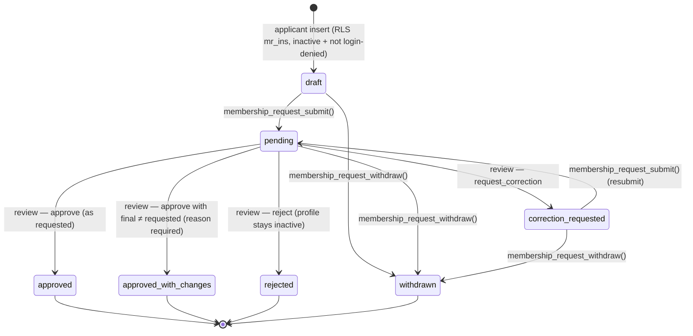
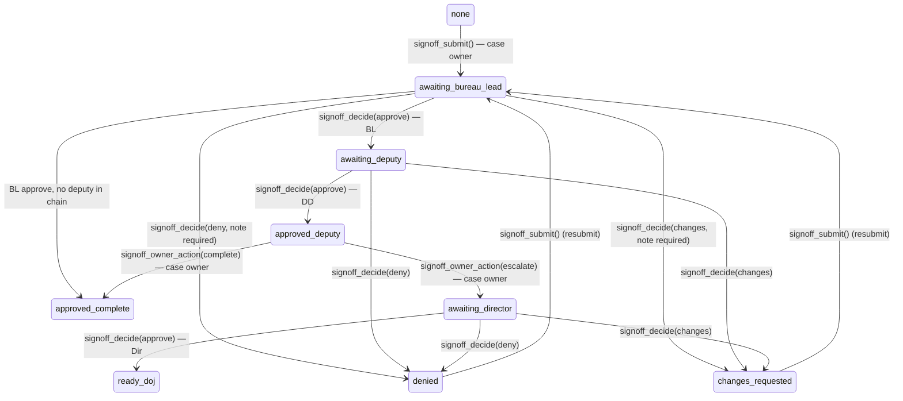
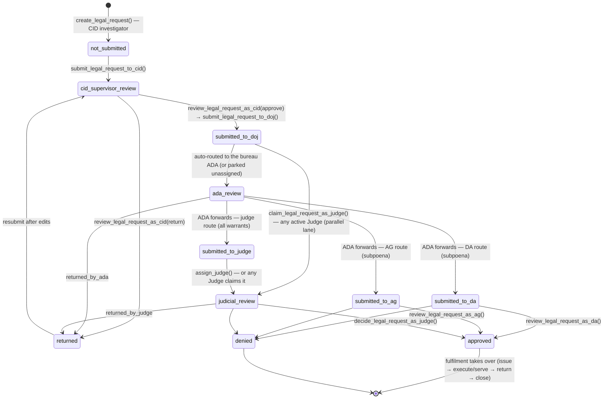
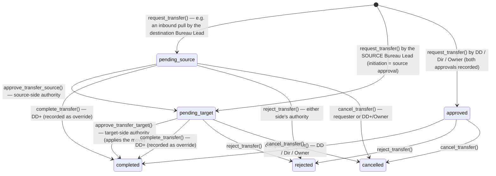
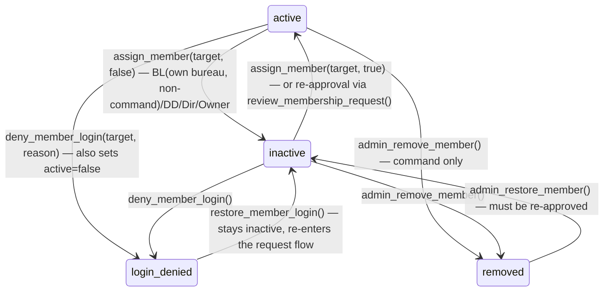

# Workflows & State Machines

Every state machine in the CID Portal, with who may trigger each transition and which server-side RPC enforces it — the reviewer's companion to [`docs/handbook/04-features.md`](handbook/04-features.md) and [`docs/DOJ-INTEGRATION.md`](DOJ-INTEGRATION.md).

Every approve / deny / return / assignment below is **recorded with the acting member, whose authority is validated server-side**. Transitions run through SECURITY DEFINER RPCs (pinned `search_path`, row locking, explicit state validation) or RLS-checked writes; routing (sign-off assignee selection, ADA routing, default classification) is rule-based, database-driven logic in `private.*` helper functions. Direct client writes to workflow columns are frozen by triggers or missing grants throughout.

Roles: **Det** = Detective, **SrDet** = Senior Detective, **BL** = Bureau Lead, **DD** = Deputy Director, **Dir** = Director, **Owner** = `profiles.is_owner` flag (never an `app_role`). Justice roles (**ADA/DA/AG/Judge**) live in `justice_memberships`, a separate identity domain.

---

## 1. CID membership requests

Migration [`20260713030000_membership_requests.sql`](../supabase/migrations/20260713030000_membership_requests.sql), tightened by the v1.16 unified matrix [`20260718010000_unified_role_policy.sql`](../supabase/migrations/20260718010000_unified_role_policy.sql). One request per applicant (`unique (applicant_id)`); requested bureau locked to LSB/BCB/SAB (JTF is never a permanent department); since v1.16 any normal CID role (detective … director) may be *requested* — requesting grants nothing.

| Transition | Who | Enforced by |
| --- | --- | --- |
| create draft | the applicant (inactive, not login-denied) | RLS `mr_ins` + column-level INSERT grant |
| edit form fields | applicant, while `draft`/`correction_requested` | RLS `mr_upd`; workflow/decision columns frozen by `trg_guard_membership_request` |
| submit / resubmit | applicant | `membership_request_submit()` (blocks login-denied callers; notifies command, suppressed for `rls-test-*` fixtures) |
| withdraw | applicant, from draft/pending/correction_requested | `membership_request_withdraw()` |
| request correction / reject | any active BL/DD/Dir or Owner (never the applicant — self-review rejected) | `review_membership_request()` |
| approve / approve_with_changes | reviewer with **matrix authority over the FINAL role in the FINAL bureau** (below) | `review_membership_request()` → `private.can_assign_cid_role()` |

**v1.16 decision matrix** (`private.can_assign_cid_role`) — used identically by membership review, role changes, and transfers:

| Final role | May be granted by |
| --- | --- |
| Detective / Senior Detective | Bureau Lead **of that bureau**, or DD / Dir / Owner |
| Bureau Lead | DD, Dir, or Owner |
| Deputy Director | Dir or Owner |
| Director | Owner only |

Approval is atomic: request decided + `profiles.role/division/active` flipped + `role_events` (with reason/source) + history + audit + one applicant notification, in one transaction. `approved_with_changes` requires an applicant-visible reason. Command reads the grant-revoked `internal_decision_note` only via `admin_membership_requests()`.

## 2. Justice membership (DOJ / Judiciary)

Migration [`20260714010000_justice_identity.sql`](../supabase/migrations/20260714010000_justice_identity.sql); overview in [DOJ-INTEGRATION.md](DOJ-INTEGRATION.md#identity-model). Same statuses and shape as §1 (draft → pending → correction_requested / approved / approved_with_changes / rejected / withdrawn; same applicant-owned RPC pair `justice_membership_request_submit()` / `justice_membership_request_withdraw()`), but a **separate identity domain**: approval upserts `justice_memberships` and never touches the CID profile.

| Requested / final role | May decide (per `private.can_review_justice_role`) |
| --- | --- |
| Assistant District Attorney | DA, AG, or Owner |
| District Attorney | AG or Owner |
| Attorney General | Owner only |
| Judge | AG or Owner (Owner-only before [`20260731010000`](../supabase/migrations/20260731010000_justice_request_visibility.sql)) |

Decision RPC: `review_justice_membership_request()` (no self-review; authority checked against the requested role, and again against the final role on approval). Deactivation/reactivation of an existing membership: `set_justice_membership_active()` under the same matrix. Reviewers (DA/AG/Owner) read internal notes via `admin_justice_membership_requests()`. CID Bureau Leads cannot approve justice requests; a Judge cannot approve DOJ requests.

## 3. Cases

Two independent dimensions on `public.cases` (see [handbook ch. 4.1](handbook/04-features.md)):

**Status board** — `status ∈ open / active / cold / closed` (`CASE_STATUSES`, `src/lib/signoff.ts`). Moved by a direct RLS-checked `update('cases', {status})` from anyone with case access (`private.can_access_case`: own bureau, lead, creator, command, access grant, or active joint assignment); a trigger stamps `closed_at`.

**Sign-off chain** — a separate `signoff_status`/`signoff_stage` dimension, movable **only** through the sign-off RPCs ([`20260617190100_signoff_server_side_rpcs.sql`](../supabase/migrations/20260617190100_signoff_server_side_rpcs.sql) as hardened by [`20260702170000`](../supabase/migrations/20260702170000_signoff_owner_only_submit.sql), [`20260706140000`](../supabase/migrations/20260706140000_signoff_decide_assignee_access.sql), and [`20260721040000_signoff_integrity.sql`](../supabase/migrations/20260721040000_signoff_integrity.sql), which adds the command-override lane); direct column writes are trigger-blocked. (A case's *bureau* is likewise frozen — moving one is `case_reassign_bureau()`, DD/Dir/Owner only; see [AUTHORIZATION.md §4](AUTHORIZATION.md).)

| RPC | Who | Notes |
| --- | --- | --- |
| `signoff_submit(case)` | the **case owner** — lead detective, or creator when no lead is set | LOA-aware routing: `private.signoff_route(step, bureau)` picks the stage + a non-LOA assignee; fails if no active reviewer exists |
| `signoff_decide(case, approve\|deny\|changes, note)` | active holder of the stage role (BL/DD/Dir) **with case access**, and the assigned reviewer — a Director may override the assignee | deny/changes require a note; every action appends to the append-only `case_signoff_history` |
| `signoff_owner_action(case, complete\|escalate)` | the case owner, only at the `approved_deputy` stop-point | escalate re-routes to an active Director |
| `signoff_command_override(case, complete\|escalate, reason)` | Deputy Director / Director / Owner (never Bureau Lead) | acts in the owner's place at the `approved_deputy` stop-point when the owner is unavailable; reason required, recorded in history with `source='command_override'` ([`20260721040000`](../supabase/migrations/20260721040000_signoff_integrity.sql)) |

## 4. Reports

Reports belong to a case (`private.can_access_case` gates everything). Lifecycle RPCs: [`20260617190200_report_finalize_rpc.sql`](../supabase/migrations/20260617190200_report_finalize_rpc.sql) → versioned by [`20260715010000_report_versions.sql`](../supabase/migrations/20260715010000_report_versions.sql); reopen: [`20260713010000`](../supabase/migrations/20260713010000_report_reopen_rpc.sql) hardened by [`20260713020000_report_seal_hardening.sql`](../supabase/migrations/20260713020000_report_seal_hardening.sql).

- **draft → finalized (sealed)** — `report_finalize(report, badge?)`: any active member with case access. The signature's `signer_id` comes from `auth.uid()` (never client input), and the exact sealed content + signature are frozen as the next `report_versions` row (immutable: no client write grants, UPDATE-blocking trigger; seal v1 → reopen → edit → seal again = v2 with v1 still readable).
- **finalized → draft (logged seal break)** — `report_reopen(report)`: Bureau Lead **of the case's bureau only** (JTF cases shared), DD/Dir unrestricted. The permission check runs before the state check (no probing), and the broken seal is preserved in `fields._reopen_log` (`at`, `by`, `prev_signature`) rather than erased.
- **Lockdown** — `private.block_direct_report_finalize()` rejects any direct client write to `finalized`/`signature`, and locks a finalized report's `fields` entirely.
- **CID warrant-report tracker** (distinct from the DOJ legal workflow in §5): reports on warrant templates carry a `fields._warrant_status` of `draft → signed → executed → returned`, movable only via `warrant_set_status()` (status whitelist, warrant templates only, actor stamped server-side into `fields._warrant_log`).

## 5. Warrants & subpoenas (DOJ legal review)

Full narrative in [DOJ-INTEGRATION.md](DOJ-INTEGRATION.md); server surface in [`20260714040000_legal_workflow.sql`](../supabase/migrations/20260714040000_legal_workflow.sql) + [`20260714045000_legal_workflow_review.sql`](../supabase/migrations/20260714045000_legal_workflow_review.sql). `legal_requests` carries three **independent** status dimensions — every legal table is SELECT-only for clients, so all transitions are definer RPCs:

- `document_status`: `draft / finalized / reopened`
- `review_status`: the review pipeline below
- `fulfilment_status`: post-approval lifecycle (warrant: `unissued / issued / executed / returned / expired / revoked / closed`; subpoena: `served / compliance_pending / records_received / testimony_completed / non_compliance / return_recorded / closed`)

Key rules (all server-enforced):

| Stage | Who / RPC |
| --- | --- |
| Draft + packet | creator: `create_legal_request`, `update_legal_draft`, `add_legal_exhibit` / `remove_legal_exhibit` — reviewers later see **only** the selected exhibits, never the whole case |
| CID supervisor gate | `submit_legal_request_to_cid` → `review_legal_request_as_cid` (source report finalized, required fields, subject or search targets, valid responsible bureau via `private.legal_resolve_bureau`) |
| DOJ intake & routing | `submit_legal_request_to_doj`; auto-assign via `get_routing_ada_for_bureau` (active acting → active primary ADA; missing coverage parks the request — DA/AG/Owner assign via `reassign_legal_ada`) |
| Prosecutor review | `review_legal_request_as_ada` / `_as_da` / `_as_ag`; route per `private.legal_default_route` — **every warrant routes `judge`**; DA/AG/Owner may change a *subpoena's* route with a reason (`set_legal_approval_route`) |
| Judicial decision | `assign_judge` + `decide_legal_request_as_judge` — **warrants are approved only by a Judge**; conflict-of-role checks (`private.legal_is_prosecution_side`) keep prosecution and bench separate; signatures are version-bound |
| Parallel judiciary lane | `claim_legal_request_as_judge` ([`20260805010000`](../supabase/migrations/20260805010000_legal_parallel_judiciary.sql)) — any active Judge may take a judge-routed request straight into judicial review from `submitted_to_doj` or `submitted_to_judge` (no ADA hand-off required); same conflict guards as formal assignment; sealed requests are excluded and keep the explicit-assignment audience |
| Fulfilment (CID side) | `issue_legal_request`, `record_warrant_execution`, `record_warrant_return`, `record_subpoena_service`, `record_subpoena_compliance`, `close_legal_request`, `withdraw_legal_request` (gated by `private.can_fulfil_legal`) |

Every submission freezes an immutable `legal_request_versions` snapshot; reviewers act on the exact `current_version_id`. Classification `standard / restricted / classified / sealed` — warrants default `classified`; **sealed** requests are undiscoverable outside their participant set (SECURITY INVOKER search, generic notifications). Approved+issued **arrest** warrants project an MDT wanted row (`private.mdt_project`; search warrants never do). Historical imports: owner-only `import_legal_warrant()` / `import_rollback_by_key()`.

## 6. Evidence custody

`custody_chain` ([`20260616090000_platform.sql`](../supabase/migrations/20260616090000_platform.sql), scoped by [`20260617140100_bureau_isolation_rls.sql`](../supabase/migrations/20260617140100_bureau_isolation_rls.sql)) is **append-only by construction**: SELECT and INSERT policies only (both requiring `private.can_access_case` on the parent evidence's case), no UPDATE or DELETE policy exists, and inserts are audit-logged. A custody transfer is a new row (`from_officer`, `to_officer`, `reason`, `transferred_by` defaulting to `auth.uid()`, timestamp); history is never edited. Executed warrants attach new evidence through this same system — the legal workflow never mutates originals.

## 7. Joint-case access

Migration [`20260713040000_joint_cases.sql`](../supabase/migrations/20260713040000_joint_cases.sql). A joint case keeps its **originating bureau** (`cases.bureau` never flips to JTF); the JTF designation is the `is_joint_case` display flag, and cross-bureau access flows only through temporary `case_assignments` rows (`assignment_source='joint_case'`).

| Step | Who | RPC |
| --- | --- | --- |
| Convert case → joint + add members | `private.can_manage_joint`: command, the case lead/creator, or an active JTF Case Lead / Co-Lead on the case | `convert_case_to_joint(case, members[])` |
| Add more members (joint role + optional `expires_at`) | same | `joint_case_add_members` |
| Remove a member (reason recorded, history kept via `removed_at/removed_by/removal_reason`) | same | `joint_case_remove_member` |
| End the joint case (closes every active grant, keeps history) | same | `joint_case_end` |

Access is exactly one case: `private.has_joint_access` requires an active, un-removed, **unexpired** joint assignment — expiry is server-enforced at read time, and removal revokes immediately. Direct client `case_assignments` writes are pinned to inert `assignment_source='standard'` rows, so nobody can mint joint access outside the RPCs.

## 8. Operations

`public.operations` groups cases (`cases.operation_id`) under a named operation with `status ∈ open / active / cold / closed` (`OP_STATUSES`, `src/lib/operations.ts`). No dedicated state RPC: standard intel-registry RLS — any active member creates/updates (`private.is_active()`), command deletes (`private.can_delete()`), with delete unlinking cases (`deleteWithUndo` sets `cases.operation_id` null). UI: `src/components/operations/OperationsView.tsx`.

## 9. Officer transfers (v1.16)

Migration [`20260718020000_officer_transfers.sql`](../supabase/migrations/20260718020000_officer_transfers.sql). A deliberate two-sided workflow between permanent bureaus (JTF never a source or destination); one open transfer per member (partial unique index); every write is a definer RPC — the table has no client write policies, and visibility is bureau-scoped (target, requester, the two involved bureaus' leads, DD+/Owner).

| Rule | Enforcement |
| --- | --- |
| Initiate | `request_transfer(target, to_bureau, reason, to_role?)` — BL (rank-and-file members only, and only when one side is their own bureau: outbound *or* inbound pull), or DD/Dir/Owner. **Source lead initiation counts as source approval** (starts `pending_target`); **DD+/Owner initiation starts `approved`**; an inbound pull by the destination lead starts `pending_source` — no lead can unilaterally take another bureau's member |
| Decide a side | `private.can_decide_transfer_side(bureau)`: that bureau's BL, or DD+/Owner. No self-approval at any step |
| Apply the move | `private.transfer_apply` (inside `approve_transfer_target` / `complete_transfer`): re-validates the member is still active, un-removed, login-allowed, and still in `from_bureau`; a riding role change needs matrix authority over the new role in the destination and fails stale if the live role moved; a plain transfer carries the member's **live** role. Writes `role_events` (source `transfer`) + audit + notifications |
| Complete directly | `complete_transfer()` — DD/Dir/Owner only; recorded as `override: true` when approvals were still missing |
| Reject / cancel | `reject_transfer()` (either side's authority) / `cancel_transfer()` (the requester, or DD+/Owner) |

## 10. Account lifecycle (deactivation, login denial, permanent removal, permanent deletion)

Four escalating, reversible-by-design states on `profiles` (plus one irreversible owner-only exception path, below), each with its own RPC; privileged columns (`role/division/active/is_owner/removed_at`) are trigger-frozen against all direct client writes ([`20260718010000`](../supabase/migrations/20260718010000_unified_role_policy.sql)), and deny columns likewise ([`20260713090000_login_denial.sql`](../supabase/migrations/20260713090000_login_denial.sql)).

| State | What it means | RPC & authority |
| --- | --- | --- |
| **Deactivated** (`active=false`) | Loses every `private.is_active()`-gated capability; profile intact | `assign_member(target, set_active)` — since v1.16 activation/deactivation **only** (the legacy role/division arguments were dropped); BL scoped to own-bureau, non-command targets; Owner bypasses |
| **Login-denied** (`login_denied=true`, `active=false`) | Can still authenticate but the app shows an Access-denied screen with the recorded reason, and RLS + `membership_request_submit()` block filing or advancing a membership request — a removed/rejected person cannot simply re-apply | `deny_member_login(target, reason)` — BL (own bureau, non-command) / DD / Dir / Owner; the Owner account can never be denied. Reverse: `restore_member_login()` (clears the block only; member stays inactive) |
| **Removed** (`removed_at` set, `email` nulled) | Permanent removal without deleting rows: access blocked, sign-in email (PII) scrubbed, hidden from the roster, watchlist + case assignments cleared — **authored history and attribution preserved** (reports, evidence, audit rows keep their author) | `admin_remove_member(target)` — command only ([`20260708150000`](../supabase/migrations/20260708150000_permanent_member_removal.sql)); no self-removal; the last active Director cannot be removed. Restore: `admin_restore_member()` — returns **inactive**, must be re-approved |
| **Permanently deleted** (profile + auth row erased; historical FKs repointed to the system tombstone) | The irreversible exception path when a member must be **erased**, not just deactivated — soft remove stays the default. Members referenced by immutable records (legal paper, sign-off history, tracker signatures, report authorship, custody transfers, evidence collection, justice identity, prosecutor assignments) are **hard-blocked** and can only be deactivated; active-work pointers must be reassigned first. An owner-only `deleted_member_ledger` row snapshots identity, reason, the full reference map, and the member's `role_events` history | `permanent_delete_preview()` → `permanent_delete_arm(target, reason)` → `permanent_delete_execute(token, confirm)` — Owner only, each step requiring a **fresh sign-in** (< 5-minute session), a 5-minute single-use token, and a typed `DELETE <display name>` confirmation ([`20260726010000`](../supabase/migrations/20260726010000_phase_b_permanent_deletion.sql); details in [AUTHORIZATION.md §4](AUTHORIZATION.md)) |

Every transition writes `role_events` and/or `audit_log` plus a notification to the affected member.

## Related workflows documented elsewhere

- **Announcements** — audience-targeted publish (`publish_announcement()` resolves recipients server-side; `all` is DD+/Owner-only, bureau audiences are that bureau's lead or DD+, `specific_members` mentions only): [`20260713050000`](../supabase/migrations/20260713050000_announcement_audiences.sql), [handbook ch. 4.5](handbook/04-features.md).
- **Prosecutor bureau coverage** — assignment lifecycle (`assign_ada_to_bureau`, `set_primary_ada`, `set_acting_ada`, `end_ada_bureau_assignment`; append-only, assignments end rather than delete): [DOJ-INTEGRATION.md](DOJ-INTEGRATION.md#bureau-aligned-ada-coverage).
- **Feedback triage, SOP versioning, shift reports** — [handbook ch. 4](handbook/04-features.md).
