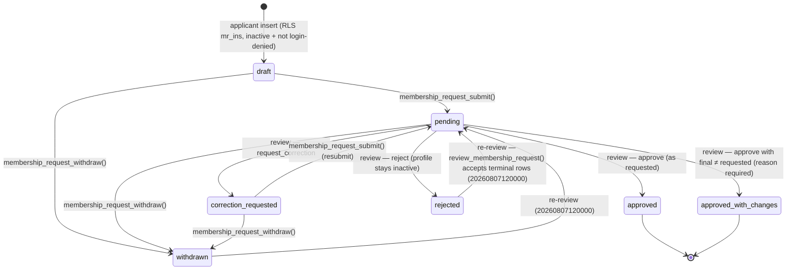
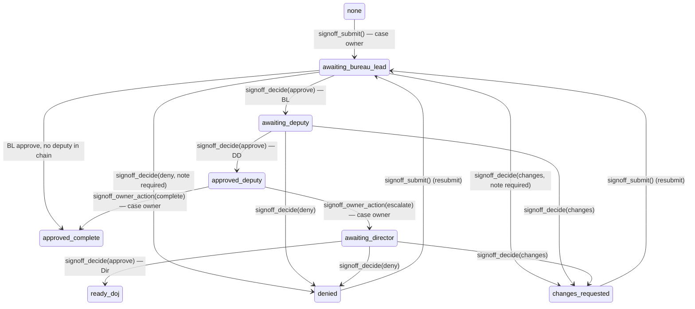
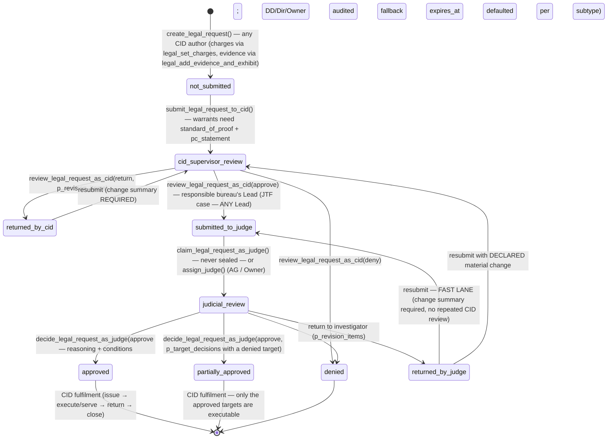
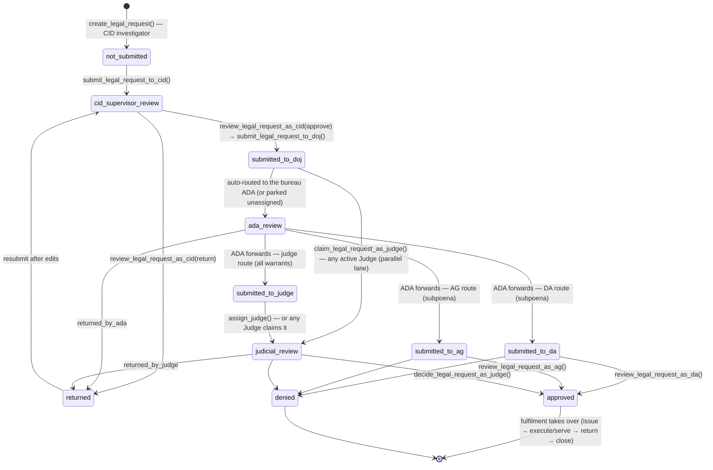
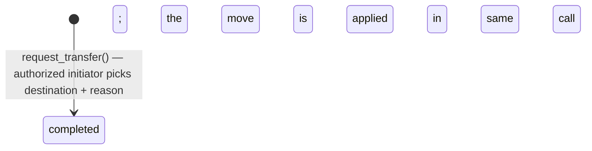

# Workflows & State Machines

Every state machine in the CID Portal, with who may trigger each transition and which server-side RPC enforces it — the reviewer's companion to [`docs/handbook/04-features.md`](handbook/04-features.md) and [`docs/DOJ-INTEGRATION.md`](DOJ-INTEGRATION.md).

Every approve / deny / return / assignment below is **recorded with the acting member, whose authority is validated server-side**. Transitions run through SECURITY DEFINER RPCs (pinned `search_path`, row locking, explicit state validation) or RLS-checked writes; routing (sign-off assignee selection, ADA routing, default classification) is rule-based, database-driven logic in `private.*` helper functions. Direct client writes to workflow columns are frozen by triggers or missing grants throughout.

Roles: **Det** = Detective, **SrDet** = Senior Detective, **BL** = Bureau Lead, **DD** = Deputy Director, **Dir** = Director, **Owner** = `profiles.is_owner` flag (never an `app_role`). Justice roles (**ADA/DA/AG/Judge**) live in `justice_memberships`, a separate identity domain.

---

## 1. CID membership requests

Migration [`20260713030000_membership_requests.sql`](../supabase/migrations/20260713030000_membership_requests.sql), tightened by the v1.16 unified matrix [`20260718010000_unified_role_policy.sql`](../supabase/migrations/20260718010000_unified_role_policy.sql). One request per applicant (`unique (applicant_id)`); requested bureau locked to the permanent bureaus — `major_crimes` / `street_crimes` since the 2026-08-25 restructure (JTF is never a permanent department, and SIB membership is appointed, never requested); since v1.16 any normal CID role (detective … director) may be *requested* — requesting grants nothing.


```mermaid
stateDiagram-v2
    [*] --> draft: applicant insert (RLS mr_ins, inactive + not login-denied)
    draft --> pending: membership_request_submit()
    pending --> correction_requested: review — request_correction
    correction_requested --> pending: membership_request_submit() (resubmit)
    pending --> approved: review — approve (as requested)
    pending --> approved_with_changes: review — approve with final ≠ requested (reason required)
    pending --> rejected: review — reject (profile stays inactive)
    draft --> withdrawn: membership_request_withdraw()
    pending --> withdrawn: membership_request_withdraw()
    correction_requested --> withdrawn: membership_request_withdraw()
    rejected --> pending: re-review — review_membership_request() accepts terminal rows (20260807120000)
    withdrawn --> pending: re-review (20260807120000)
    approved --> [*]
    approved_with_changes --> [*]
```

| Transition | Who | Enforced by |
| --- | --- | --- |
| create draft | the applicant (inactive, not login-denied) | RLS `mr_ins` + column-level INSERT grant |
| edit form fields | applicant, while `draft`/`correction_requested` | RLS `mr_upd`; workflow/decision columns frozen by `trg_guard_membership_request` |
| submit / resubmit | applicant | `membership_request_submit()` (blocks login-denied callers; notifies command, suppressed for `rls-test-*` fixtures) |
| withdraw | applicant, from draft/pending/correction_requested | `membership_request_withdraw()` |
| request correction / reject | any active BL/DD/Dir or Owner (never the applicant — self-review rejected) | `review_membership_request()` |
| approve / approve_with_changes | reviewer with **matrix authority over the FINAL role in the FINAL bureau** (below) | `review_membership_request()` → `private.can_assign_cid_role()` |

**v1.16 decision matrix** (`private.can_assign_cid_role`) — used identically by membership review, role changes, and transfers:

| Final role | May be granted by |
| --- | --- |
| Detective / Senior Detective | Bureau Lead **of that bureau**, or DD / Dir / Owner |
| Bureau Lead | DD, Dir, or Owner |
| Deputy Director | Dir or Owner |
| Director | Owner only |

Approval is atomic: request decided + `profiles.role/division/active` flipped + `role_events` (with reason/source) + history + audit + one applicant notification, in one transaction. `approved_with_changes` requires an applicant-visible reason. Command reads the grant-revoked `internal_decision_note` only via `admin_membership_requests()`.

`rejected` and `withdrawn` are **not** dead ends: since [`20260807120000_membership_rereview_terminal.sql`](../supabase/migrations/20260807120000_membership_rereview_terminal.sql), `review_membership_request()` also accepts a terminal row and decides it again (the supersession is recorded in `membership_request_history` with the real prior status) — the applicant's only path back in, since the unique constraint blocks re-applying. `approved` / `approved_with_changes` decisions remain final.

## 2. Justice membership (DOJ / Judiciary)

> **Status.** The open DOJ/Judiciary *signup path* was retired 2026-07-22
> ([`20260808140000`](../supabase/migrations/20260808140000_legal_lead_approval.sql))
> and justice seats were then **revived as appointment-only** by
> [`20260816120000_minimal_doj_revival.sql`](../supabase/migrations/20260816120000_minimal_doj_revival.sql):
> live roles are `prosecutor`, `judge` and `attorney_general` (legacy
> ADA/DA rows resolve to `prosecutor` via `private.justice_role_effective`),
> created by `justice_appoint` — there is still no public application form.
> The request/approval workflow below is historical.

Migration [`20260714010000_justice_identity.sql`](../supabase/migrations/20260714010000_justice_identity.sql); overview in [DOJ-INTEGRATION.md](DOJ-INTEGRATION.md#identity-model). Same statuses and shape as §1 (draft → pending → correction_requested / approved / approved_with_changes / rejected / withdrawn; same applicant-owned RPC pair `justice_membership_request_submit()` / `justice_membership_request_withdraw()`), but a **separate identity domain**: approval upserts `justice_memberships` and never touches the CID profile.

| Requested / final role | May decide (per `private.can_review_justice_role`) |
| --- | --- |
| Assistant District Attorney | DA, AG, or Owner |
| District Attorney | AG or Owner |
| Attorney General | Owner only |
| Judge | AG or Owner (Owner-only before [`20260731010000`](../supabase/migrations/20260731010000_justice_request_visibility.sql)) |

Decision RPC: `review_justice_membership_request()` (no self-review; authority checked against the requested role, and again against the final role on approval). Deactivation/reactivation of an existing membership: `set_justice_membership_active()` under the same matrix. Reviewers (DA/AG/Owner) read internal notes via `admin_justice_membership_requests()`. CID Bureau Leads cannot approve justice requests; a Judge cannot approve DOJ requests.

## 3. Cases

Two independent dimensions on `public.cases` (see [handbook ch. 4.1](handbook/04-features.md)):

**Status board** — `status ∈ open / active / cold / closed` (`CASE_STATUSES`, `src/lib/signoff.ts`). Moved by a direct RLS-checked `update('cases', {status})` from anyone with case access (`private.can_access_case`: own bureau, lead, creator, command, access grant, or active joint assignment); a trigger stamps `closed_at`.

**Investigative stage** — a third, investigator-facing dimension since [`20260818120000_bureau_queues_stages.sql`](../supabase/migrations/20260818120000_bureau_queues_stages.sql): `investigative_stage ∈ intake / active_investigation / legal_process / enforcement_ready / pending_closure / closed`, distinct from `status`. Moves are **manual and RPC-only** — direct writes are frozen by the non-definer trigger `private.block_direct_case_stage()`; `case_set_stage(p_case, p_stage, p_reason)` requires a non-blank reason and is allowed for the case lead, Senior Detective+ supervisors, or the Owner, and every change is audited (`CASE_STAGE_CHANGED` with previous stage, new stage, actor, reason, timestamp). Nothing moves a stage automatically. Case members see the trail in the Record area via `case_stage_history(p_case)` ([`20260819120000_case_stage_history.sql`](../supabase/migrations/20260819120000_case_stage_history.sql)) — a definer read scoped to exactly one case's `CASE_STAGE_CHANGED` rows under `private.can_access_case`; the audit log itself stays Owner-only.

**Sign-off chain** — a separate `signoff_status`/`signoff_stage` dimension, movable **only** through the sign-off RPCs ([`20260617190100_signoff_server_side_rpcs.sql`](../supabase/migrations/20260617190100_signoff_server_side_rpcs.sql) as hardened by [`20260702170000`](../supabase/migrations/20260702170000_signoff_owner_only_submit.sql), [`20260706140000`](../supabase/migrations/20260706140000_signoff_decide_assignee_access.sql), and [`20260721040000_signoff_integrity.sql`](../supabase/migrations/20260721040000_signoff_integrity.sql), which adds the command-override lane); direct column writes are trigger-blocked. (A case's *bureau* is likewise frozen — moving one is `case_reassign_bureau()`, DD/Dir/Owner only; see [AUTHORIZATION.md §4](AUTHORIZATION.md).)


```mermaid
stateDiagram-v2
    none --> awaiting_bureau_lead: signoff_submit() — case owner
    awaiting_bureau_lead --> awaiting_deputy: signoff_decide(approve) — BL
    awaiting_bureau_lead --> approved_complete: BL approve, no deputy in chain
    awaiting_deputy --> approved_deputy: signoff_decide(approve) — DD
    approved_deputy --> approved_complete: signoff_owner_action(complete) — case owner
    approved_deputy --> awaiting_director: signoff_owner_action(escalate) — case owner
    awaiting_director --> ready_doj: signoff_decide(approve) — Dir
    awaiting_bureau_lead --> denied: signoff_decide(deny, note required)
    awaiting_deputy --> denied: signoff_decide(deny)
    awaiting_director --> denied: signoff_decide(deny)
    awaiting_bureau_lead --> changes_requested: signoff_decide(changes, note required)
    awaiting_deputy --> changes_requested: signoff_decide(changes)
    awaiting_director --> changes_requested: signoff_decide(changes)
    denied --> awaiting_bureau_lead: signoff_submit() (resubmit)
    changes_requested --> awaiting_bureau_lead: signoff_submit() (resubmit)
```

| RPC | Who | Notes |
| --- | --- | --- |
| `signoff_submit(case)` | the **case owner** — lead detective, or creator when no lead is set | LOA-aware routing: `private.signoff_route(step, bureau)` picks the stage + a non-LOA assignee, **excluding the submitter and lead detective** (a lead's own case escalates rather than routing back to its author); fails if no active reviewer exists. Submit/escalate notify the routed assignee |
| `signoff_decide(case, approve\|deny\|changes, note)` | the **routed assignee** (a Director may override the assignee) **with case access** — the submitter/lead can never decide their own case (`private.signoff_assert_decider`, [`20260807060000`](../supabase/migrations/20260807060000_signoff_authority_restore.sql)) | deny/changes require a note; every action appends to the append-only `case_signoff_history` and notifies the case owner |
| `signoff_owner_action(case, complete\|escalate)` | the case owner, only at the `approved_deputy` stop-point | escalate re-routes to an active Director |
| `signoff_command_override(case, complete\|escalate, reason)` | Deputy Director / Director / Owner (never Bureau Lead) | acts in the owner's place at the `approved_deputy` stop-point when the owner is unavailable; reason required, recorded in history with `source='command_override'` ([`20260721040000`](../supabase/migrations/20260721040000_signoff_integrity.sql)) |

## 4. Reports

Reports belong to a case (`private.can_access_case` gates everything). Lifecycle RPCs: [`20260617190200_report_finalize_rpc.sql`](../supabase/migrations/20260617190200_report_finalize_rpc.sql) → versioned by [`20260715010000_report_versions.sql`](../supabase/migrations/20260715010000_report_versions.sql); reopen: [`20260713010000`](../supabase/migrations/20260713010000_report_reopen_rpc.sql) hardened by [`20260713020000_report_seal_hardening.sql`](../supabase/migrations/20260713020000_report_seal_hardening.sql); the Phase 5 report builder (Portal Improvements P5-01 … P5-07): templates in [`20261028120000_report_templates.sql`](../supabase/migrations/20261028120000_report_templates.sql), the review flow, entities and exports in [`20261029120000_report_review.sql`](../supabase/migrations/20261029120000_report_review.sql).

```
templates:  draft (proposed) ──publish──▶ published ──next publish──▶ superseded
reports:    draft ──submit──▶ submitted ──approve──▶ approved (sealed) ──reopen (reason)──▶ draft
                     ▲            │ return
                     └── returned ┘
            self-seal templates:  draft ──submit / finalize──▶ approved (sealed)
```

- **Templates are a server catalog** — `report_templates` (one row per `FORM_SCHEMAS` key; `active`, `is_default`, `sort_order`) and `report_template_versions` (the `FormSchema` json, `required` / `advisory` key arrays, `review_required`, `status` draft → published → superseded; at most one published and one draft per template). The 14 forms are seeded as published v1. A **Bureau Lead+ proposes** a draft with `report_template_save(key, name, schema, required, advisory, review_required, change_summary, description)` — a second save on the same template REPLACES the draft; **only the Director / Deputy Director / Owner** may create a NEW key, `report_template_publish(version, note)` (the previous version becomes `superseded`; audit `REPORT_TEMPLATE_PUBLISHED`), or `report_template_update(template, {name, description, active, sort_order, is_default})`. `report_template_discard(version)` is the draft's author or an admin. The server validates the schema shape (section ids and field keys unique; field types `text|date|money|select|textarea|checks`; every required / advisory key present) and raises on a malformed one. No client writes on either table.
- **Every report pins a version.** `report_create(case, template, kind, fields)` refuses an unknown or retired key ("unknown report template") and sets `reports.template_version_id`; a direct client INSERT with a known key is pinned by the `reports_template_pin` BEFORE INSERT trigger (an unknown legacy key such as `'initial'` keeps NULL). A later publish never moves an existing report — it keeps rendering and validating against the version it was written under.
- **draft → submitted** — `report_submit(report, signature?, badge?)`: the **author only**, while `review_status in ('draft','returned')` and the case is writable. Every key in the pinned version's `required` array must be present (non-blank string, non-empty array, a grid with at least one row) or the RPC raises `required fields missing: <labels>`; the client shows the same gaps beforehand but never hard-codes the keys — it reads them from the version. The author signature `{officer, signer_id, badge, signed_at, typed}` is captured (`signer_id` = `auth.uid()`, `typed` defaults to the officer's name). A review-required template lands in `submitted` (`submitted_at/by`, audit `REPORT_SUBMITTED`) and notifies the reviewer pool `private.report_reviewers(case)` — active, case access, not the author, Senior Detective / Bureau Lead / Deputy Director / Director (Bureau Leads of the case bureau, JTF any; SrDets on the case) — with `report_submitted`.
- **Self-seal templates.** The four legal drafting forms (`arrest_warrant`, `search_warrant`, `wiretap_warrant`, `subpoena`) carry `review_required = false` — a legal request has its own review — so `report_submit` seals them directly (`finalized`, `review_status = 'approved'`, a `report_versions` row, audit `REPORT_FINALIZED {self_sealed:true}`, `report_finalized` to the case lead, never the author). `report_finalize(report, badge?)` is kept for them and **raises** "this template requires review — submit the report for review" on every narrative template.
- **submitted → returned / approved** — `report_review(report, decision, note?, signature?, badge?)`: `private.can_review_report` — active, case access, **never the author**, Senior Detective+ or the Owner, and only while `submitted`. `return` needs a note → `returned` (`review_note`, `reviewed_by/at`, audit `REPORT_RETURNED`, `report_returned` to the author) and the author may edit and resubmit. `approve` captures `reviewer_signature` `{officer, signer_id, badge, signed_at, typed, role}`, sets `approved` + `finalized`, freezes the exact fields with **both** signatures as the next `report_versions` row (immutable, as before), writes `REPORT_APPROVED` + `REPORT_FINALIZED` and sends `report_finalized` to the author.
- **Case closure gate.** A `case_closure` report additionally refuses submit while any case task is open — `not done and waived_at is null and deleted_at is null` — raising `N open task(s) must be done or waived before closure`. `case_task_waive(task, reason)` / `case_task_unwaive(task)` (the case lead, a Bureau Lead of the case bureau — JTF any —, DD / Director, Owner; case writable; reason required; audit `TASK_WAIVED` / `TASK_UNWAIVED`) record the waiver on the task (`waived_at/by`, `waive_reason`) — the columns are client-frozen.
- **approved → draft (logged seal break)** — `report_reopen(report, reason)`: Bureau Lead **of the case's bureau only** (JTF cases shared), DD / Director, Owner; the old one-argument signature is dropped and a blank reason raises "a reason is required to reopen a sealed report". The permission check runs before the state check (no probing). Clears `finalized`, both signatures and the `reviewed_*` columns, resets `review_status` to `draft`, appends `{at, by, reason, prev_signature, prev_reviewer_signature}` to `fields._reopen_log`, audits `REPORT_REOPENED` and notifies the author (`report_reopened`). Earlier `report_versions` stay readable.
- **Lockdown** — `private.block_direct_report_finalize()` rejects any direct client write to `finalized`, `signature`, `review_status`, `submitted_*`, `reviewed_*`, `review_note`, `reviewer_signature` and `template_version_id`, and refuses `fields` changes while the report is `submitted` / `approved` / finalized ("a submitted report's contents are locked until it is returned"). `record_versions` keeps versioning draft saves only.
- **Entities and mentions (P5-04 / P5-05)** — `report_entities` is the set of records a report inserted or mentioned: `{kind ∈ person | vehicle | gang | place | evidence | media | officer | charge | legal_request | case | timeline_event, ref_id (null only for a timeline_event), role ('mention' for a narrative token, else the insert role), label, snapshot, edited}`. `report_entities_set(report, items)` REPLACES the set — the author or any case-writable editor, while draft / returned and not finalized (else `{ok:false, code:'denied'}`); every `ref_id` must exist AND be readable by the caller (a charge must belong to the same case; a legal request via `can_view_legal_request`; a case via `can_read_case`) or the RPC raises; the source record is never written. Audit `REPORT_ENTITIES_SET {count}`. Reads follow the parent report, so "which reports mention this record" is `list('report_entities', {eq:{kind, ref_id}})` under RLS. Narrative tokens are `[kind:id]` in markdown; the client rewrites the entity set on every narrative save and renders a token the viewer cannot resolve as the literal "Restricted record".
- **Exports (P5-07)** — every download calls `report_record_export(report, format)` first (`pdf | docx | md`; any reader of the report): it writes a `report_exports` receipt with `version_number` = the latest sealed version (null for an unsealed draft) and a fresh 10-character `verification_code` minted per export (a receipt, not a hash — a code on paper proves an export was recorded), audits `REPORT_EXPORTED`, and the client renders the pinned schema + (sealed ? the frozen fields : live fields) + entities + both signatures + template name / version + the code as the letterhead footer. Restricted media is never printed. `report_exports` reads follow the report; no client writes.
- **CID warrant-report tracker** (distinct from the DOJ legal workflow in §5): reports on warrant templates carry a `fields._warrant_status` of `draft → signed → executed → returned`, movable only via `warrant_set_status()` (status whitelist, warrant templates only, actor stamped server-side into `fields._warrant_log`).
- **Labels** — `REPORT_REVIEW_LABEL`: draft "Draft", submitted "Awaiting review", returned "Returned for revision", approved "Sealed". Notification payloads are minimal (`{report_id, case_id, case_number, template, title, reason, actor_id, actor_name}`) and deep-link to the case's Reports tab (`?report=<id>`); the test-actor → real-target suppression of `private.legal_notify` applies.

Pinned by `tests/rls/v187a.test.ts` (templates), `v187b` (review flow, self-seal, closure gate, notifications) and `v187c` (entities, exports); the mock contract in `src/mocks/handlers/reports.ts`.

## 5. Warrants & subpoenas (legal review)

> **Status.** The original ADA→DA→AG pipeline was retired 2026-07-22
> ([`20260808140000`](../supabase/migrations/20260808140000_legal_lead_approval.sql)),
> the minimal-DOJ prosecutor queue that replaced it
> ([`20260816120000`](../supabase/migrations/20260816120000_minimal_doj_revival.sql))
> was retired by **Portal Improvements Phase 4** (P4-01,
> [`20261025120000_legal_reroute.sql`](../supabase/migrations/20261025120000_legal_reroute.sql); tables `20261024120000`, RPCs `20261026120000`, sweeps `20261027120000`).
> What runs today is **Detective → Bureau Lead → Judge** (SIB: **Special Agent →
> X-1 → Judge**, Attorney General oversight). Every prosecutor RPC
> (`legal_claim_prosecutor`, `legal_assign_prosecutor`,
> `review_legal_request_as_prosecutor`, `legal_return_to_prosecutor_queue`,
> `review_legal_request_as_ag`, `submit_legal_request_to_doj`,
> `reassign_legal_ada`) is EXECUTE-revoked; the retired stages stay in the
> `review_status` CHECK and render read-only ("Retired stage — …").

Full narrative in [DOJ-INTEGRATION.md](DOJ-INTEGRATION.md); server surface in [`20260714040000_legal_workflow.sql`](../supabase/migrations/20260714040000_legal_workflow.sql) + [`20260714045000_legal_workflow_review.sql`](../supabase/migrations/20260714045000_legal_workflow_review.sql) + the Phase 4 migrations `20261024120000` → `20261027120000`; authority in [AUTHORIZATION.md §16](AUTHORIZATION.md#16-the-legal-workflow-phase-4-20261024120000--20261027120000). `legal_requests` carries three **independent** status dimensions — every legal table is SELECT-only for clients, so all transitions are definer RPCs:

- `document_status`: `draft / finalized / reopened`
- `review_status`: the review pipeline below (+ `partially_approved` since P4-07)
- `fulfilment_status`: post-approval lifecycle — one 13-value CHECK shared by both instrument types (`20260714030000_legal_core.sql`): `unissued / issued / executed / returned / expired / revoked / closed / served / compliance_pending / records_received / testimony_completed / non_compliance / return_recorded`. Warrants walk the execute/return arm, subpoenas the serve/comply arm; `service_status` and `compliance_status` are further independent dimensions.

**Active pipeline (both warrants and subpoenas).** The responsible bureau's
Bureau Lead gates the packet; an approve hands the request **straight to the
judicial queue** (`submitted_to_judge`), where any active Judge claims it (or
the Attorney General / Owner assigns it — the only path for a **sealed**
request). The judge approves in full or **in part** (per-target decisions,
P4-07), denies, or returns with a structured revision checklist. Judicial
approval terminates at `review_status='approved' | 'partially_approved'`;
issuance stays a separate CID fulfilment step (`fulfilment_status` stays
`unissued` until `issue_legal_request`):


```mermaid
stateDiagram-v2
    [*] --> not_submitted: create_legal_request() — any CID author (charges via legal_set_charges, evidence via legal_add_evidence_and_exhibit)
    not_submitted --> cid_supervisor_review: submit_legal_request_to_cid() — warrants need standard_of_proof + pc_statement
    cid_supervisor_review --> returned_by_cid: review_legal_request_as_cid(return, p_revision_items)
    returned_by_cid --> cid_supervisor_review: resubmit (change summary REQUIRED)
    cid_supervisor_review --> submitted_to_judge: review_legal_request_as_cid(approve) — responsible bureau's Lead (JTF case — ANY Lead); DD/Dir/Owner audited fallback
    cid_supervisor_review --> denied: review_legal_request_as_cid(deny)
    submitted_to_judge --> judicial_review: claim_legal_request_as_judge() — never sealed — or assign_judge() (AG / Owner)
    judicial_review --> approved: decide_legal_request_as_judge(approve — reasoning + conditions; expires_at defaulted per subtype)
    judicial_review --> partially_approved: decide_legal_request_as_judge(approve, p_target_decisions with a denied target)
    judicial_review --> denied
    judicial_review --> returned_by_judge: return to investigator (p_revision_items)
    returned_by_judge --> submitted_to_judge: resubmit — FAST LANE (change summary required, no repeated CID review)
    returned_by_judge --> cid_supervisor_review: resubmit with DECLARED material change
    approved --> [*]: CID fulfilment (issue → execute/serve → return → close)
    partially_approved --> [*]: CID fulfilment — only the approved targets are executable
    denied --> [*]
```

Alongside the graph: any pre-decision request → `withdrawn` (creator,
`withdraw_legal_request`) or `cancelled` (command / AG / Owner with a reason,
`legal_admin_cancel`); a decided request → `superseded` (`legal_mark_superseded`,
the replacement must itself be approved or partially approved); **Amend** is
never an edit in place — `legal_amend(p_request, p_reason)` clones a decided /
superseded / withdrawn / cancelled request (type, case, title, form minus the
frozen `_` keys, narrative, subject, exhibits, charges) into a NEW draft with
`amends_request_id` set and an `amended_from` timeline row.

Return routing is explicit, never inferred: `submit_legal_request_to_cid(p_request,
p_change_summary, p_material_change)` sends a corrected judge-returned request
**straight back to the judicial queue** unless the investigator sets
`p_material_change=true` — the declaration is logged (`material_change_declared`)
and the request re-enters full CID review. Every resubmission from a
`returned_*` state needs a change summary ("a change summary is required when
resubmitting"); the reviewer's checklist lives in `legal_request_revision_items`
and the creator resolves each item (`legal_revision_resolve`) before resubmitting.

Since [`20261001120100_legal_review_records_rank.sql`](../supabase/migrations/20261001120100_legal_review_records_rank.sql)
every CID-stage decision also records the reviewer's rank **at decision time**
(`legal_requests.cid_reviewed_role`, plus `actor_rank` in the audit payloads) —
the review history answers "who acted, and as what" without re-deriving it from
today's roster. Since P4-01 `legal_requests.stage_entered_at` restarts on every
status change (trigger-maintained; `nudged_at` / `escalated_at` cleared with
it) — the clock the reminder sweep reads.

### The SIB lane ([`20260903170000_siu_legal_lane.sql`](../supabase/migrations/20260903170000_siu_legal_lane.sql), re-routed by P4-01 / [`20261025120000`](../supabase/migrations/20261025120000_legal_reroute.sql))

A request on a case with `case_authority = 'siu'` runs a **different chain inside
the same state machine** — it never enters `cid_supervisor_review`:

```
Special Agent draft → siu_command_review (X-1 / the case's lead agent; never the author)
                    → submitted_to_judge (AG notified — oversight only, no gate) → judicial_review → approved | partially_approved
```

- Submission fan-out stays inside the unit (SACs only, compartment- and
  recusal-aware); with no SIB commander seated the **Attorney General** is
  alerted — never CID command.
- An X-1 approve lands in the judicial queue directly; the Attorney General
  is notified and holds oversight visibility of the request from that
  moment (`submitted_to_judge_at`), but never decides. The former `ag_review`
  stage is retired — the "known gap" (an SIB request stalling at the AG step
  because `review_legal_request_as_ag` was revoked) is **resolved** by
  removing the step.
- Returns use `returned_by_siu_command`; the judge **fast lane does not apply**
  to SIB requests — every resubmission re-enters SIB command review.
- Authority is `private.siu_case_command()` (SIB command **or** the
  investigation's lead agent), signature action `siu_command_approval`.

Key rules (all server-enforced):

| Stage | Who / RPC |
| --- | --- |
| Draft + packet | creator (any CID author): `create_legal_request`, `update_legal_draft`, `add_legal_exhibit` / `remove_legal_exhibit`, `legal_add_evidence_and_exhibit` (host upload → media row on the case → exhibit, one step), `legal_set_charges` (replaces the request's charge set from the case's own `case_charges`, statute snapshot frozen per row) — reviewers later see **only** the selected exhibits, never the whole case. Warrants carry `form_data.standard_of_proof` (`probable_cause` / `reasonable_suspicion`) and `pc_statement`; submit refuses them otherwise |
| CID supervisor gate | `submit_legal_request_to_cid` → `review_legal_request_as_cid(p_decision, p_note, p_override_reason, p_signature, p_revision_items)` (source report finalized, required fields, subject or search targets, valid responsible bureau via `private.legal_resolve_bureau` — for JTF-assigned cases the chain derives it from `originating_bureau` → case-number prefix → lead detective's division → creator's division and persists the answer, [`20260815120000_jtf_legal_routing.sql`](../supabase/migrations/20260815120000_jtf_legal_routing.sql)). **Who decides** ([`20260818120000`](../supabase/migrations/20260818120000_bureau_queues_stages.sql)): an ordinary bureau case — the responsible bureau's Bureau Lead ONLY; a **JTF-assigned case — ANY eligible Bureau Lead**; DD/Director/Owner are the fallback everywhere, and every decision by anyone other than the responsible bureau's own lead is audited with `fallback`/`jtf_any_lead` flags. The creator can never decide. **Approve hands off to the judicial queue** (`submitted_to_judge`, `LEGAL_SUBMITTED_TO_JUDGE`; fan-out to every active Judge, sealed → the AG); a return files the checklist |
| Judicial stage | `claim_legal_request_as_judge` (any active Judge; **sealed requests are assigned by the Attorney General** — never self-claimed) or `assign_judge(p_request, p_judge)` (AG or Owner only; the Owner is the fallback when no AG is seated) → `judicial_review` → `decide_legal_request_as_judge(p_decision, p_note, p_conditions, p_expires_at, p_target_decisions, p_revision_items)`: reasoning mandatory; `p_target_decisions` = `[{target_key, exhibit_id, decision, reasoning}]` (`subject` or `exhibit:<id>`) — any denied target → `partially_approved` (at least one target must be approved, else "deny the request instead of denying every target"); the narrowed scope and the charges are frozen into the judicial version (`form_data._target_decisions`, `_charges`); `expires_at` defaults from `legal_expiry_defaults` (arrest 30 d, search 14 d) when the judge sets none. Conflicts recuse on permanent user IDs; deactivating the holding judge returns the work to the queue |
| DOJ case visibility | Judges and the AG never gain case access — `legal_request_case_brief(p_request)` returns the concise case summary plus ONLY the material the request references (exhibits, finalized-report content, media metadata), gated by `private.can_view_legal_request` — database-enforced, not a UI convention. A retired prosecutor who must see a request today is a per-request **observer** (`legal_set_observer`, AG / Owner / approver pool / creator), never a role |
| Comments | `legal_comment(p_request, p_body, p_parent)` / `legal_comment_edit` (author) / `legal_comment_delete` (author, AG, Owner — body blanked, row kept): creator, active participants (judge once claimed, observers), the approver pool, AG when visible, Owner. Prior bodies live in `legal_request_comment_versions`; the `legal_comment` notification carries `{request_id, sealed:true}` for a sealed request and never pages the author |
| Reminders & expiry | hourly `legal-sweep` cron (:35): > 48 h in a stage → `legal_nudge` to the responsible party; > 5 d → `legal_escalated` to the next authority (+ creator); approved-unissued > 7 d → `legal_unissued`; `expires_at` within 72 h → `legal_expiring`; past → `fulfilment_status='expired'` + `legal_expired`; subpoena `response_deadline` passed → `legal_deadline_passed`. Idempotent through `legal_request_reminders`; `legal_sweep_run()` is the Owner's manual trigger |
| Exports | `legal_record_export(p_request, p_format pdf\|docx, p_kind instrument\|packet)` — instrument only once approved / partially approved; `verification_code` = short hash of the judicial version; audited (`LEGAL_EXPORTED`, `legal_export_log`); restricted media excluded unless separately approved |
| Fulfilment (CID side) | `issue_legal_request` (approved **or** partially approved; a subpoena's `response_deadline` defaults from `legal_expiry_defaults`), `record_warrant_execution`, `record_warrant_return`, `record_subpoena_service`, `record_subpoena_compliance`, `close_legal_request`, `withdraw_legal_request` (gated by `private.can_fulfil_legal`); `legal_admin_cancel`, `legal_mark_superseded`, `legal_amend` for the post-decision paths |

<details>
<summary><strong>Legacy DOJ pipeline (retired 2026-07-22 — historical records only)</strong></summary>

The multi-stage pipeline below is **retired**. Its prosecution-side RPCs (`review_legal_request_as_ada` / `_as_da` / `_as_ag`, `submit_legal_request_to_doj`, `reassign_legal_ada`, routing/coverage helpers) are EXECUTE-revoked — as are the minimal-DOJ prosecutor RPCs that briefly succeeded them (`legal_claim_prosecutor`, `legal_assign_prosecutor`, `review_legal_request_as_prosecutor`, `legal_return_to_prosecutor_queue`); `assign_judge`, `claim_legal_request_as_judge` and `decide_legal_request_as_judge` live on in the current graph. Historical requests may still display these stages read-only ("Retired stage — …").


```mermaid
stateDiagram-v2
    [*] --> not_submitted: create_legal_request() — CID investigator
    not_submitted --> cid_supervisor_review: submit_legal_request_to_cid()
    cid_supervisor_review --> returned: review_legal_request_as_cid(return)
    returned --> cid_supervisor_review: resubmit after edits
    cid_supervisor_review --> submitted_to_doj: review_legal_request_as_cid(approve) → submit_legal_request_to_doj()
    submitted_to_doj --> ada_review: auto-routed to the bureau ADA (or parked unassigned)
    submitted_to_doj --> judicial_review: claim_legal_request_as_judge() — any active Judge (parallel lane)
    ada_review --> submitted_to_da: ADA forwards — DA route (subpoena)
    ada_review --> submitted_to_ag: ADA forwards — AG route (subpoena)
    ada_review --> submitted_to_judge: ADA forwards — judge route (all warrants)
    submitted_to_da --> approved: review_legal_request_as_da()
    submitted_to_ag --> approved: review_legal_request_as_ag()
    submitted_to_judge --> judicial_review: assign_judge() — or any Judge claims it
    judicial_review --> approved: decide_legal_request_as_judge()
    submitted_to_da --> denied
    submitted_to_ag --> denied
    judicial_review --> denied
    ada_review --> returned: returned_by_ada
    judicial_review --> returned: returned_by_judge
    approved --> [*]: fulfilment takes over (issue → execute/serve → return → close)
    denied --> [*]
```

Legacy key rules:

| Stage | Who / RPC |
| --- | --- |
| DOJ intake & routing | `submit_legal_request_to_doj`; auto-assign via `get_routing_ada_for_bureau` (active acting → active primary ADA; missing coverage parks the request — DA/AG/Owner assign via `reassign_legal_ada`) |
| Prosecutor review | `review_legal_request_as_ada` / `_as_da` / `_as_ag`; route per `private.legal_default_route` — **every warrant routed `judge`**; DA/AG/Owner could change a *subpoena's* route with a reason (`set_legal_approval_route`) |
| Judicial decision | `assign_judge` + `decide_legal_request_as_judge` — warrants were approved only by a Judge; conflict-of-role checks (`private.legal_is_prosecution_side`) kept prosecution and bench separate; signatures are version-bound |
| Parallel judiciary lane | `claim_legal_request_as_judge` ([`20260805010000`](../supabase/migrations/20260805010000_legal_parallel_judiciary.sql)) — any active Judge could take a judge-routed request straight into judicial review from `submitted_to_doj` or `submitted_to_judge` (no ADA hand-off); sealed requests excluded. A judge-returned request cleared its judge assignment on resubmission ([`20260807100000_legal_resubmit_clears_judge.sql`](../supabase/migrations/20260807100000_legal_resubmit_clears_judge.sql)) |

</details>

Every submission freezes an immutable `legal_request_versions` snapshot; reviewers act on the exact `current_version_id`. Classification `standard / restricted / classified / sealed` — warrants default `classified`; **sealed** requests are undiscoverable outside their participant set (SECURITY INVOKER search, generic notifications). Approved+issued **arrest** warrants project an MDT wanted row (`private.mdt_project`; search warrants never do) — except **sealed** arrest warrants, which stay off the MDT wanted list until executed ([`20260807080000_mdt_sealed_skip.sql`](../supabase/migrations/20260807080000_mdt_sealed_skip.sql)). Historical imports: owner-only `import_legal_warrant()` / `import_rollback_by_key()`.

## 6. Evidence custody

`custody_chain` ([`20260616090000_platform.sql`](../supabase/migrations/20260616090000_platform.sql), scoped by [`20260617140100_bureau_isolation_rls.sql`](../supabase/migrations/20260617140100_bureau_isolation_rls.sql)) is **append-only by construction**: SELECT and INSERT policies only (both requiring `private.can_access_case` on the parent evidence's case), no UPDATE or DELETE policy exists, and inserts are audit-logged. A custody transfer is a new row (`from_officer`, `to_officer`, `reason`, `transferred_by` defaulting to `auth.uid()`, timestamp); history is never edited. Executed warrants attach new evidence through this same system — the legal workflow never mutates originals.

## 7. Joint-case access

Migration [`20260713040000_joint_cases.sql`](../supabase/migrations/20260713040000_joint_cases.sql). A joint case keeps its **originating bureau** (`cases.bureau` never flips to JTF); the JTF designation is the `is_joint_case` display flag, and cross-bureau access flows only through temporary `case_assignments` rows (`assignment_source='joint_case'`).

| Step | Who | RPC |
| --- | --- | --- |
| Convert case → joint + add members | `private.can_manage_joint`: command, the case lead/creator, or an active JTF Case Lead / Co-Lead on the case | `convert_case_to_joint(case, members[])` |
| Add more members (joint role + optional `expires_at`) | same | `joint_case_add_members` |
| Remove a member (reason recorded, history kept via `removed_at/removed_by/removal_reason`) | same | `joint_case_remove_member` |
| End the joint case (closes every active grant, keeps history) | same | `joint_case_end` |

Access is exactly one case: `private.has_joint_access` requires an active, un-removed, **unexpired** joint assignment — expiry is server-enforced at read time, and removal revokes immediately. Direct client `case_assignments` writes are pinned to inert `assignment_source='standard'` rows, so nobody can mint joint access outside the RPCs.

## 8. Operations

`public.operations` groups cases (`cases.operation_id`) under a named operation with `status ∈ open / active / cold / closed` (`OP_STATUSES`, `src/lib/operations.ts`). No dedicated state RPC: standard intel-registry RLS — any active member creates/updates (`private.is_active()`), command deletes (`private.can_delete()`), with delete unlinking cases (`deleteWithUndo` sets `cases.operation_id` null). UI: `src/components/operations/OperationsView.tsx`.

## 9. Officer transfers (single-step since v1.40)

Migration [`20260718020000_officer_transfers.sql`](../supabase/migrations/20260718020000_officer_transfers.sql), widened to every department pair — **JTF is a valid source and destination** — by [`20260807020000_transfer_any_bureau.sql`](../supabase/migrations/20260807020000_transfer_any_bureau.sql), then collapsed to a **single-step move** by [`20260807040000_transfer_single_step.sql`](../supabase/migrations/20260807040000_transfer_single_step.sql): an authorized initiation applies the move immediately — no request/approval workflow, no pending states, and the source bureau has no veto. One open transfer per member (partial unique index); every write is a definer RPC — the table has no client write policies, and visibility is bureau-scoped (target, requester, the two involved bureaus' leads, DD+/Owner).


```mermaid
stateDiagram-v2
    [*] --> completed: request_transfer() — authorized initiator picks destination + reason; the move is applied in the same call
```

| Rule | Enforcement |
| --- | --- |
| Initiate = apply | `request_transfer(target, to_bureau, reason, to_role?)` — BL (rank-and-file members only, and only when one side of the move is their own bureau: outbound *or* inbound pull), or DD/Dir/Owner (anyone, anywhere). The row is stamped approved on both sides by the initiator and applied via `private.transfer_apply` in the same call — a lead **can** unilaterally pull a rank-and-file member from another bureau |
| Apply the move | `private.transfer_apply`: re-validates the member is still active, un-removed, login-allowed, and still in `from_bureau`; a riding role change needs matrix authority over the new role in the destination and fails stale if the live role moved; a plain transfer carries the member's **live** role. Writes `role_events` (source `transfer`) + audit + notifications |
| Guardrails | reason required; no self-transfer; owner accounts movable only by another owner; `from <> to`; one open transfer per member |
| Legacy open rows | `approve_transfer_source/_target`, `complete_transfer`, `reject_transfer`, `cancel_transfer` remain **only** to resolve pre-existing open rows (`private.can_decide_transfer_side(bureau)`: that side's BL, or DD+/Owner) — nothing creates pending rows anymore |

## 10. Account lifecycle (deactivation, login denial, permanent removal, permanent deletion)

Four escalating, reversible-by-design states on `profiles` (plus one irreversible owner-only exception path, below), each with its own RPC; privileged columns (`role/division/active/is_owner/removed_at`) are trigger-frozen against all direct client writes ([`20260718010000`](../supabase/migrations/20260718010000_unified_role_policy.sql)), and deny columns likewise ([`20260713090000_login_denial.sql`](../supabase/migrations/20260713090000_login_denial.sql)).

```mermaid
stateDiagram-v2
    active --> inactive: assign_member(target, false) — BL(own bureau, non-command)/DD/Dir/Owner
    inactive --> active: assign_member(target, true) — or re-approval via review_membership_request()
    active --> login_denied: deny_member_login(target, reason) — also sets active=false
    inactive --> login_denied: deny_member_login()
    login_denied --> inactive: restore_member_login() — stays inactive, re-enters the request flow
    active --> removed: admin_remove_member() — authority matrix (20260807070000)
    inactive --> removed: admin_remove_member()
    removed --> inactive: admin_restore_member() — Director/Owner only; must be re-approved
```

| State | What it means | RPC & authority |
| --- | --- | --- |
| **Deactivated** (`active=false`) | Loses every `private.is_active()`-gated capability; profile intact | `assign_member(target, set_active)` — since v1.16 activation/deactivation **only** (the legacy role/division arguments were dropped); BL scoped to own-bureau, non-command targets; Owner bypasses |
| **Login-denied** (`login_denied=true`, `active=false`) | Can still authenticate but the app shows an Access-denied screen with the recorded reason, and RLS + `membership_request_submit()` block filing or advancing a membership request — a removed/rejected person cannot simply re-apply | `deny_member_login(target, reason)` — BL (own bureau, non-command) / DD / Dir / Owner; the Owner account can never be denied. Reverse: `restore_member_login()` (clears the block only; member stays inactive) |
| **Removed** (`removed_at` set, `email` nulled) | Permanent removal without deleting rows: access blocked, sign-in email (PII) scrubbed, hidden from the roster, watchlist + case assignments cleared — **authored history and attribution preserved** (reports, evidence, audit rows keep their author) | `admin_remove_member(target)` — the unified authority matrix ([`20260807070000_member_removal_matrix.sql`](../supabase/migrations/20260807070000_member_removal_matrix.sql), originally command-wide in [`20260708150000`](../supabase/migrations/20260708150000_permanent_member_removal.sql)): BL removes own-bureau rank-and-file only; DD anyone below deputy; Dir anyone except an Owner account; Owner anyone. No self-removal; system accounts refused; the last active Director cannot be removed. Restore: `admin_restore_member()` — **Director/Owner only**; returns **inactive**, must be re-approved |
| **Permanently deleted** (profile + auth row erased; historical FKs repointed to the system tombstone) | The irreversible exception path when a member must be **erased**, not just deactivated — soft remove stays the default. Members referenced by immutable records (legal paper, sign-off history, tracker signatures, report authorship, custody transfers, evidence collection, justice identity, prosecutor assignments) are **hard-blocked** and can only be deactivated; active-work pointers must be reassigned first. An owner-only `deleted_member_ledger` row snapshots identity, reason, the full reference map, and the member's `role_events` history | `permanent_delete_preview()` → `permanent_delete_arm(target, reason)` → `permanent_delete_execute(token, confirm)` — Owner only, each step requiring a **fresh sign-in** (< 5-minute session), a 5-minute single-use token, and a typed `DELETE <display name>` confirmation ([`20260726010000`](../supabase/migrations/20260726010000_phase_b_permanent_deletion.sql); details in [AUTHORIZATION.md §4](AUTHORIZATION.md)) |

Every transition writes `role_events` and/or `audit_log` plus a notification to the affected member.

## 11. Intelligence intake (field submissions)

One entity for everything that arrives as *information* — patrol, detectives,
surveillance, outside agencies (`field_submissions` + per-entity claim tables;
`src/lib/fieldSubmissions.ts`, `src/components/field/`). Two authoring doors:

- **Intelligence-only submitters** — SAHP/BCSO/LSPD personnel appointed via the
  self-serve onboarding fork ("What do you need access for?" → *Submit
  Intelligence*, `field_access_self_serve()`): immediate access, submission-only
  interface (Home · Submit Intelligence · My Reports · Drafts). Safety comes
  from the access class (a field officer is not `profiles.active`), not a queue.
- **Investigators** author the same structured record via **+ New intelligence**
  on the review screen.

Lifecycle (author-facing labels): `draft` Draft → `new` Sent → `reviewing`
Being reviewed → `needs_info` Question for you → `reviewed` / `actionable`
Being acted on / `archived` Filed, no action. Reviewers claim/release/assign,
verify **per claim** (Verified / Unverified / Disputed / Rejected — reliability
grades the source, a verdict grades one claim), match claims to existing
registry records (`field_claim_link` — asserts identity, edits neither side),
convert (open a case, link a case, cite a surveillance observation, register a
confidential source), archive with a reason, or — command only — soft-delete
(Owner-only undelete). SIB referral: flag → refer (category; `public_corruption`
restricts the report immediately) → SIB accepts/declines and assigns its own
agent — a Bureau Lead cannot make that assignment.

## Related workflows documented elsewhere

- **Announcements** — audience-targeted publish (`publish_announcement()` resolves recipients server-side; `all` is DD+/Owner-only, bureau audiences are that bureau's lead or DD+, `specific_members` mentions only): [`20260713050000`](../supabase/migrations/20260713050000_announcement_audiences.sql), [handbook ch. 4.5](handbook/04-features.md).
- **Prosecutor bureau coverage** — assignment lifecycle (`assign_ada_to_bureau`, `set_primary_ada`, `set_acting_ada`, `end_ada_bureau_assignment`; append-only, assignments end rather than delete): [DOJ-INTEGRATION.md](DOJ-INTEGRATION.md#bureau-aligned-ada-coverage).
- **Feedback triage, SOP versioning, shift reports** — [handbook ch. 4](handbook/04-features.md).
