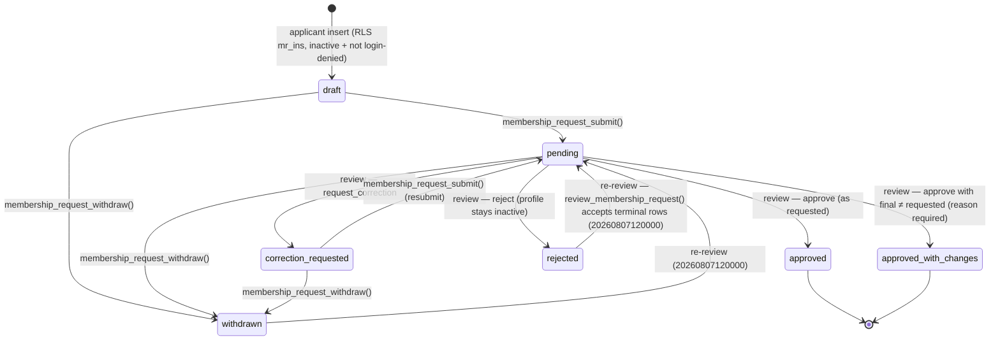
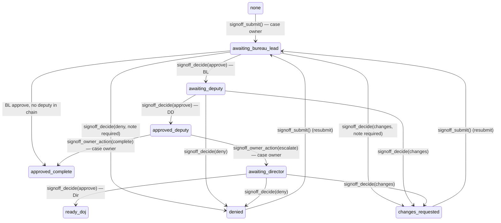
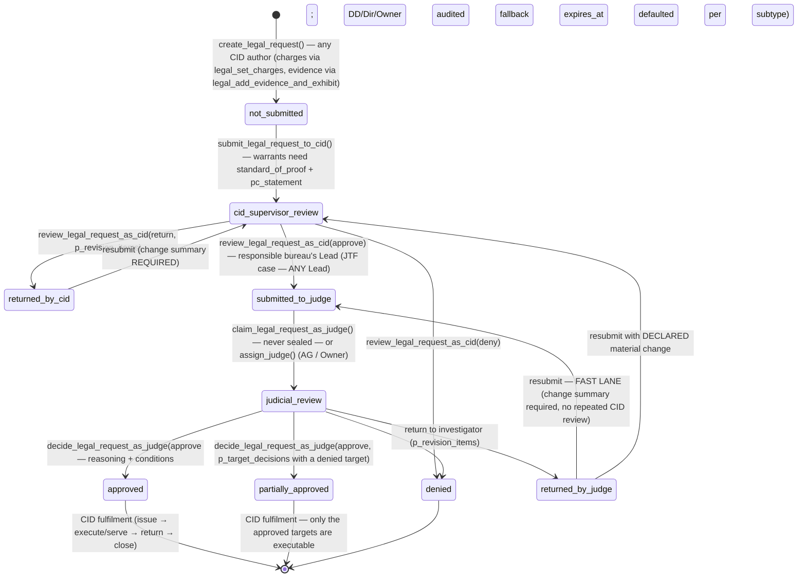
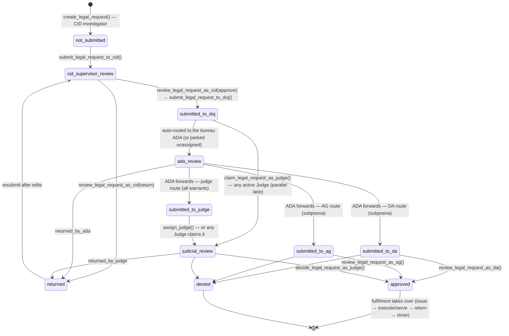
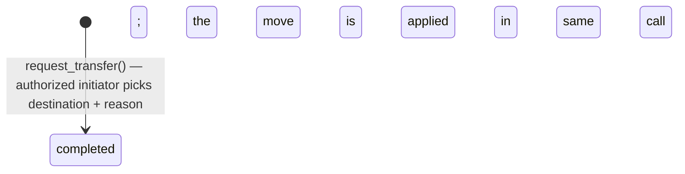
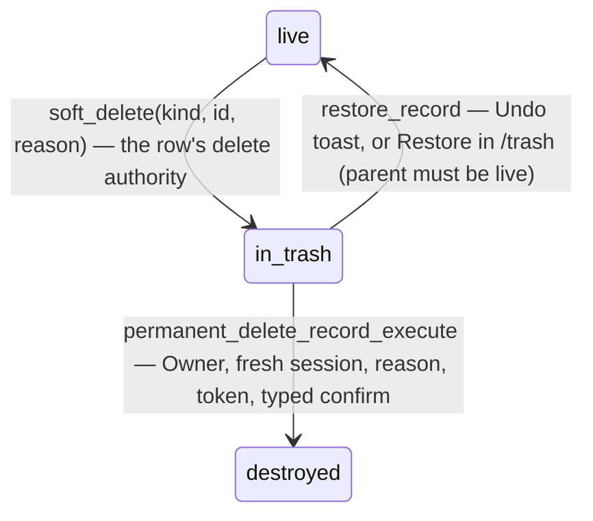
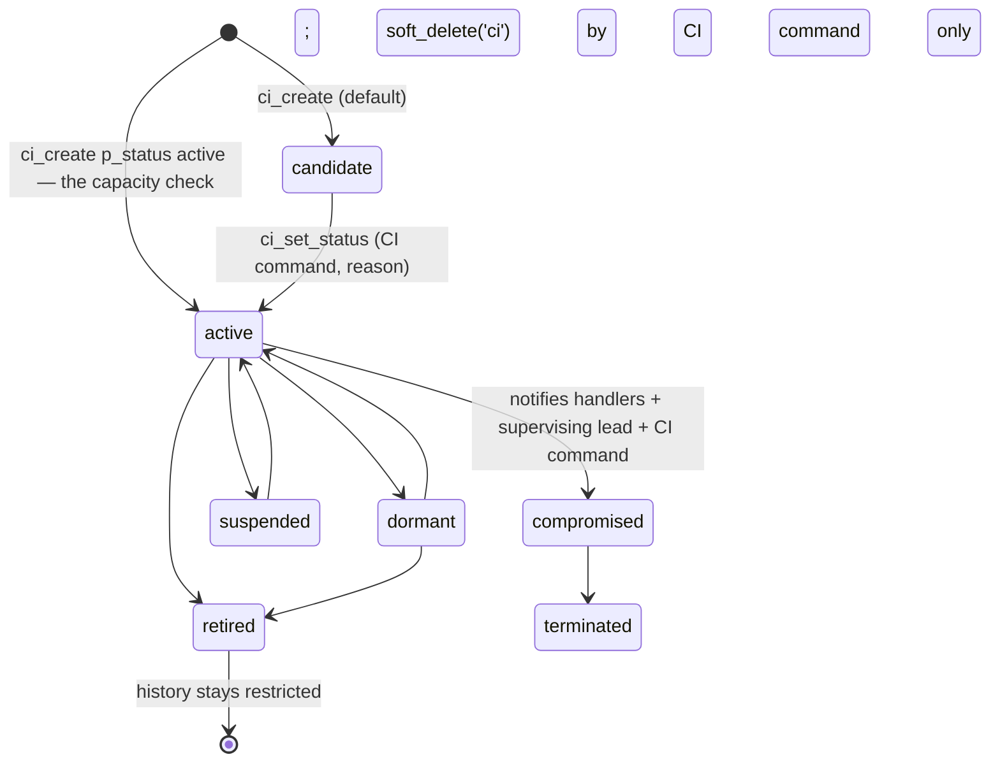

# Workflows & State Machines

Every state machine in the CID Portal, with who may trigger each transition and which server-side RPC enforces it — the reviewer's companion to [`docs/handbook/04-features.md`](handbook/04-features.md) and [`docs/DOJ-INTEGRATION.md`](DOJ-INTEGRATION.md).

Every approve / deny / return / assignment below is **recorded with the acting member, whose authority is validated server-side**. Transitions run through SECURITY DEFINER RPCs (pinned `search_path`, row locking, explicit state validation) or RLS-checked writes; routing (sign-off assignee selection, ADA routing, default classification) is rule-based, database-driven logic in `private.*` helper functions. Direct client writes to workflow columns are frozen by triggers or missing grants throughout.

Roles: **Det** = Detective, **SrDet** = Senior Detective, **BL** = Bureau Lead, **DD** = Deputy Director, **Dir** = Director, **Owner** = `profiles.is_owner` flag (never an `app_role`). Justice roles (**ADA/DA/AG/Judge**) live in `justice_memberships`, a separate identity domain.

---

## 1. CID membership requests

Migration [`20260713030000_membership_requests.sql`](../supabase/migrations/20260713030000_membership_requests.sql), tightened by the v1.16 unified matrix [`20260718010000_unified_role_policy.sql`](../supabase/migrations/20260718010000_unified_role_policy.sql). One request per applicant (`unique (applicant_id)`); requested bureau locked to the permanent bureaus — `major_crimes` / `street_crimes` since the 2026-08-25 restructure (JTF is never a permanent department, and SIB membership is appointed, never requested); since v1.16 any normal CID role (detective … director) may be *requested* — requesting grants nothing.


```mermaid
stateDiagram-v2
    [*] --> draft: applicant insert (RLS mr_ins, inactive + not login-denied)
    draft --> pending: membership_request_submit()
    pending --> correction_requested: review — request_correction
    correction_requested --> pending: membership_request_submit() (resubmit)
    pending --> approved: review — approve (as requested)
    pending --> approved_with_changes: review — approve with final ≠ requested (reason required)
    pending --> rejected: review — reject (profile stays inactive)
    draft --> withdrawn: membership_request_withdraw()
    pending --> withdrawn: membership_request_withdraw()
    correction_requested --> withdrawn: membership_request_withdraw()
    rejected --> pending: re-review — review_membership_request() accepts terminal rows (20260807120000)
    withdrawn --> pending: re-review (20260807120000)
    approved --> [*]
    approved_with_changes --> [*]
```

| Transition | Who | Enforced by |
| --- | --- | --- |
| create draft | the applicant (inactive, not login-denied) | RLS `mr_ins` + column-level INSERT grant |
| edit form fields | applicant, while `draft`/`correction_requested` | RLS `mr_upd`; workflow/decision columns frozen by `trg_guard_membership_request` |
| submit / resubmit | applicant | `membership_request_submit()` (blocks login-denied callers; notifies command, suppressed for `rls-test-*` fixtures) |
| withdraw | applicant, from draft/pending/correction_requested | `membership_request_withdraw()` |
| request correction / reject | any active BL/DD/Dir or Owner (never the applicant — self-review rejected) | `review_membership_request()` |
| approve / approve_with_changes | reviewer with **matrix authority over the FINAL role in the FINAL bureau** (below) | `review_membership_request()` → `private.can_assign_cid_role()` |

**v1.16 decision matrix** (`private.can_assign_cid_role`) — used identically by membership review, role changes, and transfers:

| Final role | May be granted by |
| --- | --- |
| Detective / Senior Detective | Bureau Lead **of that bureau**, or DD / Dir / Owner |
| Bureau Lead | DD, Dir, or Owner |
| Deputy Director | Dir or Owner |
| Director | Owner only |

Approval is atomic: request decided + `profiles.role/division/active` flipped + `role_events` (with reason/source) + history + audit + one applicant notification, in one transaction. `approved_with_changes` requires an applicant-visible reason. Command reads the grant-revoked `internal_decision_note` only via `admin_membership_requests()`.

`rejected` and `withdrawn` are **not** dead ends: since [`20260807120000_membership_rereview_terminal.sql`](../supabase/migrations/20260807120000_membership_rereview_terminal.sql), `review_membership_request()` also accepts a terminal row and decides it again (the supersession is recorded in `membership_request_history` with the real prior status) — the applicant's only path back in, since the unique constraint blocks re-applying. `approved` / `approved_with_changes` decisions remain final.

## 2. Justice membership (DOJ / Judiciary)

> **Status.** The open DOJ/Judiciary *signup path* was retired 2026-07-22
> ([`20260808140000`](../supabase/migrations/20260808140000_legal_lead_approval.sql))
> and justice seats were then **revived as appointment-only** by
> [`20260816120000_minimal_doj_revival.sql`](../supabase/migrations/20260816120000_minimal_doj_revival.sql):
> live roles are `prosecutor`, `judge` and `attorney_general` (legacy
> ADA/DA rows resolve to `prosecutor` via `private.justice_role_effective`),
> created by `justice_appoint` — there is still no public application form.
> The request/approval workflow below is historical.

Migration [`20260714010000_justice_identity.sql`](../supabase/migrations/20260714010000_justice_identity.sql); overview in [DOJ-INTEGRATION.md](DOJ-INTEGRATION.md#identity-model). Same statuses and shape as §1 (draft → pending → correction_requested / approved / approved_with_changes / rejected / withdrawn; same applicant-owned RPC pair `justice_membership_request_submit()` / `justice_membership_request_withdraw()`), but a **separate identity domain**: approval upserts `justice_memberships` and never touches the CID profile.

| Requested / final role | May decide (per `private.can_review_justice_role`) |
| --- | --- |
| Assistant District Attorney | DA, AG, or Owner |
| District Attorney | AG or Owner |
| Attorney General | Owner only |
| Judge | AG or Owner (Owner-only before [`20260731010000`](../supabase/migrations/20260731010000_justice_request_visibility.sql)) |

Decision RPC: `review_justice_membership_request()` (no self-review; authority checked against the requested role, and again against the final role on approval). Deactivation/reactivation of an existing membership: `set_justice_membership_active()` under the same matrix. Reviewers (DA/AG/Owner) read internal notes via `admin_justice_membership_requests()`. CID Bureau Leads cannot approve justice requests; a Judge cannot approve DOJ requests.

## 3. Cases

Two independent dimensions on `public.cases` (see [handbook ch. 4.1](handbook/04-features.md)):

**Status board** — `status ∈ open / active / cold / closed` (`CASE_STATUSES`, `src/lib/signoff.ts`). Moved by a direct RLS-checked `update('cases', {status})` from anyone with case access (`private.can_access_case`: own bureau, lead, creator, command, access grant, or active joint assignment); a trigger stamps `closed_at`.

**Investigative stage** — a third, investigator-facing dimension since [`20260818120000_bureau_queues_stages.sql`](../supabase/migrations/20260818120000_bureau_queues_stages.sql): `investigative_stage ∈ intake / active_investigation / legal_process / enforcement_ready / pending_closure / closed`, distinct from `status`. Moves are **manual and RPC-only** — direct writes are frozen by the non-definer trigger `private.block_direct_case_stage()`; `case_set_stage(p_case, p_stage, p_reason)` requires a non-blank reason and is allowed for the case lead, Senior Detective+ supervisors, or the Owner, and every change is audited (`CASE_STAGE_CHANGED` with previous stage, new stage, actor, reason, timestamp). Nothing moves a stage automatically. Case members see the trail in the Record area via `case_stage_history(p_case)` ([`20260819120000_case_stage_history.sql`](../supabase/migrations/20260819120000_case_stage_history.sql)) — a definer read scoped to exactly one case's `CASE_STAGE_CHANGED` rows under `private.can_access_case`; the audit log itself stays Owner-only.

**On a phone** (Phase 8, P8-01 / P8-07) — a narrow viewport opening a case tab in the workspace is redirected to the phone-first route `/m/cases/<id>?s=<section>` (`MobileCaseView`: header, bottom section switcher over the phone sections — overview, tasks, notes, people, vehicles, gangs, locations, media, reports, activity; a desktop-only section renders an "Open on desktop" card — cards instead of tables) unless the tab asked for the desktop (`sessionStorage['cid:desktop-on-mobile']`, set by "Open on desktop"); `/cases?case=` on a phone lands there too. The quick actions make **exactly the writes the desktop tabs make** — a task added or marked done (`case_tasks`), a note (`case_notes`), an entity linked (`case_intel_links`), a report's own draft narrative autosaved (1.5 s debounce) through `update('reports', id, {fields})` with the other keys preserved (`mergeNarrativeFields`; a failed or offline save keeps a local copy in `Drafts` under `report:<id>:narrative` and retries on focus) — so RLS, `case_writable`, the freeze triggers and the audit rows are the same. Submit / seal / review are desktop-only ("Submit from the desktop"). The three P3-07 states (missing, deleted, restricted) render as on the desktop.

**Sign-off chain** — a separate `signoff_status`/`signoff_stage` dimension, movable **only** through the sign-off RPCs ([`20260617190100_signoff_server_side_rpcs.sql`](../supabase/migrations/20260617190100_signoff_server_side_rpcs.sql) as hardened by [`20260702170000`](../supabase/migrations/20260702170000_signoff_owner_only_submit.sql), [`20260706140000`](../supabase/migrations/20260706140000_signoff_decide_assignee_access.sql), and [`20260721040000_signoff_integrity.sql`](../supabase/migrations/20260721040000_signoff_integrity.sql), which adds the command-override lane); direct column writes are trigger-blocked. (A case's *bureau* is likewise frozen — moving one is `case_reassign_bureau()`, DD/Dir/Owner only; see [AUTHORIZATION.md §4](AUTHORIZATION.md).)


```mermaid
stateDiagram-v2
    none --> awaiting_bureau_lead: signoff_submit() — case owner
    awaiting_bureau_lead --> awaiting_deputy: signoff_decide(approve) — BL
    awaiting_bureau_lead --> approved_complete: BL approve, no deputy in chain
    awaiting_deputy --> approved_deputy: signoff_decide(approve) — DD
    approved_deputy --> approved_complete: signoff_owner_action(complete) — case owner
    approved_deputy --> awaiting_director: signoff_owner_action(escalate) — case owner
    awaiting_director --> ready_doj: signoff_decide(approve) — Dir
    awaiting_bureau_lead --> denied: signoff_decide(deny, note required)
    awaiting_deputy --> denied: signoff_decide(deny)
    awaiting_director --> denied: signoff_decide(deny)
    awaiting_bureau_lead --> changes_requested: signoff_decide(changes, note required)
    awaiting_deputy --> changes_requested: signoff_decide(changes)
    awaiting_director --> changes_requested: signoff_decide(changes)
    denied --> awaiting_bureau_lead: signoff_submit() (resubmit)
    changes_requested --> awaiting_bureau_lead: signoff_submit() (resubmit)
```

| RPC | Who | Notes |
| --- | --- | --- |
| `signoff_submit(case)` | the **case owner** — lead detective, or creator when no lead is set | LOA-aware routing: `private.signoff_route(step, bureau)` picks the stage + a non-LOA assignee, **excluding the submitter and lead detective** (a lead's own case escalates rather than routing back to its author); fails if no active reviewer exists. Submit/escalate notify the routed assignee |
| `signoff_decide(case, approve\|deny\|changes, note)` | the **routed assignee** (a Director may override the assignee) **with case access** — the submitter/lead can never decide their own case (`private.signoff_assert_decider`, [`20260807060000`](../supabase/migrations/20260807060000_signoff_authority_restore.sql)) | deny/changes require a note; every action appends to the append-only `case_signoff_history` and notifies the case owner |
| `signoff_owner_action(case, complete\|escalate)` | the case owner, only at the `approved_deputy` stop-point | escalate re-routes to an active Director |
| `signoff_command_override(case, complete\|escalate, reason)` | Deputy Director / Director / Owner (never Bureau Lead) | acts in the owner's place at the `approved_deputy` stop-point when the owner is unavailable; reason required, recorded in history with `source='command_override'` ([`20260721040000`](../supabase/migrations/20260721040000_signoff_integrity.sql)) |

## 4. Reports

Reports belong to a case (`private.can_access_case` gates everything). Lifecycle RPCs: [`20260617190200_report_finalize_rpc.sql`](../supabase/migrations/20260617190200_report_finalize_rpc.sql) → versioned by [`20260715010000_report_versions.sql`](../supabase/migrations/20260715010000_report_versions.sql); reopen: [`20260713010000`](../supabase/migrations/20260713010000_report_reopen_rpc.sql) hardened by [`20260713020000_report_seal_hardening.sql`](../supabase/migrations/20260713020000_report_seal_hardening.sql); the Phase 5 report builder (Portal Improvements P5-01 … P5-07): templates in [`20261028120000_report_templates.sql`](../supabase/migrations/20261028120000_report_templates.sql), the review flow, entities and exports in [`20261029120000_report_review.sql`](../supabase/migrations/20261029120000_report_review.sql).

```
templates:  draft (proposed) ──publish──▶ published ──next publish──▶ superseded
reports:    draft ──submit──▶ submitted ──approve──▶ approved (sealed) ──reopen (reason)──▶ draft
                     ▲            │ return
                     └── returned ┘
            self-seal templates:  draft ──submit / finalize──▶ approved (sealed)
```

- **Templates are a server catalog** — `report_templates` (one row per `FORM_SCHEMAS` key; `active`, `is_default`, `sort_order`) and `report_template_versions` (the `FormSchema` json, `required` / `advisory` key arrays, `review_required`, `status` draft → published → superseded; at most one published and one draft per template). The 14 forms are seeded as published v1. A **Bureau Lead+ proposes** a draft with `report_template_save(key, name, schema, required, advisory, review_required, change_summary, description)` — a second save on the same template REPLACES the draft; **only the Director / Deputy Director / Owner** may create a NEW key, `report_template_publish(version, note)` (the previous version becomes `superseded`; audit `REPORT_TEMPLATE_PUBLISHED`), or `report_template_update(template, {name, description, active, sort_order, is_default})`. `report_template_discard(version)` is the draft's author or an admin. The server validates the schema shape (section ids and field keys unique; field types `text|date|money|select|textarea|checks`; every required / advisory key present) and raises on a malformed one. No client writes on either table.
- **Every report pins a version.** `report_create(case, template, kind, fields)` refuses an unknown or retired key ("unknown report template") and sets `reports.template_version_id`; a direct client INSERT with a known key is pinned by the `reports_template_pin` BEFORE INSERT trigger (an unknown legacy key such as `'initial'` keeps NULL). A later publish never moves an existing report — it keeps rendering and validating against the version it was written under.
- **draft → submitted** — `report_submit(report, signature?, badge?)`: the **author only**, while `review_status in ('draft','returned')` and the case is writable. Every key in the pinned version's `required` array must be present (non-blank string, non-empty array, a grid with at least one row) or the RPC raises `required fields missing: <labels>`; the client shows the same gaps beforehand but never hard-codes the keys — it reads them from the version. The author signature `{officer, signer_id, badge, signed_at, typed}` is captured (`signer_id` = `auth.uid()`, `typed` defaults to the officer's name). A review-required template lands in `submitted` (`submitted_at/by`, audit `REPORT_SUBMITTED`) and notifies the reviewer pool `private.report_reviewers(case)` — active, case access, not the author, Senior Detective / Bureau Lead / Deputy Director / Director (Bureau Leads of the case bureau, JTF any; SrDets on the case) — with `report_submitted`.
- **Self-seal templates.** The four legal drafting forms (`arrest_warrant`, `search_warrant`, `wiretap_warrant`, `subpoena`) carry `review_required = false` — a legal request has its own review — so `report_submit` seals them directly (`finalized`, `review_status = 'approved'`, a `report_versions` row, audit `REPORT_FINALIZED {self_sealed:true}`, `report_finalized` to the case lead, never the author). `report_finalize(report, badge?)` is kept for them and **raises** "this template requires review — submit the report for review" on every narrative template.
- **submitted → returned / approved** — `report_review(report, decision, note?, signature?, badge?)`: `private.can_review_report` — active, case access, **never the author**, Senior Detective+ or the Owner, and only while `submitted`. `return` needs a note → `returned` (`review_note`, `reviewed_by/at`, audit `REPORT_RETURNED`, `report_returned` to the author) and the author may edit and resubmit. `approve` captures `reviewer_signature` `{officer, signer_id, badge, signed_at, typed, role}`, sets `approved` + `finalized`, freezes the exact fields with **both** signatures as the next `report_versions` row (immutable, as before), writes `REPORT_APPROVED` + `REPORT_FINALIZED` and sends `report_finalized` to the author.
- **Case closure gate.** A `case_closure` report additionally refuses submit while any case task is open — `not done and waived_at is null and deleted_at is null` — raising `N open task(s) must be done or waived before closure`. `case_task_waive(task, reason)` / `case_task_unwaive(task)` (the case lead, a Bureau Lead of the case bureau — JTF any —, DD / Director, Owner; case writable; reason required; audit `TASK_WAIVED` / `TASK_UNWAIVED`) record the waiver on the task (`waived_at/by`, `waive_reason`) — the columns are client-frozen.
- **approved → draft (logged seal break)** — `report_reopen(report, reason)`: Bureau Lead **of the case's bureau only** (JTF cases shared), DD / Director, Owner; the old one-argument signature is dropped and a blank reason raises "a reason is required to reopen a sealed report". The permission check runs before the state check (no probing). Clears `finalized`, both signatures and the `reviewed_*` columns, resets `review_status` to `draft`, appends `{at, by, reason, prev_signature, prev_reviewer_signature}` to `fields._reopen_log`, audits `REPORT_REOPENED` and notifies the author (`report_reopened`). Earlier `report_versions` stay readable.
- **Lockdown** — `private.block_direct_report_finalize()` rejects any direct client write to `finalized`, `signature`, `review_status`, `submitted_*`, `reviewed_*`, `review_note`, `reviewer_signature` and `template_version_id`, and refuses `fields` changes while the report is `submitted` / `approved` / finalized ("a submitted report's contents are locked until it is returned"). `record_versions` keeps versioning draft saves only.
- **Entities and mentions (P5-04 / P5-05)** — `report_entities` is the set of records a report inserted or mentioned: `{kind ∈ person | vehicle | gang | place | evidence | media | officer | charge | legal_request | case | timeline_event, ref_id (null only for a timeline_event), role ('mention' for a narrative token, else the insert role), label, snapshot, edited}`. `report_entities_set(report, items)` REPLACES the set — the author or any case-writable editor, while draft / returned and not finalized (else `{ok:false, code:'denied'}`); every `ref_id` must exist AND be readable by the caller (a charge must belong to the same case; a legal request via `can_view_legal_request`; a case via `can_read_case`) or the RPC raises; the source record is never written. Audit `REPORT_ENTITIES_SET {count}`. Reads follow the parent report, so "which reports mention this record" is `list('report_entities', {eq:{kind, ref_id}})` under RLS. Narrative tokens are `[kind:id]` in markdown; the client rewrites the entity set on every narrative save and renders a token the viewer cannot resolve as the literal "Restricted record".
- **Exports (P5-07)** — every download calls `report_record_export(report, format)` first (`pdf | docx | md`; any reader of the report): it writes a `report_exports` receipt with `version_number` = the latest sealed version (null for an unsealed draft) and a fresh 10-character `verification_code` minted per export (a receipt, not a hash — a code on paper proves an export was recorded), audits `REPORT_EXPORTED`, and the client renders the pinned schema + (sealed ? the frozen fields : live fields) + entities + both signatures + template name / version + the code as the letterhead footer. Restricted media is never printed. `report_exports` reads follow the report; no client writes.
- **CID warrant-report tracker** (distinct from the DOJ legal workflow in §5): reports on warrant templates carry a `fields._warrant_status` of `draft → signed → executed → returned`, movable only via `warrant_set_status()` (status whitelist, warrant templates only, actor stamped server-side into `fields._warrant_log`).
- **Labels** — `REPORT_REVIEW_LABEL`: draft "Draft", submitted "Awaiting review", returned "Returned for revision", approved "Sealed". Notification payloads are minimal (`{report_id, case_id, case_number, template, title, reason, actor_id, actor_name}`) and deep-link to the case's Reports tab (`?report=<id>`); the test-actor → real-target suppression of `private.legal_notify` applies.

Pinned by `tests/rls/v187a.test.ts` (templates), `v187b` (review flow, self-seal, closure gate, notifications) and `v187c` (entities, exports); the mock contract in `src/mocks/handlers/reports.ts`.

## 5. Warrants & subpoenas (legal review)

> **Status.** The original ADA→DA→AG pipeline was retired 2026-07-22
> ([`20260808140000`](../supabase/migrations/20260808140000_legal_lead_approval.sql)),
> the minimal-DOJ prosecutor queue that replaced it
> ([`20260816120000`](../supabase/migrations/20260816120000_minimal_doj_revival.sql))
> was retired by **Portal Improvements Phase 4** (P4-01,
> [`20261025120000_legal_reroute.sql`](../supabase/migrations/20261025120000_legal_reroute.sql); tables `20261024120000`, RPCs `20261026120000`, sweeps `20261027120000`).
> What runs today is **Detective → Bureau Lead → Judge** (SIB: **Special Agent →
> X-1 → Judge**, Attorney General oversight). Every prosecutor RPC
> (`legal_claim_prosecutor`, `legal_assign_prosecutor`,
> `review_legal_request_as_prosecutor`, `legal_return_to_prosecutor_queue`,
> `review_legal_request_as_ag`, `submit_legal_request_to_doj`,
> `reassign_legal_ada`) is EXECUTE-revoked; the retired stages stay in the
> `review_status` CHECK and render read-only ("Retired stage — …").

Full narrative in [DOJ-INTEGRATION.md](DOJ-INTEGRATION.md); server surface in [`20260714040000_legal_workflow.sql`](../supabase/migrations/20260714040000_legal_workflow.sql) + [`20260714045000_legal_workflow_review.sql`](../supabase/migrations/20260714045000_legal_workflow_review.sql) + the Phase 4 migrations `20261024120000` → `20261027120000`; authority in [AUTHORIZATION.md §16](AUTHORIZATION.md#16-the-legal-workflow-phase-4-20261024120000--20261027120000). `legal_requests` carries three **independent** status dimensions — every legal table is SELECT-only for clients, so all transitions are definer RPCs:

- `document_status`: `draft / finalized / reopened`
- `review_status`: the review pipeline below (+ `partially_approved` since P4-07)
- `fulfilment_status`: post-approval lifecycle — one 13-value CHECK shared by both instrument types (`20260714030000_legal_core.sql`): `unissued / issued / executed / returned / expired / revoked / closed / served / compliance_pending / records_received / testimony_completed / non_compliance / return_recorded`. Warrants walk the execute/return arm, subpoenas the serve/comply arm; `service_status` and `compliance_status` are further independent dimensions.

**Active pipeline (both warrants and subpoenas).** The responsible bureau's
Bureau Lead gates the packet; an approve hands the request **straight to the
judicial queue** (`submitted_to_judge`), where any active Judge claims it (or
the Attorney General / Owner assigns it — the only path for a **sealed**
request). The judge approves in full or **in part** (per-target decisions,
P4-07), denies, or returns with a structured revision checklist. Judicial
approval terminates at `review_status='approved' | 'partially_approved'`;
issuance stays a separate CID fulfilment step (`fulfilment_status` stays
`unissued` until `issue_legal_request`):


```mermaid
stateDiagram-v2
    [*] --> not_submitted: create_legal_request() — any CID author (charges via legal_set_charges, evidence via legal_add_evidence_and_exhibit)
    not_submitted --> cid_supervisor_review: submit_legal_request_to_cid() — warrants need standard_of_proof + pc_statement
    cid_supervisor_review --> returned_by_cid: review_legal_request_as_cid(return, p_revision_items)
    returned_by_cid --> cid_supervisor_review: resubmit (change summary REQUIRED)
    cid_supervisor_review --> submitted_to_judge: review_legal_request_as_cid(approve) — responsible bureau's Lead (JTF case — ANY Lead); DD/Dir/Owner audited fallback
    cid_supervisor_review --> denied: review_legal_request_as_cid(deny)
    submitted_to_judge --> judicial_review: claim_legal_request_as_judge() — never sealed — or assign_judge() (AG / Owner)
    judicial_review --> approved: decide_legal_request_as_judge(approve — reasoning + conditions; expires_at defaulted per subtype)
    judicial_review --> partially_approved: decide_legal_request_as_judge(approve, p_target_decisions with a denied target)
    judicial_review --> denied
    judicial_review --> returned_by_judge: return to investigator (p_revision_items)
    returned_by_judge --> submitted_to_judge: resubmit — FAST LANE (change summary required, no repeated CID review)
    returned_by_judge --> cid_supervisor_review: resubmit with DECLARED material change
    approved --> [*]: CID fulfilment (issue → execute/serve → return → close)
    partially_approved --> [*]: CID fulfilment — only the approved targets are executable
    denied --> [*]
```

Alongside the graph: any pre-decision request → `withdrawn` (creator,
`withdraw_legal_request`) or `cancelled` (command / AG / Owner with a reason,
`legal_admin_cancel`); a decided request → `superseded` (`legal_mark_superseded`,
the replacement must itself be approved or partially approved); **Amend** is
never an edit in place — `legal_amend(p_request, p_reason)` clones a decided /
superseded / withdrawn / cancelled request (type, case, title, form minus the
frozen `_` keys, narrative, subject, exhibits, charges) into a NEW draft with
`amends_request_id` set and an `amended_from` timeline row.

Return routing is explicit, never inferred: `submit_legal_request_to_cid(p_request,
p_change_summary, p_material_change)` sends a corrected judge-returned request
**straight back to the judicial queue** unless the investigator sets
`p_material_change=true` — the declaration is logged (`material_change_declared`)
and the request re-enters full CID review. Every resubmission from a
`returned_*` state needs a change summary ("a change summary is required when
resubmitting"); the reviewer's checklist lives in `legal_request_revision_items`
and the creator resolves each item (`legal_revision_resolve`) before resubmitting.

Since [`20261001120100_legal_review_records_rank.sql`](../supabase/migrations/20261001120100_legal_review_records_rank.sql)
every CID-stage decision also records the reviewer's rank **at decision time**
(`legal_requests.cid_reviewed_role`, plus `actor_rank` in the audit payloads) —
the review history answers "who acted, and as what" without re-deriving it from
today's roster. Since P4-01 `legal_requests.stage_entered_at` restarts on every
status change (trigger-maintained; `nudged_at` / `escalated_at` cleared with
it) — the clock the reminder sweep reads.

### The SIB lane ([`20260903170000_siu_legal_lane.sql`](../supabase/migrations/20260903170000_siu_legal_lane.sql), re-routed by P4-01 / [`20261025120000`](../supabase/migrations/20261025120000_legal_reroute.sql))

A request on a case with `case_authority = 'siu'` runs a **different chain inside
the same state machine** — it never enters `cid_supervisor_review`:

```
Special Agent draft → siu_command_review (X-1 / the case's lead agent; never the author)
                    → submitted_to_judge (AG notified — oversight only, no gate) → judicial_review → approved | partially_approved
```

- Submission fan-out stays inside the unit (SACs only, compartment- and
  recusal-aware); with no SIB commander seated the **Attorney General** is
  alerted — never CID command.
- An X-1 approve lands in the judicial queue directly; the Attorney General
  is notified and holds oversight visibility of the request from that
  moment (`submitted_to_judge_at`), but never decides. The former `ag_review`
  stage is retired — the "known gap" (an SIB request stalling at the AG step
  because `review_legal_request_as_ag` was revoked) is **resolved** by
  removing the step.
- Returns use `returned_by_siu_command`; the judge **fast lane does not apply**
  to SIB requests — every resubmission re-enters SIB command review.
- Authority is `private.siu_case_command()` (SIB command **or** the
  investigation's lead agent), signature action `siu_command_approval`.

Key rules (all server-enforced):

| Stage | Who / RPC |
| --- | --- |
| Draft + packet | creator (any CID author): `create_legal_request`, `update_legal_draft`, `add_legal_exhibit` / `remove_legal_exhibit`, `legal_add_evidence_and_exhibit` (host upload → media row on the case → exhibit, one step), `legal_set_charges` (replaces the request's charge set from the case's own `case_charges`, statute snapshot frozen per row) — reviewers later see **only** the selected exhibits, never the whole case. Warrants carry `form_data.standard_of_proof` (`probable_cause` / `reasonable_suspicion`) and `pc_statement`; submit refuses them otherwise |
| CID supervisor gate | `submit_legal_request_to_cid` → `review_legal_request_as_cid(p_decision, p_note, p_override_reason, p_signature, p_revision_items)` (source report finalized, required fields, subject or search targets, valid responsible bureau via `private.legal_resolve_bureau` — for JTF-assigned cases the chain derives it from `originating_bureau` → case-number prefix → lead detective's division → creator's division and persists the answer, [`20260815120000_jtf_legal_routing.sql`](../supabase/migrations/20260815120000_jtf_legal_routing.sql)). **Who decides** ([`20260818120000`](../supabase/migrations/20260818120000_bureau_queues_stages.sql)): an ordinary bureau case — the responsible bureau's Bureau Lead ONLY; a **JTF-assigned case — ANY eligible Bureau Lead**; DD/Director/Owner are the fallback everywhere, and every decision by anyone other than the responsible bureau's own lead is audited with `fallback`/`jtf_any_lead` flags. The creator can never decide. **Approve hands off to the judicial queue** (`submitted_to_judge`, `LEGAL_SUBMITTED_TO_JUDGE`; fan-out to every active Judge, sealed → the AG); a return files the checklist |
| Judicial stage | `claim_legal_request_as_judge` (any active Judge; **sealed requests are assigned by the Attorney General** — never self-claimed) or `assign_judge(p_request, p_judge)` (AG or Owner only; the Owner is the fallback when no AG is seated) → `judicial_review` → `decide_legal_request_as_judge(p_decision, p_note, p_conditions, p_expires_at, p_target_decisions, p_revision_items)`: reasoning mandatory; `p_target_decisions` = `[{target_key, exhibit_id, decision, reasoning}]` (`subject` or `exhibit:<id>`) — any denied target → `partially_approved` (at least one target must be approved, else "deny the request instead of denying every target"); the narrowed scope and the charges are frozen into the judicial version (`form_data._target_decisions`, `_charges`); `expires_at` defaults from `legal_expiry_defaults` (arrest 30 d, search 14 d) when the judge sets none. Conflicts recuse on permanent user IDs; deactivating the holding judge returns the work to the queue |
| DOJ case visibility | Judges and the AG never gain case access — `legal_request_case_brief(p_request)` returns the concise case summary plus ONLY the material the request references (exhibits, finalized-report content, media metadata), gated by `private.can_view_legal_request` — database-enforced, not a UI convention. A retired prosecutor who must see a request today is a per-request **observer** (`legal_set_observer`, AG / Owner / approver pool / creator), never a role |
| Comments | `legal_comment(p_request, p_body, p_parent)` / `legal_comment_edit` (author) / `legal_comment_delete` (author, AG, Owner — body blanked, row kept): creator, active participants (judge once claimed, observers), the approver pool, AG when visible, Owner. Prior bodies live in `legal_request_comment_versions`; the `legal_comment` notification carries `{request_id, sealed:true}` for a sealed request and never pages the author |
| Reminders & expiry | hourly `legal-sweep` cron (:35): > 48 h in a stage → `legal_nudge` to the responsible party; > 5 d → `legal_escalated` to the next authority (+ creator); approved-unissued > 7 d → `legal_unissued`; `expires_at` within 72 h → `legal_expiring`; past → `fulfilment_status='expired'` + `legal_expired`; subpoena `response_deadline` passed → `legal_deadline_passed`. Idempotent through `legal_request_reminders`; `legal_sweep_run()` is the Owner's manual trigger |
| Exports | `legal_record_export(p_request, p_format pdf\|docx, p_kind instrument\|packet)` — instrument only once approved / partially approved; `verification_code` = short hash of the judicial version; audited (`LEGAL_EXPORTED`, `legal_export_log`); restricted media excluded unless separately approved |
| Fulfilment (CID side) | `issue_legal_request` (approved **or** partially approved; a subpoena's `response_deadline` defaults from `legal_expiry_defaults`), `record_warrant_execution`, `record_warrant_return`, `record_subpoena_service`, `record_subpoena_compliance`, `close_legal_request`, `withdraw_legal_request` (gated by `private.can_fulfil_legal`); `legal_admin_cancel`, `legal_mark_superseded`, `legal_amend` for the post-decision paths |

<details>
<summary><strong>Legacy DOJ pipeline (retired 2026-07-22 — historical records only)</strong></summary>

The multi-stage pipeline below is **retired**. Its prosecution-side RPCs (`review_legal_request_as_ada` / `_as_da` / `_as_ag`, `submit_legal_request_to_doj`, `reassign_legal_ada`, routing/coverage helpers) are EXECUTE-revoked — as are the minimal-DOJ prosecutor RPCs that briefly succeeded them (`legal_claim_prosecutor`, `legal_assign_prosecutor`, `review_legal_request_as_prosecutor`, `legal_return_to_prosecutor_queue`); `assign_judge`, `claim_legal_request_as_judge` and `decide_legal_request_as_judge` live on in the current graph. Historical requests may still display these stages read-only ("Retired stage — …").


```mermaid
stateDiagram-v2
    [*] --> not_submitted: create_legal_request() — CID investigator
    not_submitted --> cid_supervisor_review: submit_legal_request_to_cid()
    cid_supervisor_review --> returned: review_legal_request_as_cid(return)
    returned --> cid_supervisor_review: resubmit after edits
    cid_supervisor_review --> submitted_to_doj: review_legal_request_as_cid(approve) → submit_legal_request_to_doj()
    submitted_to_doj --> ada_review: auto-routed to the bureau ADA (or parked unassigned)
    submitted_to_doj --> judicial_review: claim_legal_request_as_judge() — any active Judge (parallel lane)
    ada_review --> submitted_to_da: ADA forwards — DA route (subpoena)
    ada_review --> submitted_to_ag: ADA forwards — AG route (subpoena)
    ada_review --> submitted_to_judge: ADA forwards — judge route (all warrants)
    submitted_to_da --> approved: review_legal_request_as_da()
    submitted_to_ag --> approved: review_legal_request_as_ag()
    submitted_to_judge --> judicial_review: assign_judge() — or any Judge claims it
    judicial_review --> approved: decide_legal_request_as_judge()
    submitted_to_da --> denied
    submitted_to_ag --> denied
    judicial_review --> denied
    ada_review --> returned: returned_by_ada
    judicial_review --> returned: returned_by_judge
    approved --> [*]: fulfilment takes over (issue → execute/serve → return → close)
    denied --> [*]
```

Legacy key rules:

| Stage | Who / RPC |
| --- | --- |
| DOJ intake & routing | `submit_legal_request_to_doj`; auto-assign via `get_routing_ada_for_bureau` (active acting → active primary ADA; missing coverage parks the request — DA/AG/Owner assign via `reassign_legal_ada`) |
| Prosecutor review | `review_legal_request_as_ada` / `_as_da` / `_as_ag`; route per `private.legal_default_route` — **every warrant routed `judge`**; DA/AG/Owner could change a *subpoena's* route with a reason (`set_legal_approval_route`) |
| Judicial decision | `assign_judge` + `decide_legal_request_as_judge` — warrants were approved only by a Judge; conflict-of-role checks (`private.legal_is_prosecution_side`) kept prosecution and bench separate; signatures are version-bound |
| Parallel judiciary lane | `claim_legal_request_as_judge` ([`20260805010000`](../supabase/migrations/20260805010000_legal_parallel_judiciary.sql)) — any active Judge could take a judge-routed request straight into judicial review from `submitted_to_doj` or `submitted_to_judge` (no ADA hand-off); sealed requests excluded. A judge-returned request cleared its judge assignment on resubmission ([`20260807100000_legal_resubmit_clears_judge.sql`](../supabase/migrations/20260807100000_legal_resubmit_clears_judge.sql)) |

</details>

Every submission freezes an immutable `legal_request_versions` snapshot; reviewers act on the exact `current_version_id`. Classification `standard / restricted / classified / sealed` — warrants default `classified`; **sealed** requests are undiscoverable outside their participant set (SECURITY INVOKER search, generic notifications). Approved+issued **arrest** warrants project an MDT wanted row (`private.mdt_project`; search warrants never do) — except **sealed** arrest warrants, which stay off the MDT wanted list until executed ([`20260807080000_mdt_sealed_skip.sql`](../supabase/migrations/20260807080000_mdt_sealed_skip.sql)). Historical imports: owner-only `import_legal_warrant()` / `import_rollback_by_key()`.

## 6. Evidence custody (legacy — superseded by §16)

`custody_chain` ([`20260616090000_platform.sql`](../supabase/migrations/20260616090000_platform.sql), scoped by [`20260617140100_bureau_isolation_rls.sql`](../supabase/migrations/20260617140100_bureau_isolation_rls.sql)) is **append-only by construction**: SELECT and INSERT policies only (both requiring `private.can_access_case` on the parent evidence's case), no UPDATE or DELETE policy exists, and inserts are audit-logged. A custody transfer is a new row (`from_officer`, `to_officer`, `reason`, `transferred_by` defaulting to `auth.uid()`, timestamp); history is never edited. Executed warrants attach new evidence through this same system — the legal workflow never mutates originals. The platform upgrade replaced this with the hash-chained `evidence_custody_events` ledger on `media` — see §16.

## 7. Joint-case access

Migration [`20260713040000_joint_cases.sql`](../supabase/migrations/20260713040000_joint_cases.sql). A joint case keeps its **originating bureau** (`cases.bureau` never flips to JTF); the JTF designation is the `is_joint_case` display flag, and cross-bureau access flows only through temporary `case_assignments` rows (`assignment_source='joint_case'`).

| Step | Who | RPC |
| --- | --- | --- |
| Convert case → joint + add members | `private.can_manage_joint`: command, the case lead/creator, or an active JTF Case Lead / Co-Lead on the case | `convert_case_to_joint(case, members[])` |
| Add more members (joint role + optional `expires_at`) | same | `joint_case_add_members` |
| Remove a member (reason recorded, history kept via `removed_at/removed_by/removal_reason`) | same | `joint_case_remove_member` |
| End the joint case (closes every active grant, keeps history) | same | `joint_case_end` |

Access is exactly one case: `private.has_joint_access` requires an active, un-removed, **unexpired** joint assignment — expiry is server-enforced at read time, and removal revokes immediately. Direct client `case_assignments` writes are pinned to inert `assignment_source='standard'` rows, so nobody can mint joint access outside the RPCs.

## 8. Operations

`public.operations` groups cases (`cases.operation_id`) under a named operation with `status ∈ open / active / cold / closed` (`OP_STATUSES`, `src/lib/operations.ts`). No dedicated state RPC: standard intel-registry RLS — any active member creates/updates (`private.is_active()`), command deletes (`private.can_delete()`) — a soft delete through `deleteRecord` (`soft_delete('operation')`, reason required; restorable from the Trash), never a hard delete. UI: `src/components/operations/OperationsView.tsx`.

## 9. Officer transfers (single-step since v1.40)

Migration [`20260718020000_officer_transfers.sql`](../supabase/migrations/20260718020000_officer_transfers.sql), widened to every department pair — **JTF is a valid source and destination** — by [`20260807020000_transfer_any_bureau.sql`](../supabase/migrations/20260807020000_transfer_any_bureau.sql), then collapsed to a **single-step move** by [`20260807040000_transfer_single_step.sql`](../supabase/migrations/20260807040000_transfer_single_step.sql): an authorized initiation applies the move immediately — no request/approval workflow, no pending states, and the source bureau has no veto. One open transfer per member (partial unique index); every write is a definer RPC — the table has no client write policies, and visibility is bureau-scoped (target, requester, the two involved bureaus' leads, DD+/Owner).


```mermaid
stateDiagram-v2
    [*] --> completed: request_transfer() — authorized initiator picks destination + reason; the move is applied in the same call
```

| Rule | Enforcement |
| --- | --- |
| Initiate = apply | `request_transfer(target, to_bureau, reason, to_role?)` — BL (rank-and-file members only, and only when one side of the move is their own bureau: outbound *or* inbound pull), or DD/Dir/Owner (anyone, anywhere). The row is stamped approved on both sides by the initiator and applied via `private.transfer_apply` in the same call — a lead **can** unilaterally pull a rank-and-file member from another bureau |
| Apply the move | `private.transfer_apply`: re-validates the member is still active, un-removed, login-allowed, and still in `from_bureau`; a riding role change needs matrix authority over the new role in the destination and fails stale if the live role moved; a plain transfer carries the member's **live** role. Writes `role_events` (source `transfer`) + audit + notifications |
| Guardrails | reason required; no self-transfer; owner accounts movable only by another owner; `from <> to`; one open transfer per member |
| Legacy open rows | `approve_transfer_source/_target`, `complete_transfer`, `reject_transfer`, `cancel_transfer` remain **only** to resolve pre-existing open rows (`private.can_decide_transfer_side(bureau)`: that side's BL, or DD+/Owner) — nothing creates pending rows anymore |

## 10. Account lifecycle (deactivation, login denial, permanent removal, permanent deletion)

Four escalating, reversible-by-design states on `profiles` (plus one irreversible owner-only exception path, below), each with its own RPC; privileged columns (`role/division/active/is_owner/removed_at`) are trigger-frozen against all direct client writes ([`20260718010000`](../supabase/migrations/20260718010000_unified_role_policy.sql)), and deny columns likewise ([`20260713090000_login_denial.sql`](../supabase/migrations/20260713090000_login_denial.sql)).

```mermaid
stateDiagram-v2
    active --> inactive: assign_member(target, false) — BL(own bureau, non-command)/DD/Dir/Owner
    inactive --> active: assign_member(target, true) — or re-approval via review_membership_request()
    active --> login_denied: deny_member_login(target, reason) — also sets active=false
    inactive --> login_denied: deny_member_login()
    login_denied --> inactive: restore_member_login() — stays inactive, re-enters the request flow
    active --> removed: admin_remove_member() — authority matrix (20260807070000)
    inactive --> removed: admin_remove_member()
    removed --> inactive: admin_restore_member() — Director/Owner only; must be re-approved
```

| State | What it means | RPC & authority |
| --- | --- | --- |
| **Deactivated** (`active=false`) | Loses every `private.is_active()`-gated capability; profile intact | `assign_member(target, set_active)` — since v1.16 activation/deactivation **only** (the legacy role/division arguments were dropped); BL scoped to own-bureau, non-command targets; Owner bypasses |
| **Login-denied** (`login_denied=true`, `active=false`) | Can still authenticate but the app shows an Access-denied screen with the recorded reason, and RLS + `membership_request_submit()` block filing or advancing a membership request — a removed/rejected person cannot simply re-apply | `deny_member_login(target, reason)` — BL (own bureau, non-command) / DD / Dir / Owner; the Owner account can never be denied. Reverse: `restore_member_login()` (clears the block only; member stays inactive) |
| **Removed** (`removed_at` set, `email` nulled) | Permanent removal without deleting rows: access blocked, sign-in email (PII) scrubbed, hidden from the roster, watchlist + case assignments cleared — **authored history and attribution preserved** (reports, evidence, audit rows keep their author) | `admin_remove_member(target)` — the unified authority matrix ([`20260807070000_member_removal_matrix.sql`](../supabase/migrations/20260807070000_member_removal_matrix.sql), originally command-wide in [`20260708150000`](../supabase/migrations/20260708150000_permanent_member_removal.sql)): BL removes own-bureau rank-and-file only; DD anyone below deputy; Dir anyone except an Owner account; Owner anyone. No self-removal; system accounts refused; the last active Director cannot be removed. Restore: `admin_restore_member()` — **Director/Owner only**; returns **inactive**, must be re-approved |
| **Permanently deleted** (profile + auth row erased; historical FKs repointed to the system tombstone) | The irreversible exception path when a member must be **erased**, not just deactivated — soft remove stays the default. Members referenced by immutable records (legal paper, sign-off history, tracker signatures, report authorship, custody transfers, evidence collection, justice identity, prosecutor assignments) are **hard-blocked** and can only be deactivated; active-work pointers must be reassigned first. An owner-only `deleted_member_ledger` row snapshots identity, reason, the full reference map, and the member's `role_events` history | `permanent_delete_preview()` → `permanent_delete_arm(target, reason)` → `permanent_delete_execute(token, confirm)` — Owner only, each step requiring a **fresh sign-in** (< 5-minute session), a 5-minute single-use token, and a typed `DELETE <display name>` confirmation ([`20260726010000`](../supabase/migrations/20260726010000_phase_b_permanent_deletion.sql); details in [AUTHORIZATION.md §4](AUTHORIZATION.md)) |

Every transition writes `role_events` and/or `audit_log` plus a notification to the affected member.

## 11. Intelligence intake (field submissions)

One entity for everything that arrives as *information* — patrol, detectives,
surveillance, outside agencies (`field_submissions` + per-entity claim tables;
`src/lib/fieldSubmissions.ts`, `src/components/field/`). Two authoring doors:

- **Intelligence-only submitters** — SAHP/BCSO/LSPD personnel appointed via the
  self-serve onboarding fork ("What do you need access for?" → *Submit
  Intelligence*, `field_access_self_serve()`): immediate access, submission-only
  interface (Home · Submit Intelligence · My Reports · Drafts). Safety comes
  from the access class (a field officer is not `profiles.active`), not a queue.
- **Investigators** author the same structured record via **+ New intelligence**
  on the review screen.

Lifecycle (author-facing labels): `draft` Draft → `new` Sent → `reviewing`
Being reviewed → `needs_info` Question for you → `reviewed` / `actionable`
Being acted on / `archived` **Closed** / `rejected` **Closed** (Phase 6: the
submitter sees one word for both — "Kept on file; nothing further is needed
from you" — and never the reason; reviewers see "Filed, no action" vs
"Rejected"). Reviewers claim/release/assign,
verify **per claim** (Verified / Unverified / Disputed / Rejected — reliability
grades the source, a verdict grades one claim), match claims to existing
registry records (`field_claim_link` — asserts identity, edits neither side),
convert (open a case, link a case, cite a surveillance observation, register a
confidential source), archive with a reason, or — command only — soft-delete
(Owner-only undelete). SIB referral: flag → refer (category; `public_corruption`
restricts the report immediately) → SIB accepts/declines and assigns its own
agent — a Bureau Lead cannot make that assignment.

**Phase 6 triage** ([`20261030120000`](../supabase/migrations/20261030120000_intel_triage.sql) → [`20261031120000`](../supabase/migrations/20261031120000_intel_groups_convert.sql); authority in [AUTHORIZATION.md §18](AUTHORIZATION.md#18-intel-triage-phase-6-20261030120000--20261031120000)):

- **Rejected** (`field_submission_reject`, reason required) is a terminal
  reviewer state: `new | reviewing | needs_info | reviewed | actionable →
  rejected`; the only way out is `field_submission_restore` — from the
  archive any reviewer, from `rejected` **command only** — which lands in
  `reviewing` and clears `rejected_at / rejected_by`. The reason is **not a
  row column**: it lives only in the reviewer note `Rejected: <reason>` /
  `Restored after rejection` and the audit rows `FIELD_SUBMISSION_REJECTED
  {reason}` / `_RESTORED {from_status}`; the submitter is **not** notified
  and never sees it (the same holds for the validation note). The
  queue's `processed` filter includes rejected records and a `rejected`
  filter lists them alone.
- **Comments** (`field_submission_comment(id, body, visible_to_officer)`):
  one composer, two audiences. Private (default) → a `field_submission_reviews`
  note; visible → a `field_submission_messages` row with `from_reviewer`.
  Neither moves the status; the body never enters the audit detail. The
  notes table is RPC-only now; the thread's only client INSERT is the
  submitter's own reply while a question is open (`needs_info`).
- **Validation** (`field_submission_validate(id, note[, clear])`): an
  explicit, audited mark on top of the derived flag —
  `field_submission_counts()` reports `claims / decided / validated` where
  `validated = claims > 0 and decided = claims and reliability is set`.
  Setting the mark requires that flag ('validate every claim and grade the
  source first (n of m claims decided, source ungraded)') and a note; a
  later verdict change or re-grade does not clear it (the badge adds "claims
  changed since"); withdrawing needs a note. Closed records (archived /
  rejected) refuse both.
- **Groups** (`intel_groups` / `intel_group_members` / `intel_group_cases`,
  RPC-only): `intel_group_suggest` names the other readable records sharing
  a repeat signal (by number, never a summary) and the live groups they sit
  in; a reviewer confirms with `intel_group_create` (the lead is always a
  member) or `intel_group_add`; `intel_group_remove` needs a reason and never
  removes the lead ('the lead record stays in its group — close the group
  instead'); `intel_group_link_case`
  is a group fact (members are not individually linked); `intel_group_close`
  / `_reopen` are the creator's or command's. A group never merges, never
  deletes, never edits a member; a live member cannot be soft-deleted
  ('intel groups' in `field_submission_dependencies`). `intel_group_summary`
  counts members the caller cannot read as `hidden`.
- **Extended links + convert** (`field_claim_link`): a claim now links to
  `person | vehicle | gang | place | narcotic | account | indicator` under
  the pair rule — person → person / account / indicator; vehicle → vehicle /
  indicator; org → gang / account / indicator; location → place / indicator;
  **item → narcotic / indicator** (an indicator must sit on a case the
  caller can see; a duplicate live link raises 'already linked').
  `field_submission_convert(kind, claim_kind, claim, payload[, reason])`
  creates the registry record from the claim (payload keys = the kind's
  `CREATE_FIELDS`; server-side `entity_duplicates` → `{ok:false,
  code:'duplicate', matches}` unless a reason is given, which is appended
  as "Created despite a possible duplicate: …"), stamps
  `source_submission_id` (**provenance**, on persons / vehicles / gangs /
  places / accounts / narcotics), links the claim and audits
  `FIELD_CLAIM_CONVERTED`.
- **Notifications** (`private.intel_notify`, minimal payload — never the
  summary, details, reason or a claim; never the actor; one unread per kind
  per record per hour; test actors never reach real targets): `intel_new`
  (a send → command + Owner inside the record's wall), `intel_assigned`
  (the assignee), `intel_question` (the submitter — the only kind a
  submitter ever receives), `intel_reply` (the assignee, else the reviewer
  who asked), `intel_referred` (SIB agents, never the referrer or oversight).
- **Realtime**: `field_submission_events` is the shadow the clients
  subscribe to — `submission_id / status / assigned_to / siu_state /
  updated_at`, no text — maintained by an AFTER trigger (a draft is never
  mirrored; a soft-deleted record stays as status `deleted` rather than a
  realtime DELETE that would hand its key to every subscriber) and read
  through the same wall as the record, so a `siu_sensitive` row never
  reaches a client outside it. `intel_new` is capped at ten unread per
  actor per ten minutes.
- **SIB cross-link**: `siu_state = referred | accepted` is the link;
  `siu_referred_submissions()` lists them for SIB **agents** only (zero rows
  for oversight) without the summary; SIB Intake shows "Referred from field
  intelligence" and the record's SIB panel shows the SIB case once
  `siu_case_id` is set.

## 12. The Action Center ([`20261101120000`](../supabase/migrations/20261101120000_action_center.sql); authority in [AUTHORIZATION.md §19](AUTHORIZATION.md#19-the-action-center-and-the-scheduler-phase-7-20261101120000))

**One queue, one loader.** The Action Center (`/action`, `src/components/actioncenter/`) is the single prioritized list of everything waiting on the signed-in member. Every surface that shows "what is waiting on me" — the Action Center itself, My Dashboard's *Needs your attention* slice, the Command Center's decision slices, the Approval Queue, the nav badges — reads **one** store, `useActionQueue()` (`useActionQueue.ts`), so the sources are fetched once per realtime bump however many consumers mount (AC7). The builder `buildActionItems` (`src/lib/actionItems.ts`) is pure: bounded, projected, gated, fail-open fetches in; sorted `ActionItem`s out (urgency desc → due asc → updated desc). Each item carries a **dedupe key** that names it across surfaces and in the per-viewer state table — `task:<id>`, `blocker:<id>`, `case:<id>:signoff-decide`, `case:<id>:signoff-returned`, `case:<id>:followup`, `transfer:<id>`, `member_transfer:<id>`, `access:<id>`, `grant:<id>`, `membership:pending`, `legal:<id>`, `legal_queue:<id>`, `legal_hold:<id>`, `restricted:<id>[:export|:expiry]`, `surv_obs:<id>`, `surv_tgt:<id>[:expiry]`, `intel:<id>[:reply|:rejected|:validate]`, `bolo:<id>`, `draft:<key>`, `document_ack|review|approval|sync|suggestion:<id>`, `sib_access|sib_referral|sib_disclosure:<id>`, `notif:<id>`, and the Phase 7 kinds below. RLS is the authority for every source: the queue never lists a row the viewer could not read directly, and every inline action is the **same RPC the owning screen calls** (`inlineActions.ts` — `inlineActionsFor(item, viewer)` decides what to offer, `runInlineAction` performs it); server-authoritative decisions without a canonical RPC deep-link to their owning surface. `cases.priority` weighs in (`+100` critical, `+50` high) and an escalated item climbs by `+80`.

### Queue kinds added in Phase 7 (P7-02) — who sees what, and the direct action

| Kind (`sourceType`) | Source | Who (loader gate) | Key | Inline action (RPC) | Deep link |
|---|---|---|---|---|---|
| `restricted_export` | `restricted_access_log` `packet_export` in the last hour with no approval row | command | `restricted:<id>:export` | Approve (`packet_export_approve_restricted`) — reason modal | case overview |
| `mdt_export` | `mdt_exports.status = 'proposed'` | command | `mdt_export:<id>` | Approve (`mdt_export_approve`) | `/tools?tool=bolo` |
| `field_access` | `field_access_requests.status = 'pending'` | command | `field_access:<id>` | Approve / Deny (`field_access_decide`) — access modal | `/tools?tool=field-review` |
| `claim_verdict` | my field submissions with undecided claims | can edit | `claim:<submission_id>` | link only | the review tool, record open |
| `narcotic_suggestion` | `narcotic_suggestions` submitted / under review / needs more information | can edit (RLS: managers) | `narcotic:<id>` | Approve / Decline with note (`decide_narcotic_suggestion`) | `/tools?tool=narcotics` |
| `gang_duplicate` | `gang_members` clusters flagged for review (`src/lib/gangDuplicates.ts`) | can edit | `gang_dup:<member_id>` | Review (`gang_member_review`) | gang dossier |
| `tracker_cosign` | `trackers.status = 'pending'`, my signature slot empty, not my own | command | `tracker:<id>` | link only (co-sign lives in Trackers) | `/command` |
| `sib_conflict` | `siu_conflicts.status = 'declared'` | SIB command | `siu_conflict:<id>` | link only | `/siu?s=intake` |
| `sib_watch_review` | `siu_watchlist` active, review or expiry within 7 d | SIB agent | `siu_watch:<id>[:expiry]` | link only | `/siu?s=watchlist` |
| `owner_signal` | `client_errors` in the last 24 h (one item), `audit_chain_mismatch` unread | Owner | `owner:client_errors:<day>` / `notif:<id>` | link only | `/owner` / `/audit` |
| `justice_application` | `justice_membership_requests` pending / correction requested — one item each | can admin | `justice:<id>` | link only | `/command-center?s=approvals` |
| `surveillance_alert` | `surveillance_alerts.status = 'open'` | can edit (RLS: case access) | `surv_alert:<id>` | Acknowledge / Dismiss (`surveillance_alert_ack`) | case Surveillance tab |
| `legal_comment` | `legal_request_comments` by others since my last read, 7 d, on requests I can view | any | `legal_comment:<id>` | Mark read (a dismiss — `action_item_set_state`) | `/legal?request=<id>` |
| `report_review` | `reports.review_status = 'submitted'` on cases I may review (`canReviewReport`) | can edit | `report:<id>` | link only (the review lives in the report) | the report |
| `intel_reply` / `intel_restore` / `intel_validate` | an officer reply after my last note / rejected in the last 7 d (command) / every claim decided, not validated | can edit / command / can edit | `intel:<id>:reply` / `:rejected` / `:validate` | link only | the review tool |
| (existing `legal_request`) | `legal_requests.escalated_at` set | — | existing | — badge only | — |

Where a source table is not in the realtime publication the loader says so in a comment and relies on the periodic refresh.

### Seen, snooze, dismiss — the per-viewer state (P7-01)

`action_item_state (user_id, dedupe_key, seen_at, snoozed_until, dismissed_at)` is the viewer's own memory of the queue — readable only by its `user_id`, written only through `action_item_set_state(p_key, p_op, p_until)` / `action_item_set_state_many(p_keys, p_op, p_until)` (`seen | snooze | unsnooze | dismiss | undismiss`; at most 100 keys per bulk call). The rules follow the **class of the key**, decided by `private.action_key_class` (client mirror `classifyActionKey`, `src/lib/actionState.ts`, with a parity test):

| Class | Keys | Snooze | Dismiss |
|---|---|---|---|
| **dismissable** — informational, nobody is waiting on the viewer | `notif:`, `draft:`, `legal_hold:`, `sib_disclosure:`, `bolo:`, `document_ack:`, `document_review:`, `document_sync:`, `surv_obs:`, `grant:`, `owner:`, `legal_comment:`, `siu_watch:`; any key ending `:expiry`; `case:<id>:followup` | yes, ≤ 48 h | yes |
| **decision** — a command / authority decision the viewer owns | `transfer:`, `member_transfer:`, `access:`, `membership:`, `restricted:`, `sib_access:`, `mdt_export:`, `field_access:`, `tracker:`, `justice:`, `siu_conflict:`, `surv_tgt:` (not `:expiry`), `document_approval:`, `document_suggestion:`, `narcotic:`, `claim:`, `legal:`, `legal_queue:`, `report:`, `gang_dup:`; `case:<id>:signoff-decide` | yes, ≤ 48 h — **audited** (`ACTION_ITEM_SNOOZED`, AC1) | never |
| **work** — assigned to the viewer | everything else: `task:`, `blocker:`, `case:<id>:signoff-returned`, `intel:`, `sib_referral:` | yes, ≤ 48 h | never |

A key is an identifier (`^[a-z_]+:[A-Za-z0-9_:.@-]+$`, a CHECK on the table). A snooze needs a future `p_until` within 48 hours ('snooze for up to 48 hours'; the presets are 1 h, 4 h, Tomorrow 9:00 capped at 48 h, 48 h); dismissing a decision or work item is refused with `P0403` ('this item is a decision or assigned work — decide it, finish it or snooze it') on the single call and **skipped and reported** (`{applied, skipped}`) on the bulk call. Snoozed and dismissed items leave `items` and appear under `snoozed` / `dismissed` with a *Show snoozed* toggle; `seen_at` is stamped when the viewer sees a row so a *new since you looked* marker can be drawn. The table is in the realtime publication (ids only — a key is never free text).

### The escalation ladder (P7-03)

Waiting work escalates on a **server clock**, hourly at :50 (`action-escalation-sweep`, `private.action_escalation_job` → `private.action_escalation_sweep()`), by rules the Owner tunes in `action_escalation_rules` (`action_escalation_rule_set(kind, after_hours, enabled)`; 1–720 h):

| Kind | After (seed) | Who is told (`action_escalated {kind, source_id, case_id, case_number}`) |
|---|---|---|
| `signoff` — a case waiting in `awaiting_bureau_lead` / `awaiting_deputy` / `awaiting_director` since `signoff_submitted_at` | 72 h | the **next** authority: Bureau Lead stage → the Deputy Directors, Deputy stage → the Directors, Director stage → the Owner |
| `access_request` — a `case_access_requests` row still `pending` since `created_at` | 48 h | the case bureau's Bureau Leads + the Deputy Directors |
| `task_overdue` — an open task (`not done`, not waived, not deleted) whose `due` has passed | 48 h | the case lead; when the lead **is** the assignee, the bureau's Bureau Leads instead |
| `legal` | 120 h, **disabled** | the legal sweep escalates legal requests itself (`legal_escalated`, since `20261027120000`) |

Each escalation is **one row** in the ledger `action_escalations (kind, source_id, case_id, stage, escalated_at, notified, resolved_at)` — unique per (kind, source); the notification and the `ACTION_ESCALATED` audit row are written only when the row is opened, so a second pass tells nobody twice, and `notified` holds only the recipients actually written. Recipients are filtered through the target-side access check (`private.user_can_access_case`) — an SIU case never reaches CID command. When the source no longer qualifies (approved, decided, done, waived, deleted, archived) the sweep sets `resolved_at`; a **sign-off that advances a stage** (the Bureau Lead decides, the Deputies now wait) resolves its row and, once the new stage is itself overdue, re-opens the same row for the next authority — `stage` records where it was raised. The ledger is read with the **case's** visibility (an `access_request` row only by the case lead and command), so every viewer of the case sees the same rose **Escalated** badge (`title="Escalated <time ago>"`), the `escalated` status filter and the *Escalated* metric — the plan's per-viewer `escalated_at` could not carry a shared fact (AUTHORIZATION §19). A case created by a test member only ever escalates to test recipients; the RLS suite drives the sweep through `rls_test_escalation_run(case)` — one fixture case, never the dataset. The Owner runs the whole sweep by hand with `action_escalation_run()` (anyone else: `{ok:false, code:'denied'}`; `ACTION_ESCALATION_RUN`); the hourly job leaves a `scheduled_job_runs` row (`action_escalation_sweep`).

### Reassigning a task or blocker (P7-04)

`action_reassign_task(p_task, p_user, p_reason)` and `action_reassign_blocker(p_blocker, p_user, p_reason)` are the Action Center's *Reassign* dialog (`ReassignDialog.tsx`, offered when `canReassignCaseWork` — the viewer is the case lead or holds a command role). The **case lead or command** (`private.can_grant_case`) on a **writable** case — answered first, so a refused caller learns nothing about the row; then an open task (`not done`, not waived) / an `open` blocker; a reason of at least three characters; the target **active and able to see the case** (`private.user_can_access_case` — command role, lead / creator, the case bureau, JTF, a live `case_access_grants` row, an active SIB membership for an SIB case) and not the current holder. The write is `case_tasks.assignee` / `case_blockers.owner_id`, audited `TASK_REASSIGNED` / `BLOCKER_REASSIGNED {case_id, from, to, reason}`, and the target is told with a **minimal** payload — `task_assigned {case_id, case_number, task_id}` (the existing kind) / `blocker_assigned {case_id, case_number, blocker_id}` (new) — never a title. Refusal wording is in AUTHORIZATION §19.

### Bulk actions (P7-05, AC5)

Row checkboxes (`aria-label="Select <title>"`, 44 px targets), Shift+click for a range, Ctrl/⌘+A selects the visible rows while focus is in the queue, Escape clears. The bulk bar (`role="toolbar"`, sticky at the bottom on a phone, `aria-live` selection count) offers exactly three things — **Mark read** (notification-backed rows → `notifications_mark_read`), **Snooze** (a preset → `action_item_set_state_many(keys, 'snooze', until)`), **Dismiss** (dismissable keys only; the bar says "n of m can be dismissed" and toasts the skipped keys). **Never a decision in bulk.**

### Saved views and presets (P7-05)

The queue's filter (`?f=`), status (`?s=`), sections, *show snoozed* and preset are an `ActionViewConfig` saved through the shared `useSavedViews('action')` API (account-scoped, one default per list, rename / delete). `src/lib/actionPresets.ts` defines the role presets — **Detective**, **Bureau Lead**, **Command**, **Judge**, **SIB**, **Owner** — each with an availability rule from the viewer's flags and a default chosen by role (`defaultPresetFor`); `?view=<name>` / `?preset=<id>` apply one from a link and the chips (`aria-pressed`) reflect it. On a narrow screen (P7-08) rows become cards, the filter chips scroll horizontally and sections collapse.

### Notifications: read state and hydration (P7-07)

`notifications.read_at` is stamped by trigger when `read` flips true (cleared when it flips back); `notifications_mark_read(p_ids)` (≤ 500) replaces the per-row client updates, and the client's remaining direct write is a column grant on `read` alone. Because a notification outlives the viewer's access to its subject, the bell and the queue's `notif:` rows call `notification_resolve(p_ids)` (the first 100 ids, **SECURITY INVOKER** — it runs under the caller's own RLS): the payload's subject (report → task → blocker → submission → request → case, the most specific first; ids cast tolerantly) is looked up and returned as `{subject_kind, subject_id, visible, label}` (a report is labelled by its `kind`); a subject the viewer can no longer read comes back `visible = false` with a null label and the row reads **"An item you no longer have access to"** with its deep link suppressed; a notification without a subject answers a null kind (nothing to link — not lost access). Notification **titles** live in one map, `src/lib/notificationTitles.json` — `NOTIF_LABEL` imports it and `scripts/sync-notification-titles.mjs` copies it to the Discord edge function (`npm run check:notif-titles` fails on drift), so a kind renders the same words in the bell, the queue and a DM.

### Discord DMs — opt in by category (P7-07)

A member with a Discord ID chooses the categories they want DMs for (`user_prefs` key `notif_discord`, `{categories: […]}`; the checkbox list under the Discord ID on My Profile): **assignments** (`task_assigned`, `blocker_assigned`, `case_assigned`, `case_handover`, `siu_case_assigned`), **decisions** (sign-off, access, membership, transfer, justice), **legal** (`legal*`, `ada_assignment`), **mentions**, **escalations** (`action_escalated`, `signoff_escalated`, `legal_escalated`, `stale_case`), **intel**, **reports**, **announcements**, **security** (`login_*`, `audit_chain_mismatch`, `client_error`). No preference row means every category (today's behaviour); the edge function reads the recipient's row with the service role and skips a muted category (`{skipped:'category muted'}`); a kind outside every category is `other` and is always sent when a title exists.

Pinned by `tests/rls/v189a.test.ts` (state, mark-read, resolve, reassign) and `v189b` (rules, the sweep, the ledger's visibility, the job row); the offline contract lives in `src/mocks/handlers/action.ts` (`action.test.ts`); the smoke is `tests/e2e/action.spec.ts`.

## 13. Trash, restore and permanent deletion ([`20261102120000`](../supabase/migrations/20261102120000_trash_list.sql); authority in [AUTHORIZATION.md §8–§9, §12 and §20](AUTHORIZATION.md))

Nothing a member deletes is destroyed. **Delete** — every soft-deletable table (27 kinds: the 15 registries, the 10 case tables, case notes and case links) is deleted through `soft_delete(kind, id, reason)`; the client `DELETE` privilege is revoked and a trigger freezes the lifecycle columns. The one client helper is `src/lib/deleteRecord.ts` (`deleteRecord(table, rows, opts)`): confirm → a reason prompt for the kinds the server requires one for (`REASON_REQUIRED`: the registries, cases, reports, media, evidence, RICO cases) → `soft_delete` per row → the toast **"<noun> deleted · In Trash"** with **Undo** and an "Open Trash" link. A case takes its exclusive children (reports, media, evidence, tasks, messages, intel links, blockers, RICO material, notes, links) under one `delete_batch`; a **task does not cascade to its sub-tasks** (they stay live under the case — the confirm copy says so); shared entities, legal requests and holds are never touched; a row on a case under an active legal hold refuses (`held`). The only non-soft deletions left are a case template and a commendation (a plain confirmed `remove()` — the copy says "cannot be undone") and a case assignment — ended through `case_assignment_end(p_assignment)` (Bureau Lead+ with case reach on a writable case; stamps `removed_at` / `removed_by`, audits `CASE_UNASSIGNED`; a client UPDATE of `removed_at` matches zero rows; an unassignment, no undo).


```mermaid
stateDiagram-v2
    live --> in_trash: soft_delete(kind, id, reason) — the row's delete authority
    in_trash --> live: restore_record — Undo toast, or Restore in /trash (parent must be live)
    in_trash --> destroyed: permanent_delete_record_execute — Owner, fresh session, reason, token, typed confirm
```

**Undo** — the toast's Undo calls `restore_record(kind, id, 'undo')`; because the Trash holds the row, the same restore works minutes later from `/trash`. **The Trash** (`/trash`, Oversight, badge = `trash_count()`) lists what `trash_list(kind?, limit)` returns for the caller — exactly the rows they could restore (`perm_dispatch('restore', kind, id)`: a detective their own case material and the links they created; command every deleted row of the cases they reach; the Owner everything), grouped Cases / Case material / Registry / Links, with the label (case number, name, plate, title, …), the case, who deleted it, when and why. A case child is listed only while the caller can still **read** the case (a member moved off a case stops seeing its deleted tasks, whoever authored them); a restricted media row only for the Owner; the badge (`trash_count()`) counts to 100 and shows 99+. **Restore** confirms, offers (never demands) a reason for the reason-required kinds and calls `restore_record`; a parent kind brings its whole batch back; a child of a case that is itself in the Trash answers `parent_deleted` — the UI says "Restore the record this belongs to first". **Permanent deletion** is the Owner's armed protocol and nothing else: from a Trash row (`RecordPermanentDelete`) or the Owner console — `permanent_delete_record_preview` (blockers, active work, what is repointed / cascaded / set null, storage assets, `eligible`) → `_arm` (fresh sign-in, reason, a 5-minute single-use token) → `_execute` (the typed `DELETE <label>`); a `deleted_record_ledger` row survives. Every step is audited (`RECORD_SOFT_DELETED`, `RECORD_RESTORED`, `PERMANENT_DELETE_ARMED` / `_EXECUTED`).

Pinned by `tests/rls/v180a` / `v180b` (soft delete and restore), `v185` (the protocol) and `v190a` (the Trash: who sees what, the kind filter, the count, restore removing the row, `parent_deleted`, the Owner's preview); the offline contract is `src/mocks/handlers/trash.ts` (`trash.test.ts`); the smoke is `tests/e2e/trash.spec.ts`.

## 14. Record history and restore ([`20261011120000`](../supabase/migrations/20261011120000_record_versions.sql); authority in [AUTHORIZATION.md §10](AUTHORIZATION.md))

Every `UPDATE` to a covered record (cases, persons, vehicles, gangs, places, accounts, narcotics, evidence, reports while unsealed, legal drafts, field submissions, case notes) leaves a `record_versions` row — `old`, `new`, `changed_fields`, the actor, `source` (`edit` / `restore` / `merge` / `unmerge` / `suggestion` / `promotion`); same-actor bursts inside five minutes coalesce. A version is visible exactly when its parent row is (`private.version_visible`, SECURITY INVOKER). **History** (`RecordHistory`, Phase 8 — on the person / vehicle / gang dossiers, the case Overview, a note, a report draft, a legal draft, an intel record) reads `record_history(kind, id)` newest first and shows each version's field changes (jsonb and long text through `DiffView`), **Compare** any two versions side by side, and — only when `can_record('restore_version', kind, id)` holds, i.e. the edit authority — **Restore this version** with a reason (≥ 3 characters): `restore_version(kind, id, version_no, reason)` writes the version's fields back as an ordinary UPDATE, minus the RPC-governed columns (identity, lifecycle, workflow state), so it lands as a **new** version with `source='restore'` and `RECORD_VERSION_RESTORED`. A sealed report and a submitted legal request are read-only history; a **draft** legal request offers Compare only (no restore — its versions are the draft columns, and the request's own editor is the write path). Retention: older than two years, never the latest five per record, never a record on an open case or under a legal hold (`record-versions-prune`, daily). `VersionViewer` stays for SOP document versions.

Pinned by `tests/rls/v183`; the client mirror of the coalescing and compare rules is `src/lib/recordHistory.ts` (`recordHistory.test.ts`).

## 15. Confidential Informants ([`20261103120000`](../supabase/migrations/20261103120000_confidential_informants.sql); authority in [AUTHORIZATION.md §21](AUTHORIZATION.md#21-confidential-informants--a-cid-compartment-20261103120000))

A source is a **compartment**: the people who can see it are the handlers assigned to it and CI command (the Owner, Bureau Leads, Deputy Directors, Directors, active SIB members). Everyone else — including every member of the case the source feeds — sees nothing about it, anywhere: no Informants entry in the navigation, nothing at `/informants`, no tab on the case, no card on the person, no notification, no search hit, no audit row. The person stays an ordinary person in the registry. What a case member *does* see is the **sanitized release** command chose to make. Every write below is a definer RPC (no table has a client write path); every step lands in `ci_audit_events` (never `audit_log`); every notification carries ids only and is portal-only (never a Discord DM).

**Recruitment.** A handler who already handles a source recruits another themselves (`ci_create` with themselves as primary, no secondary); a first source is always designated by CI command (any primary, optional secondary) — a member outside the compartment gets `P0403` from `ci_create`, never a hint about the person — the Add CI wizard: person (picked or created in the registry, never labelled), motive (primary / secondary / explanation), handler, the live capacity check, bureau, recruitment notes, initial status. A person who is already a live source, merged, deleted or invisible answers the one wording *"This person cannot be designated right now."* — the same for the handler and for command. The source gets a number (`CI-0041`), the handlers get `ci_assigned`, the record opens. **Status:** `candidate` → `active` (counts toward capacity) → `dormant` / `suspended` / `compromised` / `retired` / `terminated`; only CI command changes it, with a reason; `compromised` alerts the handlers, the supervising lead and CI command. Leaving `active` frees the handler's capacity; nothing else changes — a retired source's history is as restricted as an active one's.


```mermaid
stateDiagram-v2
    [*] --> candidate: ci_create (default)
    [*] --> active: ci_create p_status active — the capacity check
    candidate --> active: ci_set_status (CI command, reason)
    active --> dormant
    active --> suspended
    active --> compromised: notifies handlers + supervising lead + CI command
    dormant --> active
    suspended --> active
    active --> retired
    compromised --> terminated
    dormant --> retired
    retired --> [*]: history stays restricted; soft_delete('ci') by CI command only
```

**Capacity.** Six active sources per handler by default. At 6 / 6 a handler's Add CI becomes **Request Assignment**; a seventh active source is refused *"You are at capacity (6 / 6). Request additional capacity or an assignment."*. **Capacity request:** the handler asks for a new ceiling (7–30) with a reason and the operational need → `pending` → a reviewer (the bureau's Bureau Leads, the Deputies and Directors, the SIB special agent in charge — told with `ci_capacity_request`) approves (optionally editing the number and setting an expiry), denies or returns (a note) → the handler is told (`ci_request_decided`); approval writes the override and the handler's `n / c` strip updates. **Assignment request:** any member proposes a person (motive, estimated risk, expected usefulness, case) → approval designates the source with the requester as primary, overriding capacity with *"Approved assignment request <id>"* as the reason. **Override:** when CI command assigns a source to a handler already at capacity, the wizard's *Capacity warning* step — "Handler currently has 6 / 6 active informants. Assigning this source will exceed their normal capacity." — requires a reason (**Assign with authorization**); without one the server refuses *"<name> is at capacity (6 / 6). Confirm the override with a reason."*; with one the assignment proceeds, `CI_CAPACITY_OVERRIDE` records the reason and the handler's ceiling is raised to the new count. CI command may also set a ceiling directly (`ci_capacity_set`; null returns the handler to 6). Request states: `pending` → `approved` | `denied` | `returned` | `withdrawn` (by the requester while pending).

**Handler change.** CI command replaces or adds a handler (`ci_handler_set` — role primary / secondary, member, reason, the same capacity warning and override) or removes one (`ci_handler_remove`); the primary of an active or candidate source cannot be removed until a new primary is assigned (*"Assign a new primary handler first"*). The moment the row ends, the former handler's access ends — the roster, the profile, the realtime feed and the notifications all stop; the new handler gets `ci_assigned`, the removed one `ci_handler_removed`, the other handler and the supervising lead `ci_handler_changed`. Handler history is readable by CI command alone.

**Contact.** A handler logs a contact (when, how — in person / phone / message / other —, where, a summary, follow-up, the next contact date, an optional case, restricted notes); the source's *last contact* and *next contact* follow. The hourly sweep (`ci-contact-sweep`, :40) tells the active handlers when a next contact is overdue (`ci_contact_overdue`, once a day per source) and tells the handlers and the supervising lead when an active source has been silent for 30 days. Overdue contacts appear in the handler's Action Center as **CI contact due**.

**Intelligence.** A handler files what the source said (summary, body, received date, an optional case the handler can read, the source's reliability at the time, sensitivity, follow-up, handler notes, mentions of persons / vehicles / gangs / places / narcotics the handler can see — a hidden target refuses the whole entry). Filing on a case links the source to the case; the source's **other** handlers are told (`ci_intel_added`). Inside the case the intelligence appears on the **CI Intelligence** tab — for the source's handlers and CI command only; the tab does not exist for anyone else. **Corroboration** is a separate mark from reliability — *what the source said* vs *what the investigation confirmed*: `unverified` → `partially_corroborated` / `corroborated` / `contradicted` / `unable_to_verify`, set by anyone with access to the source, with a note.

**Sanitize / release.** When a case needs the information without the source, CI command releases it (`ci_release`): a title, a body written fresh (the dialog pre-fills nothing), the handling (`official_use` / `law_enforcement_sensitive` / `court_disclosable`). The server refuses a text that names the source — the CI number, the person's name or alias, the source alias, a handler's name — with *"The text names the source — remove the CI number, name, alias or handler."* (the dialog's live check is only a preview of that rule). A clean release becomes a `case_intel_releases` row every case reader sees under **Confidential intelligence** on the case's Intel tab (title, body, handling badge — no source, no handler); the case lead is told (`case_intel_released`, a kind that names no CI). The link back to the source (`ci_releases`) is restricted to the compartment; the original intelligence is untouched. CI command may **revoke** a release with a reason — it disappears for case readers and stays, greyed, for command.

**Assessments and payments.** An assessment (reliability, credibility, access, risk, compromise likelihood, usefulness, a note) is recorded by anyone with access and copies reliability / risk onto the source. A payment (amount, date, reason, optional intel / case) is recordkeeping — approved at once when recorded by CI command, otherwise approved by CI command later.

**Deletion.** A source is soft-deleted by CI command through the standard `soft_delete('ci', id, reason)` (Trash label = the CI number); intelligence, contacts and payments through their own `ci_*_delete` RPCs (a handler may delete their own); restore and permanent deletion follow §13 (restore by CI command, destruction the Owner's). Exports (`ci_export` — one source for a handler, the roster for CI command) are audited server-side (`CI_EXPORTED`).

Pinned by `tests/rls/v191a` … `v191c`; the offline contract in `src/mocks/handlers/ci.ts`; the member's view in [USER-GUIDE.md §K](USER-GUIDE.md).

## 16. Evidence lifecycle ([`20261105120000`](../supabase/migrations/20261105120000_platform_upgrade.sql); authority in [AUTHORIZATION.md §22](AUTHORIZATION.md#22-platform-services--evidence-packets-sources-graph-search-jobs-flags-20261105120000); design in [PLATFORM-UPGRADE.md §5–§6](PLATFORM-UPGRADE.md))

**Upload and register.** On the case's **Evidence & Media** tab, *Add evidence* hashes the file in the browser (SHA-256), uploads it to the private `case-evidence` bucket at `case/<case>/<media>/<file>`, inserts the media row and calls `evidence_register` — one round trip, no waiting on a service. The item gets its **EV-000001** number, the custody ledger opens with COLLECTED (when a collection time was given) → UPLOADED → REGISTERED, the chip reads **UNVERIFIED**, and an `evidence.verify` job is queued (plus `evidence.derive` for images / PDFs and `document.extract` for documents). A legacy external-hosted row (FiveManage) keeps working but can never be registered — there are no bytes to hash.

**Verify.** The runner re-hashes the object: a match flips the chip to **VERIFIED** with the check time; a mismatch flips it to **INTEGRITY FAILURE**, appends INTEGRITY_FAILURE `{expected, actual}` (the expected hash is never changed), audits `EVIDENCE_INTEGRITY_FAILURE` and notifies the uploader, the custodian, the case lead and every Owner (`evidence_integrity_failure`, high priority, Discord-eligible under *security*). *Verify* on the card re-queues a check; a nightly sweep re-verifies items older than 30 days.

**Custody.** The detail sheet's **Custody history** is the hash-chained ledger; *Transfer custody…* (custodian, uploader or command → an active member who can read the case, a reason required) appends TRANSFERRED and tells the recipient (`evidence_custody_transfer`, ids only). Viewing / downloading appends VIEWED (deduped per viewer per 10 minutes) / DOWNLOADED. **Seal** (Senior Detective+ or the uploader, only a VERIFIED item, flag `evidence_sealing`) appends SEALED and freezes the descriptive fields in the UI; **Release** (command, reason) appends RELEASED. The sheet runs `evidence_chain_verify` and shows the result beside the timeline; the case Timeline's *Custody* lane mirrors the significant events.

**Derivatives.** Previews, thumbnails, OCR text, redacted / converted / compressed copies and generated documents are separate media rows carrying `parent_media_id` and the parent's hash, registered by the service (`evidence_derivative_register`), verified at birth, listed under *Derivatives* on the parent's sheet. The original is never overwritten.

**What a member never sees.** Another bureau's item (no card, no custody event, the same P0403 for a hidden id and a random id); a restricted item without a break-glass grant; the integrity columns as editable fields. The tests are `tests/rls/v192a` and `tests/e2e/evidence.spec.ts`.

## 17. Case packets and documents ([`20261105120000`](../supabase/migrations/20261105120000_platform_upgrade.sql); authority in [AUTHORIZATION.md §22](AUTHORIZATION.md#22-platform-services--evidence-packets-sources-graph-search-jobs-flags-20261105120000); design in [PLATFORM-UPGRADE.md §7](PLATFORM-UPGRADE.md))

**Generate.** The case's **Documents** tab → *Case Packets* → **Generate Case Packet…**: pick a type (Full / DOJ / Command brief / Disclosure / Custom), tick sections, add a watermark, *Generate packet*. The server snapshots what **you** may print right then — restricted media without a fresh approval, sealed legal material and anything confidential are excluded before the snapshot exists, and the exclusions are counted — queues `packet.render`, and answers with "Packet generation started"; you keep working. The row moves **Queued → Rendering → Ready** live; *Cancel* withdraws a queued packet (the Owner may *Retry* a failed one). When it is ready you are told (`case_packet_ready` → Documents → Case Packets).

**Download and verify.** *Download* records `CASE_PACKET_DOWNLOADED` and opens a 300 s signed URL; the packet ships with `manifest.json` + `manifest.sha256`. *Verify package* lets anyone with the files (a prosecutor, a court) drop them in: the browser hashes them and `manifest_verify` answers verified / modified / missing / unexpected / hash_mismatch per file; `node scripts/verify-bundle.mjs <dir>` does the same offline. Every packet is an immutable `export_manifests` row and appends PACKET_INCLUDED to each included item's custody ledger.

**Documents.** The same tab lists Reports (with export), Evidence Documents (extraction status; **Search inside documents** over the extracted pages, "Open page N"), Legal Documents (the case's requests, read-only), Generated Documents (derivatives), and **Document Tools** — merge, split, extract pages, rearrange, rotate, page numbers, watermark, metadata, compare work without the document service; OCR, redact, compress, crop, sanitize, repair, flatten, image ↔ PDF need it (*Requires the document service* until the flag is on). Every tool result is a new derivative row with the parent's hash; the requester is told `document_ready` / `document_failed`. **Evidence bundles** (a chosen set of items → zip + manifest in your private `exports` area, `evidence_bundle_ready`) live behind *Export selected* on Evidence & Media. The **Processing jobs** tray on the tab shows the case's jobs with progress; a queued job of yours can be cancelled.

Tests: `tests/rls/v192b`, `tests/e2e/packets.spec.ts`.

## 18. External sources ([`20261105120000`](../supabase/migrations/20261105120000_platform_upgrade.sql); authority in [AUTHORIZATION.md §22](AUTHORIZATION.md#22-platform-services--evidence-packets-sources-graph-search-jobs-flags-20261105120000); design in [PLATFORM-UPGRADE.md §8](PLATFORM-UPGRADE.md))

**Submit.** Intelligence → **External Sources** → *+ Submit URL*: a page URL, optionally a case and why it matters. The server admits only public http / https addresses (anything local, private, metadata, `file:` or credentialed is refused in the dialog — *the browser never fetches the page*), numbers the source **SRC-000001**, and queues `source.fetch`. The row is **Pending** and **UNVERIFIED INTELLIGENCE** until an analyst says otherwise.

**Fetch and versions.** The crawler (Crawl4AI when configured, else the guarded basic fetch) resolves and re-checks every hop, caps size and time from the Owner's crawler policy, snapshots the page and stores an immutable **version** with its content hash. A later fetch that finds the page changed stores a new version with a diff summary (Added / Removed / Modified, first samples) and tells the submitter and the case lead (`external_source_changed`); an unchanged page only updates *Last checked*. Sources are rechecked on a cadence (`recheck_hours`, weekly by default); *Recrawl* asks now. A version never modifies any registry record.

**Verify and link.** *Verify…* records the analyst's judgement (Unverified / Verified / Disputed / Rejected + reliability + notes); *Link to record…* attaches the source to a case, person, vehicle, gang, place, narcotic, evidence item, report or intelligence record you can see — and the link then appears on that record (case Intel tab: *External sources*; the Investigation Graph as a `source_for` edge). Nothing can be linked to a confidential informant. Analyst notes and classification are the submitter's or command's to edit; deletion goes to the Trash (`soft_delete('external_source')`, label = the SRC number).

**Who sees a source.** A source without a case: every active member. A source pinned to a case: whoever can read the case. The other bureau reads zero rows and gets the same P0403 for a hidden id and a random one. Tests: `tests/rls/v192c`, `tests/e2e/sources.spec.ts`.

## Related workflows documented elsewhere

- **Announcements** — audience-targeted publish (`publish_announcement()` resolves recipients server-side; `all` is DD+/Owner-only, bureau audiences are that bureau's lead or DD+, `specific_members` mentions only): [`20260713050000`](../supabase/migrations/20260713050000_announcement_audiences.sql), [handbook ch. 4.5](handbook/04-features.md).
- **Prosecutor bureau coverage** — assignment lifecycle (`assign_ada_to_bureau`, `set_primary_ada`, `set_acting_ada`, `end_ada_bureau_assignment`; append-only, assignments end rather than delete): [DOJ-INTEGRATION.md](DOJ-INTEGRATION.md#bureau-aligned-ada-coverage).
- **Feedback triage, SOP versioning, shift reports** — [handbook ch. 4](handbook/04-features.md).
- **The Investigation Graph, search (documents / sources / semantic), background jobs, System Health and feature flags** — [PLATFORM-UPGRADE.md](PLATFORM-UPGRADE.md) §9–§13, [USER-GUIDE.md §H / §I](USER-GUIDE.md), [handbook ch. 24](handbook/24-platform-services.md).
